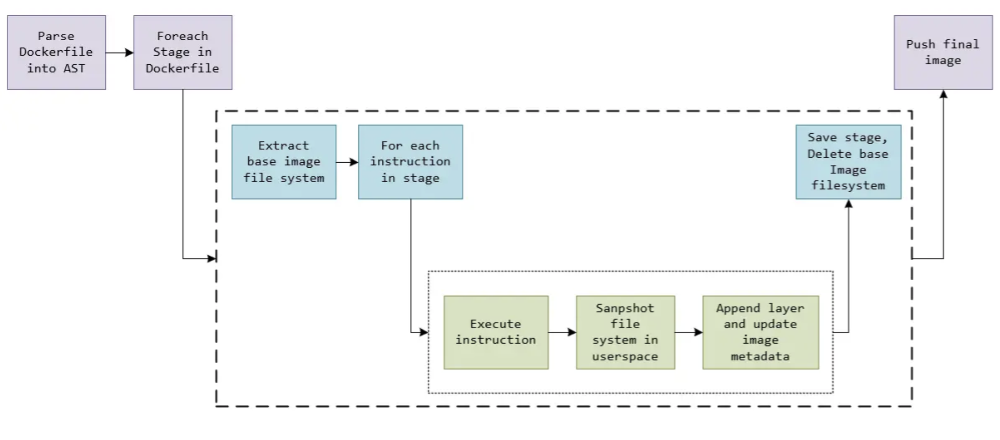

# 10.4.4 构建镜像以及创建 Pipeline

Tekton 任务在 Pod 内执行，使用 docker build 编译镜像已不再合适：

- 目前大多数容器运行时已切换为 Containerd，几乎不可能为了构建镜像额外安装 Docker。
- 即使容器运行时使用的是 Docker，Pod 需要通过特权模式访问 Docker 的守护进程 (docker.sock)，这显然增加了潜在的安全风险。

为容器镜像的构建提供一个安全、无依赖 Docker 守护进程的解决方案，Google Cloud 的工程师们开发了 Kaniko。

图 10-7 展示了 Kaniko 构建镜像的过程。Kaniko 从提供的 Dockerfile 开始，解析其中的每一条指令（如 FROM、RUN、COPY 等），并根据这些指令构建镜像。在执行每条 Dockerfile 指令时，Kaniko 会创建当前文件系统的快照，确保每个层只包含指令所生成的文件变更。构建完成后，Kaniko 将生成的镜像推送到指定的容器镜像注册中心（如 Docker Hub、Google Container Registry 等）。

:::center
  <br/>
  图 10-7 Kaniko 如何工作
:::

定义了一个构建镜像的 Task，资源文件（build-and-push.yaml ）内容如下所示

```yaml
apiVersion: tekton.dev/v1beta1
kind: Task
metadata:
  name: build-and-push
spec:
  resources:
    inputs:
      - name: repo
        type: git
  steps:
    - name: build-and-push
      image: gcr.io/kaniko-project/executor:latest
      env:
        - name: DOCKER_CONFIG
          value: /tekton/home/.docker
      command:
        - /kaniko/executor
        - --dockerfile=Dockerfile
        - --context=/workspace/repo/src
        - --destination=isno/tekton-test:latest
```

Task 中的 steps 执行 /kaniko/executor，通过 --dockerfile 指定 Dockerfile 路径，--context 指定构建上下文，我们这里当然就是项目的根目录了，然后 --destination 参数指定最终我们的镜像名称。

到目前，我们已经完成两个 Task 的创建，现在再用 Pipeline 将这两个 Task 组织起来。

```yaml
apiVersion: tekton.dev/v1beta1
kind: Pipeline
metadata:
  name: test-build-push
spec:
  params:
  - name: repo
    type: string
  tasks:
   # 运行应用测试
    - name: test
      taskRef:
        name: test
      resources:
        inputs:
          - name: repo # Task 输入名称
            resource: repo # Pipeline 资源名称
    # 构建并推送 Docker 镜像
    - name: build-and-push
      taskRef:
        name: build-and-push
      runAfter:
        - test # 测试任务执行之后
      resources:
        inputs:
          - name: repo # Task 输入名称
            resource: repo # Pipeline 资源名称
```
Pipeline 通过 spec.tasks 指定多个 task，然后根据 taskRef.name 关联到具体的 Task。

:::tip <a/>
需要注意的是，tasks 中的任务不保证先后顺序，因此如果不同任务之间有依赖关系得 runAfter 字段来指定先后关系。
:::

同样的，Pipeline 提交之后并不会被执行，再创建一个 PipelineRun 实例化和执行上面的 Pipeline。
```yaml
apiVersion: tekton.dev/v1beta1
kind: PipelineRun
metadata:
  generateName: test-build-push-run
spec:
  pipelineRef:
    name: test-build-push
  params:
  - name: repo
    value: "https://github.com/isno/tekton-example"
```
使用 create 的方式将 PipelineRun 提交到 Kubernetes，之后就会触发我们的流水线任务了。

```
$ kubectl create -f test-build-push-run.yaml 
```
