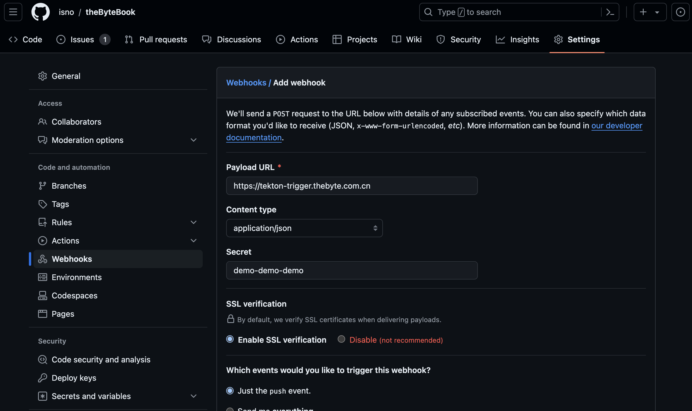

# 10.4.5 自动触发任务

前面我们都是通过手动创建一个 TaskRun 或者一个 PipelineRun 对象触发任务，本节我们讨论使用 Tekton Trigger 组件**通过外部事件自动触发流水线**。

:::tip 外部事件

gitlab、github 的 webhook 就是一种最常用的外部事件，通过 Trigger 组件监听这部分事件从而实现在提交代码后自动运行某些任务。
:::

Trigger 会先启动一个时间监听器 EventListener，它通过 HTTP 方式暴露并接收外部事件推送。当接收到外部事件（例如 github push）时）：

1. （如果有配置 interceptor 的话）会由 Interceptors 进行有效性验证、转换等处理：
	- 无效的事件会被丢弃；
	- 有效事件则交给 TriggerBinding 处理。
2. TriggerBinding 从事件内容中提取对应参数，然后将参数传递给 TriggerTemplate。
3. TriggerTemplate 根据预先定义的模版以及收到的参数创建 TaskRun 或者 PipelineRun 对象。

整个构建流程就自动执行了。

:::center
  <br/>
 Tekton 触发任务工作流程 [图片来源](https://tekton.dev/docs/getting-started/triggers/)
:::

## 创建触发器

创建一个名为 github-listener 的 EventListener 资源对象，文件（github-push-listener.yaml）内容如下所示。

```yaml
apiVersion: triggers.tekton.dev/v1beta1
kind: EventListener
metadata:
  name: github-listener
spec:
  serviceAccountName: tekton-triggers-github-sa
  triggers:
  	interceptors:
        - github:
            secretRef: # 引用 github-secret 的 Secret 对象中的 secretToken 的值
              secretName: github-secret
              secretKey: secretToken
            eventTypes:
              - Push Hook # 只接收 GitLab Push 事件
    - name: hello-trigger 
      bindings:
      - ref: github-push-binding
      template:
        ref: github-echo-template
```
## 暴露触发器服务

EventListener 创建完成后会生成一个名为 el-gitlab-listener 的 Service 对外暴露用于接收事件响应，我们通过 IngressRoute 对象来暴露该服务。

```yaml
apiVersion: traefik.containo.us/v1beta1
kind: IngressRoute
metadata:
  name: el-gitlab-listener
spec:
  routes:
    - match: Host(`tekton-trigger.thebyte.com.cn`)
      kind: Rule
      services:
        - name: el-gitlab-listener # 关联 EventListener 服务
          port: 8080
```

## 为触发器授权

由于 EventListener 对象需要访问 Kubernetes 集群内其他资源对象，通过 spec.serviceAccountName 声明 RBAC 为 EventListener 授权。

```yaml
apiVersion: v1
kind: ServiceAccount
metadata:
  name: tekton-triggers-github-sa
secrets:
  - name: github-secret
  - name: github-auth
---
kind: Role
apiVersion: rbac.authorization.k8s.io/v1
metadata:
  name: tekton-triggers-github-minimal
rules:
  # Permissions for every EventListener deployment to function
  - apiGroups: ["triggers.tekton.dev"]
    resources: ["eventlisteners", "triggerbindings", "triggertemplates"]
    verbs: ["get"]
  - apiGroups: [""]
    # secrets are only needed for Github/Gitlab interceptors, serviceaccounts only for per trigger authorization
    resources: ["configmaps", "secrets", "serviceaccounts"]
    verbs: ["get", "list", "watch"]
  # Permissions to create resources in associated TriggerTemplates
  - apiGroups: ["tekton.dev"]
    resources: ["pipelineruns", "pipelineresources", "taskruns"]
    verbs: ["create"]
---
apiVersion: rbac.authorization.k8s.io/v1
kind: RoleBinding
metadata:
  name: tekton-triggers-github-binding
subjects:
  - kind: ServiceAccount
    name: tekton-triggers-github-sa
roleRef:
  apiGroup: rbac.authorization.k8s.io
  kind: Role
  name: tekton-triggers-github-minimal
```

## 通过 TriggerBinding 提取事件参数


TriggerBinding 通过 $() 包裹的 JSONPath 表达式来提取 Github WebHook 发送过来的数据值，至于能够提取哪些参数值，需要 github/gitlab 的 WebHook 的说明 [^1]。

```yaml
apiVersion: triggers.tekton.dev/v1beta1
kind: TriggerBinding
metadata:
  name: github-push-binding
spec:
  params:
    - name: git-revision
      value: $(body.checkout_sha)
    - name: git-repository-url
      value: $(body.repository.git_http_url)
```

接下来就可以在 TriggerTemplate 对象中通过参数来读取上面 TriggerBinding 中定义的参数值了。

## 接收参数并关联 PipelineRun

定义一个如下所示的 TriggerTemplate 对象，声明一个 TaskRun 的模板

```yaml
apiVersion: triggers.tekton.dev/v1beta1
kind: TriggerTemplate
metadata:
  name: github-echo-template
spec:
  params: # 定义参数，和 TriggerBinding 中的保持一致
    - name: git-revision
    - name: git-repository-url
  resourcetemplates:
    - apiVersion: tekton.dev/v1beta1
      kind: PipelineRun # 定义 PipelineRun 模板
      metadata:
        generateName: github-pipeline-run- # PipelineRun 名称前缀
      spec:
        pipelineRef:
          name: github-pipeline
      params:
        - name: git-revision
          value: $(tt.params.git-revision)
        - name: git-repository-url
          value: $(tt.params.git-repository-url)
```

注意：TriggerTemplate 里的 pipeline 也要使用 generateName，否则名字相同、内容也相同的 pipelinerun 就会被忽略掉。


```
$ kubectl apply -f trigger-binding.yaml
```


## 设置 Github WebHook


:::center
  <br/>
:::


```
$ kubectl get pipelineruns
NAME                      SUCCEEDED   REASON      STARTTIME   COMPLETIONTIME
hello-goodbye-run         True        Succeeded   24m         24m
hello-goodbye-run-8hckl   True        Succeeded   81s         72s
```

[^1]: 参见 https://docs.gitlab.com/ee/user/project/integrations/webhook_events.html#push-events