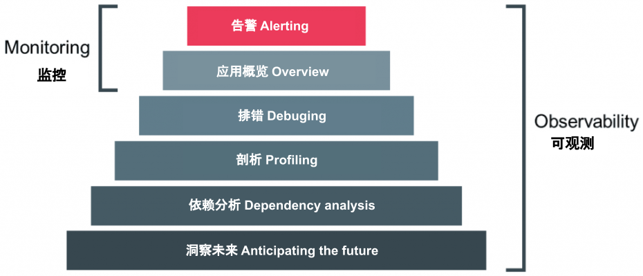
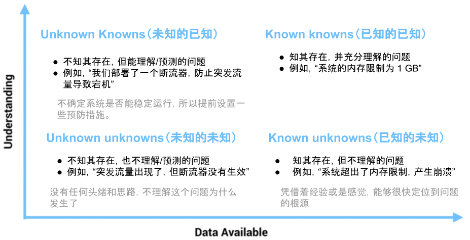

# 9.2 可观测性与传统监控

认识可观测性之后，引来第一个问题：“可观测性与传统监控区别是什么?”。《高性能 MySQL》作者 Baron Schwartz 曾用非常简洁的话总结了两者的关系，先看看他的解释。
:::tip 可观测与监控的关系
监控告诉我们系统哪些部分是工作的，可观测性告诉我们那里为什么不工作了。

:::right
——by《高性能 MySQL》作者 Baron Schwartz 
:::

业界将“可观测性”能力划分为 5 个层级，其中告警（Alerting）与应用概览（Overview）属于传统监控的概念范畴。

:::center
   
  图 9-1 监控与可观测性的关系：从上往下是系统问题逐层递进的现象和原因
:::

由于触发告警的往往是明显的症状与表象，但随着架构与应用部署方式的转变，不告警并非意味着一切正常。因此，想要主动发现问题，就要获取系统内部足够的运行信息。

实现主动发现问题的能力，由下面三个部分组成：
- 排错（Debugging），即运用数据和信息去诊断故障出现的原因； 
- 剖析（Profiling），即运用数据和信息进行性能分析；
- 依赖分析（Dependency Analysis），即运用数据信息厘清系统之前的模块，并进行关联分析。

有了足够的信息，便能构建出对系统、应用架构最深入的认知。

如图 9-2，我们把系统的理解程度和可收集信息之间的关系进行象限化分析。

:::center
   
  图 9-2 可观测性帮助开发人员发现未知的未知（Unknown Unknowns）
:::

X 轴的右侧（Known Knows 和 Known Unknowns）这些称为确定性的已知和未知，图中也给出了相对应的例子，这些信息通常是最基础的普适的事实，也就是在系统上线之前我们一定就能想到，一定能够监控起来的（CPU Load、内存、TPS、QPS 之类的指标），过去已有的大多数运维监控都是围绕这些确定的东西。但还是有很多情况是这些基础信息很难描述和衡量。

例如坐标的左上角：Unknown Knowns（未知的已知，通俗解释可称假设）。举个例子：为保证服务可用性时，通常会增加限流、熔断的机制，假设请求量突然异常，这些机制生效从而保证服务可用性。注意例子中`假设`的事情（请求突然增大）并没有发生，如果日常压力不大，很难从已有的基础监控中看出任何问题。

但到出事的时候，未曾验证失误（如限流逻辑写错）就变成最不愿意看到的 Unknown Unkowns（未知的未知，是没有任何线索、也不理解的意外）。

经验丰富（翻了无数次车）的工程师会通过经验证实自己的推测将 Unknown Unknowns 的查询范围变小，从而缩短故障解决的时间。但更合理的做法是透过系统输出的蛛丝马迹（metrics、log、trace），并以一个低门槛且形象的方式（监控大盘、追踪链路拓扑、聚合离散的事件日志等）描绘出系统更全面的状态。

如此，当发生 Unknown Unkowns 的情况时，才能具象化的一步步定位到根因。

[^1]: 参见 https://blog.sciencenet.cn/blog-829-1271882.html
