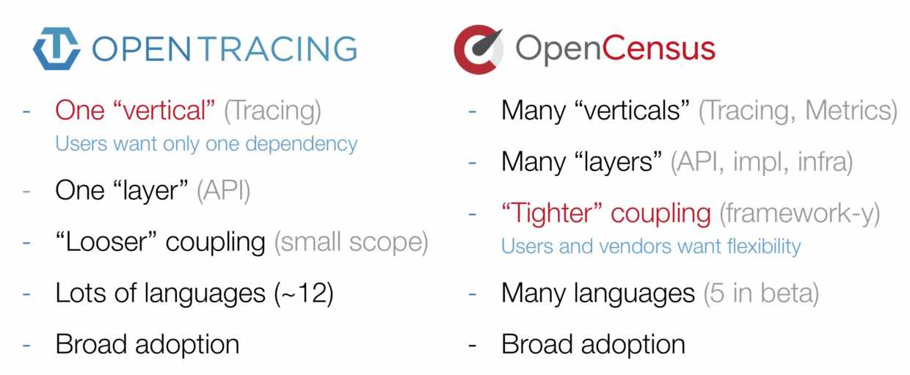

# 9.4 可观测性标准演进

Dapper 论文发布后，市场也出现了大量的追踪系统，如 Jaeger、Pinpoint、Zipkin 等，这些系统都以 Dapper 论文为原型实现，各个系统功能并没有本质差别，但又受限于实现细节，很难搭配工作。

## 9.4.1 OpenTracing

为了解决追踪系统各自为政的乱象，一些老牌 APM 所代表的厂商（Uber、LightStep、Redhat）提出了 OpenTracing 分布式追踪的标准协议，定义了一套厂商无关、语言无关的规范。只要遵守 OpenTracing 规范，任何公司的追踪探针、存储、界面就可以互换或者组合。OpenTracing 规范提出之后，业内知名的追踪系统 Jaeger 、Zipkin、Skywalking 等项目很快宣布宣布实现和支持 OpenTracing。

2016 CNCF 接纳 OpenTracing 成为 CNCF 第三个项目，前两个是鼎鼎大名的 Kubernetes 和 Prometheus，由此可见开源世界对 APM 的重视，对统一标准的重视和渴望。

## 9.4.2 OpenCensus

OpenTracing 推出不久之后，Google 和微软又联合推出了 OpenCensus 项目。

OpenCensus 的最初目标并不是抢 OpenTracing 的饭碗，而是为了把 Go 语言的 Metrics 采集、链路跟踪与 Go 语言自带的 profile 工具打通，统一用户的使用方式。随着项目的进展，开发人员想：“为什么不把其它各种语言的相关采集都统一呢？”。于是，OpenCensus 的场景进一步扩大了，不仅做了 Metrics 基础指标监控，还做了 OpenTracing 的老本行：分布式跟踪。

从 OpenTracing 和 OpenCensus 从功能和特性上来看，两者各有优缺点：OpenTracing 支持的语言更多、相对对其他系统的耦合性要更低；OpenCensus支持Metrics、分布式跟踪，同时从 API 层一直到基础设施层都进行了支持。

:::center
   
  图 OpenTracing 和 OpenCensus 功能、特性对比
:::

作为协议标准，这种竞争未免太消耗资源了。对于用户而言，一边是老牌 APM 厂商，一边是影响力巨大的 Google 和微软。选择困难症发作的同时，一个新的想法不断被讨论：**是否能有一个统一标准，能够同时支持 Metrics、Tracing、Logs 相关可观测数据的项目呢？**

## 9.4.3 OpenTelemetry

为了更好的将 Traces、Metrics 和 Logs 融合在一起，OpenTelemetry（简称 OTel）诞生了。作为 CNCF 的孵化项目，OpenTelemetry 由 OpenTracing 和 OpenCensus 项目合并而成，它的核心工作主要集中在 3 个部分：

- 规范的制定和协议的统一，规范包含数据传输、API 的规范。
- 多语言 SDK 的实现和集成，用户可以使用 SDK 进行代码自动注入和手动埋点，同时对其他三方库（Log4j、LogBack等）进行集成支持。
- 数据收集系统的实现，包括 Agent 和 Collector 的实现。

如下图所示，集成 OpenTelemetry 可观测建设：
- 只需要一种 SDK 就可以实现所有类型数据的统一产生；
- 集群只需要部署一个 OTel Collector 便可以实现所有类型数据的采集。

:::center
   
  图 集成 OpenTelemetry 的可观测架构 [图片来源](https://opentelemetry.io/docs/)
:::

由此可见，OpenTelemetry 定位明确：**专注于数据采集和标准规范的统一，对于数据如何去使用、存储、展示、告警，标准本身并不涉及**。你可以使用 Prometheus + Grafana 做 Metrics 存储、展示，使用 Jaeger 做分布式跟踪的存储和展示。

这使得 OpenTelemetry 既不会因动了“数据的蛋糕”，引起生态抵制，也极大保存了精力，得以专注于实现兼容“所有的语言、所有的系统”的数据采集器。

