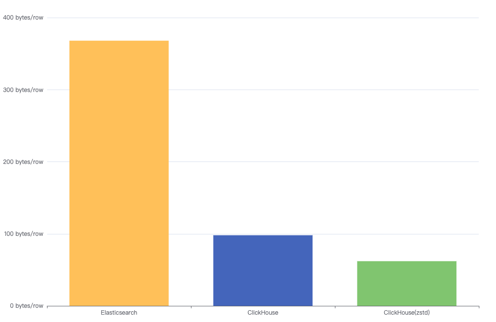
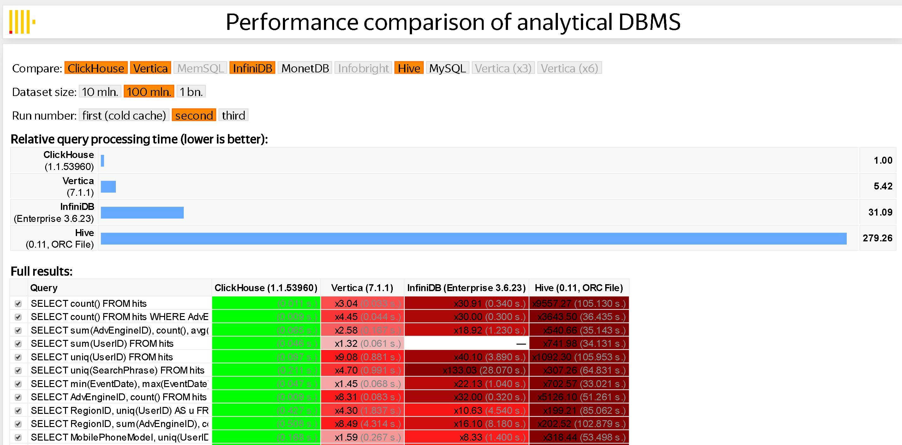

# 9.3.2 日志的存储

处理日志本来是件稀松平常的事情，但数据规模的影响下，日志处理量变引发质变，成为典型的大数据场景之一：高吞吐写入（GB/s）、低成本海量存储（PB 级别）、亿级数据量实时检索（1s 内）。

本节，笔者将从日志存储与分析的角度，介绍三种各具特色的日志系统方案：Elastic Stack（全文索引）、Loki（仅索引元数据）和 ClickHouse（列式数据库）。

## 1. 全文索引方案 Elastic Stack

讨论实现一套完整的日志系统，工程师们或多或少都应该听说过这几个名词：ELK、ELKB 或者 Elastic Stack（为统一明确，后续统称 Elastic Stack），这些其实说得都是同一套实现日志处理方案的开源组件。

Elastic Stack 是由 Elastic 公司开发的一组开源工具，专用于数据收集、搜索、分析和可视化。值得一提的是，Elastic 公司的发展始于创始人 Shay Banon 的个人兴趣，从开源、聚人、成立公司，到走向纽交所，再到股价一路狂飙（截止 2024 年 7 月 11 日，最新市值 $107 亿），几乎是最理想的工程师创业故事。

如图 9-10，展示了一套基于 Elastic Stack 完整的处理日志方案。这套方案中，Beats 组件部署到日志所在地收集原始数据，然后使用 MQ 做缓冲换取更好的吞吐，接着发给 logstash 组件做数据清洗，最后落地到 Elasticsearch 集群并进行索引，使用时通过 Kibana 组件进行可视化、检索和分析，如果有必要挂上 Nginx 做各类访问控制。

:::center
  <br/>
  图 9-10 整合了消息队列和 Nginx 的 Elastic 日志系统
:::

Elastic 套件中最核心组件是 Elasticsearch，这是一个提供一种“准实时”搜索服务的分布式搜索分析引擎。准实时的意思是，生产环境中可以做到数据上报 10 秒后可搜，不惜成本的情况下，万亿级规模下日志查询秒级响应。

:::tip 额外知识
说起 Elasticsearch 不得不提及背后的 Lucene。Lucene 的作者就是大名鼎鼎的 Doug Cutting，如果你不知道他是谁是？那你一定听过他儿子玩具的名字 —— Hadoop。

Lucene 是一个全文检索引擎，离直接使用还有部分集成工作，之后陆续有了 Solr、Nutch 等项目帮助发展，但依然不温不火。直到 2012 年，Elasticsearch 诞生后，通过优秀的 Restful API、分布式部署等扩展才把 Lucene 的使用推向新的高度。

:::

Elasticsearch 能快速从海量的数据中检索出关键词匹配的日志，其底层核心是 Lucene 中的反向索引（Inverted index）技术。

索引有两种形式，分为正向索引和反向索引：

- 正向索引（Forward Index）：传统的索引方法。它的工作原理是将文档集合中的每个单词作为键，将包含该单词的文档列表作为值。适合于快速检索特定标识符的文档，常见于数据库管理系统中作为主键索引使用
- 反向索引（inverted index）常被翻译为倒排索引，但“倒排”容易误解为倒序。反向索引和“排序”没什么关系，其原理将文本分割成一个个词，通过构建“<词->文档编号>”这样的索引，从而快速查找一个词在哪些文档出现。

以英文为例，下面是要被索引的文本：

- T~0~ = "it is what it is"
- T~1~ = "what is it"
- T~2~ = "it is a banana"

我们就能得到下面的反向文件索引：

```
"a":      {2}
"banana": {2}
"is":     {0, 1, 2}
"it":     {0, 1, 2}
"what":   {0, 1}
```

进行检索时，条件“what”, “is” 和 “it” 将对应这个集合：$\{0, 1\}\cap\{0,1,2\}\cap\{0,1,2\} = \{0,1\}$。

因此，Elasticsearch 搜索时不需要逐个扫描所有文档，而是能通过关键词快速定位包含这些词的文档。然而，面对海量数据集或者非常高的查询压力时，仅使用反向索引还不够。我们还需要将数据拆分成分片（sharding）。

分片定义为，每一条数据（或者每条记录，每行，每个文档）只属特定的分片。实际上，每个分片都可以视为一个完整的数据库，在 Elasticsearch 中，分片是独立的 Lucene 实例。当文档写入时，Elasticsearch 会通过哈希函数（通常是基于文档 ID）计算出文档应该存储在哪个分片中，从而将文档有序分配到不同分片。

分片的目的是提高可扩展性，不同的分片可以放在不同的节点中。这样，查询并行地在多个分片上执行，并行执行结束之后，再将结果聚合后再返回给客户端，这将大地提高了查询吞吐量。

Elasticsearch 极致查询性能的背后，也付出了数据写入吞出率低和存储空间占用高的代价：

- 因为文档写入时需要进行分词、词典排序、构建排序表等 CPU/内存密集操作，这导致写入吞出率大幅下降；
- Elasticsearch 会存储原始数据和反向索引，为了加速分析可能还需要存储一份列式数据。
- 默认情况下，Elasticsearch 的每个分区都有一个冗余的副本。当分区的数据丢失时，冗余的副本就会顶上去成为新的分区。这样，避免了单点故障，从而实现容灾。

Elasticsearch 冗余数据机制在观测场景下导致极高的存储成本。如果你的目的只是把日志收集起来，作用是近期范围内查询和一些简单的条件匹配（如匹配 host、service 等），那不妨看看下面介绍的 Loki。

## 2. 日志处理新贵 Loki 

Grafana Loki（简称 Loki）是由 Grafana Labs 公司开发的是一个可水平扩展、高度可用、多租户的日志聚合系统。

受 Prometheus 的启发，Loki 使用类似 Prometheus 的标签索引机制来存储和查询日志数据。Loki 采用了轻量级的索引设计，将日志元数据（例如时间戳、标签等）和实际日志内容分离。实际日志内容不做什么索引，以块（Block）的形式存储在。

如果您不想删除旧日志，也可以将日志存储在长期对象存储中，例如 Amazon Simple Storage Service (S3) or Google Cloud Storage (GCS)，或者本地文件系统内。


典型的基于 Loki 实现的日志方案，有以下三个核心的组件：


- Promtail：Promtail 是 Loki 的代理，它负责收集日志并将它们发送到 Loki。Promtail 操作模式是发现存储在磁盘上的日志文件，并将它们与一组标签关联起来转发给 Loki。Promtail 可以为与 Promtail 运行在同一节点上的 Kubernetes pod 进行服务发现，充当容器 sidecar 或 Docker 日志驱动程序，从指定文件夹读取日志，并跟踪 systemd 日志。当然，也可以接收由其他进程（如 Fluentd 或 Fluent Bit）转发的日志。

- Loki：Loki 是主要的日志聚合和查询组件，它接收并存储日志，同时提供了一个查询接口（支持 LogQL，与 Grafana 密切集成）。
- Grafana 用于查询和显示日志数据。您还可以从命令行、使用LogCLI或直接使用 Loki API 查询日志。
:::center
  <br/>
  图 9-11 Loki 日志系统架构
:::

Loki 明显优势是非常经济，它不再根据日志原始内容建立大量的全文索引，而是借鉴了 Prometheus 设计理念：由标签驱动的数据模型。Loki 使用标签来组织和索引日志数据，日志条目通过标签进行索引，日志内容不做任何索引，并压缩存储于对象存储中。

查询时，Loki 会通过标签索引定位到相关的日志数据，并从对象存储中读取日志内容。

假设你在一个分布式系统中收集应用程序日志，以下是一个简单的日志条目示例及其元数据。
```bash
2024-09-11T10:15:30.123Z [INFO] [app-123] User login successful: user_id=456
2024-09-11T10:16:45.678Z [ERROR] [app-123] Failed to connect to database: timeout
2024-09-11T10:17:55.432Z [WARN] [app-456] API rate limit exceeded: user_id=789
```

对于这些日志条目，Loki 使用以下标签来索引日志数据：

- job：表示日志的来源或应用名称，例如 app-123 或 app-456。
- level：表示日志的级别，例如 INFO、ERROR 或 WARN。
- user_id：表示日志中涉及的用户 ID，这个字段可以作为日志内容的一部分，通常会被提取为标签。
- host：表示日志产生的主机名称或 IP 地址（如果配置了）

Loki 的索引将使用这些标签来组织和存储日志数据。以下是如何索引这些标签的示例：

```json
{
  "streams": [
    {
      "stream": {
        "job": "app-123",
        "level": "INFO"
      },
      "values": [
        ["2024-09-11T10:15:30.123Z", "User login successful: user_id=456"]
      ]
    },
    {
      "stream": {
        "job": "app-123",
        "level": "ERROR"
      },
      "values": [
        ["2024-09-11T10:16:45.678Z", "Failed to connect to database: timeout"]
      ]
    },
    ...
  ]
}

```

对象存储通常具有较低的存储成本，适合存储大量日志数据。


相较于 Elastic 全文索引系统，Loki 只索引标签的，并将日志内容存储与对象存储中，最终存储成本可降低数十倍甚至更低。


受 PromQL 的启发，Loki 也有自己的查询语言，称为 LogQL。
实现日志的索引及存储之后，便可使用 Loki 查询语言（LogQL）进行查询、过滤、聚合等操作。

```
{job="app-123", level="ERROR"}
```

这个查询将检索所有 job 为 app-123 且 level 为 ERROR 的日志条目，并显示相关的日志内容和时间戳。


作为 Grafana Labs 的自家产品，Loki 与 Grafana 以及 Prometheus 密切集成。例如：

- 度量和日志集成：你可以在 Grafana 中创建一个仪表板，显示来自 Prometheus 的时序数据（如 CPU 使用率）和来自 Loki 的日志数据（如错误日志）。这样可以在同一面板上查看度量和日志信息，以便于更深入的故障排除和性能分析。
- 警报和通知：Prometheus 可以用于生成警报，而 Loki 可以提供警报触发时的日志上下文。通过集成，可以在警报触发时从 Loki 中提取相关日志，以帮助诊断问题的根源。


利用 Loki 的查询语法 LogQL 使用标签及运算符进行过滤，能展示出任何你想要的图表。

:::center
  <br/>
  图 9-12 在 Grafana 中通过 LogQL 查询展示不同的图表
:::

最后，Loki 和 Elastic 都是优秀的日志解决方案，如何选择取决于具体场景：
- Loki 相对轻量，具有较高的可扩展性和简化的存储架构，若是数据的处理不那么复杂，如应用程序日志和基础设施指标，并且以 Kubernetes 为底座的系统时，选择 Loki 更合适。
- Elastic 相对重量，需要复杂的存储架构和较高的硬件要求，部署和管理也比较复杂，适合更大的数据集和更复杂的数据处理需求。

## 3. 凶猛彪悍的 ClickHouse

ClickHouse 是一个用于 OLAP（On-Line Analytical Processing，在线分析处理）的列式列式数据库管理系统，由俄罗斯 Yandex（以 运营着俄罗斯最受欢迎的搜索引擎闻名，被称为俄罗斯的 Google）公司的工程师在 2008 年开发，并于 2016 年 6 月 开源。 

ClickHouse 的关键特点有列式存储、向量化查询执行、高效压缩、实时数据处理、水平扩展、复杂查询（支持 SQL 语法）。这些特点使 ClickHouse 大规模数据分析、实时流式数据查询以及业务数据分析的理想选择。能够在海量数据（数十亿级别）的规模下，实现基于 SQL 语法的实时查询秒级响应。

一个流行的观点认为：“提升查询速度的最简单有效方法是减少数据扫描范围和数据传输量”。减少数据扫描范围和数据传输量的核心，在于数据是如何被组织和存储的。先来看传统的行式数据库系统中，数据是如何存储的。如下所示，MySQL、Postgres 这类的数据库数据按如下顺序存储。

<center >表 9-13 行式数据库存储结构</center>

|Row | ProductId |sales  |Title| GoodEvent |CreateTime|
|:--|:--|:--|:--|:--|:--|
| #0 | 89354350662 |120 |Investor Relations|  1 |2016-05-18 05:19:20|
| #1 |  90329509958 | 10|  Contact us |  1 | 2016-05-18 08:10:20| 
| #2 |  89953706054 | 78 | Mission|  1 | 2016-05-18 07:38:00| | 
| #N |  ...|  ...|  ...|  ... | ...


行式数据库一张表中的一行内的所有数据在物理介质内是彼此相邻存储的。如果要执行下面的 SQL（统计某个产品的销售额）：

```
SELECT sum(sales) AS count FROM 表 WHERE  ProductId=90329509958
```

上述分析类的查询，实际上只需要读取表的一小部分列（sales 列）。但行式数据库首先需要将所有行从磁盘加载到内存中，然后进行扫描和过滤（检查是否符合 where 条件），过滤出目标行之后，再判断是否有聚合函数（如 SUM、MAX、MIN），如有则执行相应的计算和排序，再过滤不需要的列，最终输出结果。整个流程可能需要非常长的时间。


在列式数据库系统中，数据的存储是按如下方式组织的：

<center >表 9-14 列式数据库存储结构</center>

|Row:| #0 | #1 | #2 | #N|
|:--|:--|:--|:--|:--|
|ProductId:| 89354350662 |90329509958 |89953706054 |...|
|sales: |120 |22| 12 |...|
|Title: | Investor  Relations | Contact us | Mission |...|
|GoodEvent: | 1| 1| 1| ...|
|CreateTime: | 2016-05-18 05:19:20 |2016-05-18 08:10:20 |2016-05-18 07:38:00 |...|

可以看到，列式存储不是讲一行中的所有值存储在一起，而是将每列中的所有值存储在一起。在列式数据库中我们只需读取的数据。例如，上面统计销售额示例的 SQL，只需读取 sales 列，其他与查询无关的列并不会被读取，从而避免了不必要的磁盘 IO 操作。

此外，列式存储和数据压缩通常是伴生的。数据压缩的本质是通过一定的步长对数据进行匹配扫描，发现重复部分后进行编码转换。因此，数据中重复项越多，压缩率越高。面向列式的存储，同一列字段的数据具有相同的数据类型和语义，重复项的可能性自然更高。ClickHouse 支持不同的列配置不同的压缩算法。这样，用户可以根据每列的数据特性选择最合适的压缩方式。

如下所示，创建一个 MergeTree 类型的 example 表。对 UInt64 列使用了 LZ4 算法（适合快速读取的大量数值数据），对 name 列使用 ZSTD 算法（适合较大的字符串），对 createTime 列使用了 Double-Delta（适合递增或相邻值差异较小的数据）等。

```shell
CREATE TABLE example (
    id UInt64 CODEC(ZSTD), -- 为整数列设置 LZ4 压缩
    name String CODEC(LZ4), -- 为字符串列设置 ZSTD 压缩
    age UInt8 CODEC(NONE),  -- 不压缩
    score Float32 CODEC(Gorilla) -- 为浮点数设置 Gorilla 压缩
    createTime DateTime CODEC(Delta, ZSTD), --  为时间戳设置 Delta 编码加 ZSTD 压缩
) ENGINE = MergeTree()
ORDER BY id;
```

近几年来，经常能在国内各个技术公众号看到使用 ClickHouse 降低存储成本的实践分享。在 B 站的技术文章《B 站基于 Clickhouse 的下一代日志体系建设实践》中，我们看到相较于 Elasticsearch ，B 站使用 ClickHouse 后降低了 60%+ 的存储成本[^2]。

:::center
  <br/>
  图 9-15 同一份日志在 Elasticsearch、ClickHouse 和 ClickHouse(zstd) 中的容量对比
:::

ClickHouse 支持分片（Sharding），这是实现水平扩展和分布式并行查询的关键特性。通过增加更多的节点，Clickhouse 能实现处理数百亿到数万亿条记录，以及数 PB 级别的数据。

根据 Yandex 的内部跑分结果来看（图 9-16），ClickHouse 比 Vertia（一款商业的 OLAP 分析软件）快约 5 倍、比 Hive 快 279 倍、比 InifniDB 快 31 倍。ClickHouse 表现的惊人的查询性能，当之无愧阐述 ClickHouse 介绍中“实时”（real-time）二字含义。


:::center
  <br/>
  图 9-16 ClickHouse 性能测试 [图片来源](http://clickhouse.yandex/benchmark.html)
:::

正如 ClickHouse 的宣传所言，其他的开源系统太慢，商用的又太贵。只有 ClickHouse 在存储成本与查询性能之间做到了良好平衡，不仅快且还开源。


[^2]: 参见 https://mp.weixin.qq.com/s/dUs7WUKUDOf9lLG6tzdk0g