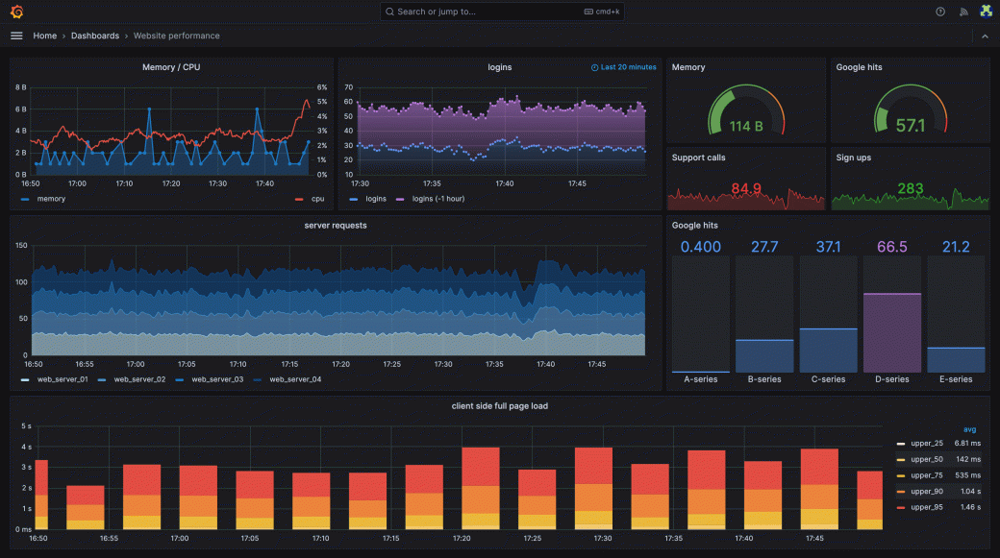

# 9.3.1 指标数据的收集与处理

指标（Metrics）是监控的代名词，提到监控系统，避不开 Prometheus。本节，笔者以剖析 Prometheus 系统为例，讲解指标的收集、存储和处理流程。

2014 年，Google 的 Borg 系统孕育出了 Kubernetes，前 Google 工程师受 Borg 配套的监控系统 Brogmon 启发，在 Soundcloud 公司以开源软件的形式开启了 Prometheus 项目。2016 年 5 月继 Kubernetes 之后，Prometheus 称为 CNCF 第二个项目。经过多年的发展，Prometheus 现已成为云原生系统中指标监控的事实标准。


如图 9-4 所示，可见 Prometheus 是一个模块化的系统，由多个独立的组件组成，每个组件负责特定的任务，其中 Service Discovery 用于自动发现被监控的目标，Exporters 用于将监控目标的指标数据转换为 Prometheus 可以理解的格式；Push Gateway 用于处理短期任务的监控数据；Prometheus Server 负责收集、存储和查询指标数据；Alertmanager 负责处理告警。

:::center
  <br/>
  图 9-4 Prometheus 的架构设计
:::


## 1. 定义指标的类型

为了方便用户使用和理解不同指标之间的差异，Prometheus 定义了四种不同的指标类型：

- 计数器（Counter）: Counter 是单调递增的计数器，适用于记录事件的累计次数。它只能递增或复位为 0，不能减少，通常用于记录某些不可逆的事件，如请求数、错误数等。常见的计数器指标为 HTTP 请求次数、系统错误次数、数据包发送量等。
- 仪表盘（Gauge）：Gauge 用于表示可增可减的值，适用于那些随时间波动的数据，例如系统资源利用率。它可以随时间上下波动，如内存使用量、CPU 使用率等。
- 直方图（Histogram）：Histogram 用于采样观测值并将其放入预定义的桶中，适合用来统计分布情况，特别是延迟、请求处理时间等场景。它不仅记录观测值的数量，还可以生成各个区间（桶）内的样本分布情况。Histogram 使用的场景如测量 API 的响应时间分布、处理任务的延迟等。
- 摘要（Summary）：Summary 也用于采样观测值，提供整体的统计信息，类似于 Histogram，但它直接计算分位数（percentile），例如 50%、90% 等常见的统计值。它更适合需要精确分位数的数据分析，使用的场景如追踪延迟、响应时间，并希望得到特定分位数的精确结果，如响应时间的 99th 百分位数。

:::center
  <br/>
  图 9-5 Prometheus 定义的四种不同的指标类型
:::

## 2. 通过 Exporter 收集指标

定义完指标的类型之后，接下来的工作是把指标从监控的目标收集起来。收集指标似乎是很简单的事情，但问题是，对于大量现有的服务、系统甚至硬件，它们并不会暴露 Prometheus 格式的指标，比如：

- Linux 的很多指标信息以文件形式记录在 proc 下的各个目录中，如 /proc/meminfo 里记录内存信息，/proc/stat 里记录 CPU 信息;
- Redis 的监控信息需要通过 INFO 命令获取;
- 路由器等硬件的监控信息需要通过 SNMP 协议获取;

Prometheus 的做法是将数据的收集与监控系统解耦，实现这一关键能力的组件称 Exporter。Exporter 充当着连接监控系统与被监控目标之间的桥梁，不同的 Exporter 去理解不同的监控指标，并将其转换为 Prometheus 支持的格式。再将指标以 HTTP（接口通常是 /metrics）的方式暴露给 Prometheus。

如下所示，从一个 metrics 接口获取类型指标为 Counter 的 Exporter 实例。Prometheus 只要通过轮询的形式定期从这些监控目标（target）中获取数据即可。

```bash
$ curl http://127.0.0.1:8080/metrics | grep http_request_total
# HELP http_request_total The total number of processed http requests
# TYPE http_request_total counter // 指标类型 类型为 Counter
http_request_total 5
```

通过 Exporter，Prometheus 可以监控几乎所有系统和应用，只需使用相应的 Exporter 或编写自定义的 Exporter。Prometheus 社区也涌现出大量各种用途的 Exporter。如表 9-1 所示，涵盖了从基础设施、中间件以及网络等各个方面，让 Prometheus 的监控范围涵盖用户关心的所有目标。

:::center
表 9-1 Prometheus 中常用 Exporter
:::

| 范围 | 常用 Exporter |
|:--|:--|
 | 数据库 |  MySQL Exporter、Redis Exporter、MongoDB Exporter、MSSQL Exporter 等 | 
 | 硬件 | Apcupsd Exporter、IoT Edison Exporter、IPMI Exporter、Node Exporter 等 | 
 | 消息队列 |  Beanstalkd Exporter、Kafka Exporter、NSQ Exporter、RabbitMQ Exporter 等 |
 | 存储 | Ceph Exporter、Gluster Exporter、HDFS Exporter、ScaleIO Exporter 等 | 
 | HTTP服务 | Apache Exporter、HAProxy Exporter、Nginx Exporter 等 |
 | API服务 | AWS ECS Exporter、Docker Cloud Exporter、Docker Hub Exporter、GitHub Exporter 等 | 
 | 日志 | Fluentd Exporter、Grok Exporter 等 | 
 | 监控系统 |  Collectd Exporter、Graphite Exporter、InfluxDB Exporter、Nagios Exporter、SNMP Exporter 等 |
 | 其它 | Blockbox Exporter、JIRA Exporter、Jenkins Exporter、Confluence Exporter 等|


## 3. 存储指标

存储本来是一种司空见惯的操作，但如果是指标类型的数据，你需要换个思路来解决存储的问题。举个例子，假设你负责一个小型的集群（只有 10 个节点），集群中运行一套微服务系统（30 个服务），每个节点要采集 CPU、内存、磁盘以及网络，每个服务要采集业务相关、中间件相关指标。这些累加在一起总共算 20 个指标，如果按 5 秒的频率采集，那么一天的数据规模是：

```
10（节点）* 30（服务）* 20 (指标) * (86400/5) （秒） = 103,680,000（记录）
```

对于一个规模仅有 10 个节点的业务而言，`7*24` 小时不间断地生成数据，有时一天的数据量就超过 1 TB。虽然，你也可以用关系数据库或 NoSQL 数据库来处理时序数据，但这类数据库并没有充分利用时序数据的特点，需要源源不断投入更多的计算资源和存储资源来处理，系统的运营维护成本急剧上升。

如何低成本的存储这些海量数据，是个关乎系统可用的重要课题。我们回顾指标数据有什么特征？

```json
  {
    "metric": "http_requests_total",  // 指标名称，表示 HTTP 请求的总数
    "labels": {                       // 标签，用于描述该指标的不同维度
      "method": "GET",                // HTTP 请求方法
      "handler": "/api/v1/users",     // 请求的处理端点
      "status": "200",                // HTTP 响应状态码
    },
    "value": 1458,                    // 该维度下的请求数量
  },
```

指标类型的数据是纯数字的、具有时间属性，它们肯定没有关系嵌套、不用考虑主键/外键、不用考虑事务处理。对于这类基于时间，揭示其趋势性、规律性的数据，业界也发展出了专门优化的数据库类型 —— 时序数据库（Time-Series Database，简称 TSDB）。

时序数据库其实并不是一个新鲜的概念，追溯其历史，1999 年问世的 RRDtool 应该是最早的专用时序数据库。2015 年起，时序数据库逐步开始流行。现在，在排行网站 DB-engines 上面，时序数据库已成为流行度最高的数据库。时序数据库与常规数据库（如关系型数据库或 NoSQL 数据库）在设计和用途上存在显著区别。笔者列举部分差异供你参考：

- 数据结构：时序数据库专为处理时间序列数据而设计。数据通常包括时间戳、测量值和标签。例如，如图所示的时序数据库结构，其中索引为时间戳（timestamp），不同的列记录了在该时间戳下的属性值。metric 表示度量（类似于关系型数据库中的表），data point 表示数据点（类似于关系型数据库中的行），field 是度量下随时间戳变化的属性值，tags 是附加的属性信息。

:::center
  <br/>
  图 9-7 时序数据库结构
:::

- 数据写入：时序数据库使用 LSM-Tree（Log-Structured Merge-Tree）来替代常规数据库中的 B+Tree。在时序数据库中，所有写入操作首先写入内存存储区（MemTable，通常为跳表或平衡树）。当 MemTable 满时，数据会被批量写入磁盘文件中。虽然磁盘写入延迟较高，但由于批量操作，时序数据库在写入吞吐量上通常优于传统关系数据库（使用 B+Tree）。
- 数据保留策略：时序数据通常有明确的生命周期，例如监控数据可能只需保留几天或几个月。时序数据库通常具有自动化的数据保留策略（data retention），以防止存储空间无限膨胀。例如，可以设置基于时间的保留策略，保留最近 30 天的数据，超过 30 天的数据将自动删除。


默认情况下，Prometheus 将数据存储在本地 TSDB 中，Prometheus 将所有数据按照时间范围“分片”存储，按照两小时为一个时间窗口，每两小时的数据存在一个块中，每个块中包含该时间窗口内的所有样本数据、元数据文件以及索引文件。
通过时间窗口的形式保存数据，有利于 Prometheus 根据特定时间段进行数据查询。Prometheus 默认保留 15 天的数据，若需要长期存储，可通过远程存储扩展（Remote Read/Write API）与外部存储系统集成。Thanos、Cortex、VictoriaMetrics、Mimir 等方案都可以为 Prometheus 提供长期存储、水平扩展、高可用性和多租户支持。

:::tip 什么是分片(sharding)

“分片”（sharding）是数据库和数据存储系统中用来提高性能和可扩展性的一种技术。它将数据划分成更小的、独立的片段，每个片段称为一个“分片”。每个分片可以被单独管理和存储，这样可以减轻单个服务器的负担，提高系统的整体处理能力和可扩展性。

笔者稍后介绍的 Elastic Stack、ClickHouse 等技术皆是利用了分片技术实现水平可扩展以及并行计算能力。
:::

Prometheus 最大的一个特点是其 PromQL 是 Prometheus 内置的数据查询语言，其提供对时间序列数据丰富的查询，聚合以及逻辑运算能力的支持，同时 PromQL中 还提供了大量的内置函数可以实现对数据的高级处理。被广泛应用在 Prometheus 的日常应用当中，包括对数据查询、可视化、告警处理当中。

例如，计算最近 5 分钟内 HTTP 请求总数的速率，并对所有实例的请求进行求和。

```PromQL
sum(rate(http_requests_total[5m])) 表示
```


## 4. 展示分析/预警

采集/存储指标最终目的要用起来，也就是要“展示分析”以及“预警”。


在数据分析和可视化领域，Grafana Labs 公司开发的 Grafana 已成为事实上的标准。最初，Grafana 专注于时间序列数据的监控与分析，但随着项目的发展，它已经扩展到所有需要数据可视化和监控的场景，包括 IT 运维、应用性能监控以及物联网、金融、医疗等行业。

图 9-17 展示了一个 Grafana 仪表板（Dashboard）。在这个仪表板中，有两个关键概念：


- 数据源（Data Source）：在 Grafana 中，数据源指的是为其提供数据的服务。Grafana 支持多种数据源，包括时序数据库（如 Prometheus、Graphite、InfluxDB）、日志数据库（如 Loki、Elasticsearch）、关系型数据库（如 MySQL、PostgreSQL），以及云监控平台（如 Google Cloud Monitoring、Amazon CloudWatch、Azure Monitor）。Grafana 插件库中提供了多达 165 种数据源。如果找不到某个特定的数据源，那通常意味着该数据源已经被市场淘汰。
- 面板（Panel）：面板是仪表板中的基本构建块，用于显示各种可视化图表。Grafana 提供了多种图表类型，如仪表盘、表格、折线图、柱状图、热力图、饼图和直方图等。每个面板可以单独配置，并具备交互选项。通过 Panel 的 Query Editor（查询编辑器），可以为每个面板设置不同的数据源。例如，如果以 Prometheus 作为数据源，那在 Query Editor 中，我们使用 PromQL 查询语言从 Prometheus 中查询出相应的数据，并且将其可视化。Grafana 支持多种数据源，每个面板可配置不同的数据源，这样就可以在一个统一的界面上（仪表板）整合和展示来自多种不同系统的数据。

Grafana 几乎涵盖了所有的数据源和图表类型。正如 Grafana 的宣传语所言“只要你能想到的数据，都能转化为你想要的图表”。

:::center
  <br/>
  图 9-7 Grafana 的仪表盘
:::


在预警方面，Prometheus 负责数据采集和预警信息的生成，而 Alertmanager 则专门处理这些预警信息。以下是一个具体的例子，展示如何使用 Prometheus 告警规则来监控某个 HTTP 接口的 QPS。

```yaml
groups:
  - name: example-alerts
    rules:
    - alert: HighQPS
      expr: sum(rate(http_requests_total[5m])) by (instance, job) > 1000
      for: 5m
      labels:
        severity: critical
      annotations:
        summary: "High QPS detected on instance {{ $labels.instance }}"
        description: "Instance {{ $labels.instance }} (job {{ $labels.job }}) has had a QPS greater than 1000 for more than 5 minutes."
```

这段规则会定期通过 PromQL 语法检测过去 5 分钟内某个被监控目标（instance）中的某个具体服务（job）的 QPS 是否大于 1000。如果条件满足，Prometheus 就会触发告警，并将其发送到 Alertmanager。Alertmanager 对告警进行进一步处理，例如：

- 分组（Grouping）：将具有相似标签的告警进行分组，以减少告警冗余。例如，若多个实例的故障告警属于同一服务，Alertmanager 可以将这些告警合并为一个群组发送，而不是发送多个独立的通知。
- 抑制（Inhibition）：定义规则来抑制某些告警的触发。当某个重要告警已触发时，可以避免其他相关但不那么重要的告警再次触发，从而防止告警风暴。例如，当整个服务宕机时，单个实例宕机的告警可以被抑制。
- 静默（Silencing）：在特定时间段内禁用某些告警通知。静默操作可以通过指定标签、持续时间和备注等条件设置，常用于维护期间的告警屏蔽。
- 路由（Routing）：根据告警标签或其他规则将告警路由到不同的接收端。Alertmanager 支持通过标签、优先级等条件进行灵活的路由设置。例如，将高优先级告警发送到短信和电话通知，而将低优先级告警仅通过邮件发送。
