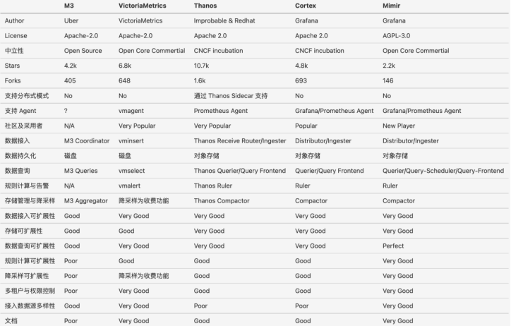

# 9.3.1 指标处理

度量的工作包含对指标数据进行收集、存储、再处理（展示/触发预警）。这一些列的处理流程，正是所有普适监控系统的主要工作。

提到监控系统，避不开 Prometheus，Prometheus 已经成为云原生中指标监控的事实标准。
:::tip 额外知识
Google 的 Borg 系统孕育出了 Kubernetes，Prometheus 的前身 —— Google 内部的监控系统 Brogmon 则由前 Google工程师在 Soundcloud 以开源软件的形式继承下来。
:::

如图 9-4 所示的 Prometheus 架构，它通过不同的子功能实现埋点采集、爬取和传输、存储、计算、展示等，再通过搭积木组合出一个以应用为中心，功能强大的监控告警系统。

:::center
  <br/>
  图 9-4 Prometheus 的架构设计
:::

分析 Prometheus 架构及总结对指标的处理，所有监控系统总体上要解决的问题其实就 3 个：

- 怎么收集指标（定义指标的类型/将定义后的指标类型告诉监控服务端）。
- 收集后指标怎么存储。
- 指标如何被使用（展示/预警）。

## 1. 定义指标的类型

了方便用户使用和理解不同指标之间的差异，Prometheus 定义了四种不同的指标类型（Metrics Type）：

- **Counter（计数器）**: Counter 类型的指标其工作方式和计数器一样，初始为 0，只增不减（除非系统发生重置）。常见的监控指标如 http_requests_total、node_cpu 等都是 Counter 类型的监控指标。
- **Gauge（仪表盘）**：与 Counter 不同，Gauge 类型的指标侧重于反应系统的当前状态，因此这类指标的样本数据可增可减。常见指标如 node_memory_MemFree（主机当前空闲的内容大小）、node_memory_MemAvailable（可用内存大小）都是 Gauge 类型的监控指标。
- **Histogram（直方图）**：观测采样统计分类数据，观测数据放入有数值上界的桶中，并记录各桶中数据的个数。典型的如延时在 `0~50ms` 的请求数，500ms 以上慢查询数，大 Key 数等。
- **Summary（摘要）**：聚合统计的多变量，跟 Histogram 有点像，但更有聚合总数的概念。典型的有有成功率、总体时延、总带宽量等。

:::center
  <br/>
  图 9-5 Prometheus 定义的四种不同的指标类型
:::

如下，从一个 metrics 接口获取类型指标为 Counter 样本。
```bash
$ curl http://127.0.0.1:8080/metrics | grep http_request_total
# HELP http_request_total The total number of processed http requests
# TYPE http_request_total counter // 指标类型 类型为 Counter
http_request_total 5
```

## 2. 通过 Exporter 收集指标

不同监控系统收集指标数据基本就两种方式：

- 被监控目标主动 push 到中心 Collector（譬如各种 Agent 采集器，Telegraf 等）；
- 中心 Collector 通过 pull 的方式从被监控的目标中主动拉取。

图 9-5 所示，Prometheus 主动从监控源拉取暴露的 HTTP 服务地址（通常是/metrics，也称为 Exporter）拉取监控样本数据。这样的好处是 Prometheus 可以控制采集频率，保证自身系统的稳定。

:::center
  <br/>
  图 9-5 Prometheus 通过 Exporter 的实例 target 中主动拉取监控数据
:::

:::tip Exporter
Exporter 一个相对开放的概念，可以是一个独立运行的程序独立于监控目标以外，也可以是直接内置在监控目标中，只要能够向 Prometheus 提供标准格式的监控样本数据即可。
:::

Prometheus 相比 zabbix 这类传统监控系统，最大的特点是对指标全方位的收集：

- **宿主机监控数据**：Node Exporter 以 DaemonSet 的方式运行在宿主机，收集节点的负载、CPU、内存、磁盘以及网络这样的常规机器的数据。
- **Kubernetes 本身的运行情况**：Kubernetes 的 API Server、Kubelet 等组件内部通过暴露 /metrics 接口，向 Prometheus 提供各个 Controller 工作队列、请求 QPS 等 Kubernetes 本身工作的情况。
- **Kubernetes Workload 相关的监控**：kuelet 内置的 cAdvisor 服务把 Metrics 信息细化到每一个容器的 CPU、文件系统、内存、网络等资源使用情况。
- **业务的监控**：用户在应用内实现 Exporter，自定义出各式各样的 Metrics。

除了上述监控范围，Prometheus 社区也涌现出大量各种用途的 Exporter。如表 9-1 所示，涵盖了从基础设施、中间件以及网络等各个方面，让 Prometheus 的监控范围涵盖用户关心的所有目标。

:::center
表 9-1 Prometheus 中常用 Exporter
:::

| 范围 | 常用 Exporter |
|:--|:--|
 | 数据库 |  MySQL Exporter、Redis Exporter、MongoDB Exporter、MSSQL Exporter 等 | 
 | 硬件 | Apcupsd Exporter、IoT Edison Exporter、IPMI Exporter、Node Exporter 等 | 
 | 消息队列 |  Beanstalkd Exporter、Kafka Exporter、NSQ Exporter、RabbitMQ Exporter 等 |
 | 存储 | Ceph Exporter、Gluster Exporter、HDFS Exporter、ScaleIO Exporter 等 | 
 | HTTP服务 | Apache Exporter、HAProxy Exporter、Nginx Exporter 等 |
 | API服务 | AWS ECS Exporter、Docker Cloud Exporter、Docker Hub Exporter、GitHub Exporter 等 | 
 | 日志 | Fluentd Exporter、Grok Exporter 等 | 
 | 监控系统 |  Collectd Exporter、Graphite Exporter、InfluxDB Exporter、Nagios Exporter、SNMP Exporter 等 |
 | 其它 | Blockbox Exporter、JIRA Exporter、Jenkins Exporter、Confluence Exporter 等|


## 3. 存储指标

存储本来是一种司空见惯的操作，但如果是指标类型的数据，你需要换个思路来解决存储的问题。

举个例子，假设你负责一个小型的集群（只有 10 个节点），集群中运行一套微服务系统（30 个服务），每个节点要采集 CPU、内存、磁盘以及网络，每个服务要采集业务相关、中间件相关指标。这些累加在一起总共算 20 个指标，如果按 5 秒的频率采集，那么一天的数据规模是：

```
10（节点）* 30（服务）* 20 (指标) * (86400/5) （秒） = 103,680,000（记录）
```

可见，这种规模级别的数据不能再常规的思路/普通的数据库存储。回顾指标数据有什么特征？纯数字、具有时间属性，它们肯定也有关系嵌套、不用考虑主键/外键、不用考虑事务处理。

对于这类基于时间，揭示其趋势性、规律性的数据，业界也发展出了专门优化的数据库类型 —— 时序数据库（TSDB）。

:::tip 时序数据库
时序数据库具备秒级写入百万级时序数据的性能，提供高压缩比低成本存储、预降采样、插值、多维聚合计算、可视化查询结果等功能，解决由设备采集点数量巨大、数据采集频率高造成的存储成本高、写入和查询分析效率低的问题。
:::

默认情况下，Prometheus 将数据存储在本地 TSDB 中，并设定了默认的存储时限（15天），这种设计的理念基于“指标数据通常反映短期内的系统行为假设，而非长期/可靠分布式存储”。

Prometheus 也考虑了长期存储的场景，你可以通过它的远端存储扩展（Remote Read/Write API）将数据存储到任意第三方存储上。目前，社区已经涌现出大量适用于长期时序数据存储的解决方案，如 Thanos、VictoriaMetrics、SignalFx、InfluxDB 和 Graphite 等。

图 9-61 展示了 Prometheus 长期存储方案各个维度对比，读者可以根据对比，选择最适合自己的存储方案。

:::center
  <br/>
  图 9-6 长期存储方案对比
:::

## 4. 展示分析/预警

采集/存储指标最终目的要用起来，也就是要“展示分析”以及“预警”。

在可观测数据展示方面，Grafana Dashboard 基本已经成为事实的标准。Grafana 的 slogan 是“Dashboard anything. Observe everything.”。Prometheus 提供了名为 PromQL 的数据查询语言，这是一套完全由 Prometheus 定制的数据查询 DSL，能对时序数据进行高效的过滤、聚合和计算，已被广泛用在数据查询、可视化、报警处理等日常使用中。

Grafana 提供了对 PromQL 的完整支持，两者结合的结果是“只要你能想到的数据就能转成任何你想要的图表”。

:::center
  <br/>
  图 9-7 通过 PromQL 查询指标数据，Grafana 展示指标数据
:::

在预警方面，Prometheus 只负责数据的采集和生成预警信息，预警的专门处理由 Alertmanager 负责。

Prometheus 定义好预警规则，会周期性对预警规则进行计算，如果满足预警条件就会向 Alertmanager 发送预警信息，Alertmanager 对这些预警信息进一步的处理，譬如去重，降噪，分组等，最后通过多种的通知渠道如邮件、微信、或者通用的 WebHook 通知用户。
