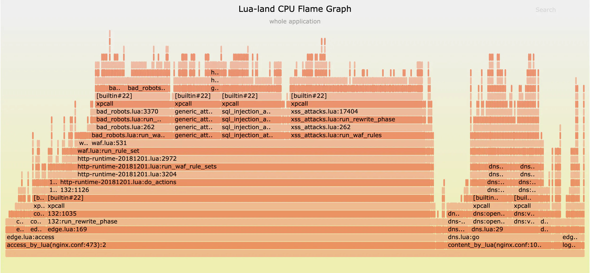

# 9.3.4 性能剖析 Profiling

可观测性领域的性能剖析（Profiling）的目标是分析运行中的应用，生成详细的性能数据（Profiles），帮助工程师全面了解应用的运行行为和资源使用情况，从而识别代码中的性能瓶颈。

性能数据通常以火焰图或堆栈图的形式呈现，分析这些数据是从“是什么”到“为什么”过程中的关键环节。例如，通过链路追踪识别延迟源（是什么），然后根据火焰图进一步分析，定位到具体的代码行（为什么）。2021 年，某网站发生崩溃事件，工程师通过分析火焰图发现 Lua 代码存在异常，最终定位到问题源头。[^1]。

:::center
   
  图 9-16 Lua 代码的 CPU 火焰图（由于函数调用按层叠加，火焰图呈现出类似火焰的形状）
:::

:::tip 火焰图分析说明

- 纵轴：表示函数调用的堆栈深度（或层级）。纵向越高表示调用链越深，底部通常是程序的入口函数（如 main 函数），上层是被下层函数调用的函数。
- 横轴：表示函数在特定时间段内所占用的 CPU 时间或内存空间，条形的宽度越大，表示该函数消耗的时间或资源越多。

分析火焰图的关键是观察横向条形的宽度，宽度越大，函数占用的时间越多。如果某个函数的条形图出现“平顶”现象，表示该函数的执行时间过长，可能成为性能瓶颈。
:::

性能数据有多种类型，每种类型由不同的分析器（Profiler）生成，常见的分析器包括：

- **CPU 分析器**：跟踪程序中每个函数或代码块的运行时间，记录函数调用堆栈信息，生成调用图，并展示函数之间的调用关系和时间分布。
- **堆分析器（Heap Profiler）**：监控程序的内存使用情况，帮助定位内存泄漏或不必要的内存分配。例如，Java 工程师通过堆分析器定位导致内存溢出的具体对象。
- **GPU 分析器**：分析 GPU 的使用情况，主要用于图形密集型应用（如游戏开发），优化渲染性能。
- **互斥锁分析器**：检测程序中互斥锁的竞争情况，帮助优化线程间的并发性能，减少锁争用引发的性能瓶颈。
- **I/O 分析器**：评估 I/O 操作的性能，包括文件读写延迟和网络请求耗时，帮助识别数据传输瓶颈并提高效率。
- **特定编程语言分析器**：例如 JVM Profiler，用于分析在 Java 虚拟机上运行的应用程序，挖掘与编程语言特性相关的性能问题。

过去，由于分析器资源消耗较高，通常仅在紧急情况下启用。随着低开销分析技术的发展，如编程语言层面的 Java Flight Recorder 和 Async Profiler 技术、操作系统层面的 systemTap 和 eBPF 技术的出现，让在生产环境进行持续性能分析（Continuous Profiling）成为可能，解决线上“疑难杂症”也变得更加容易。

[^1]: 参见《2021.07.13 我们是这样崩的》https://www.bilibili.com/read/cv17521097/

