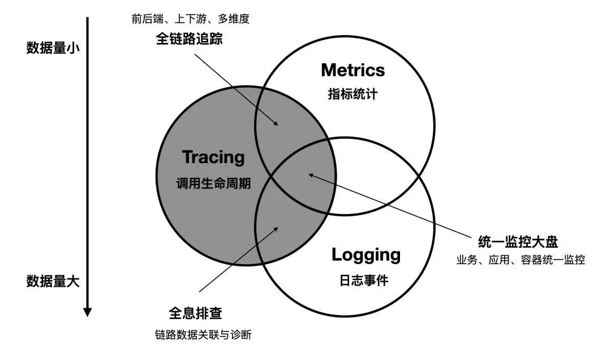

# 9.3 可观测数据的分类及处理

业界对系统输出的数据总结出三种独立的数据类型，他们分别从三个不同的维度来展示应用的状态。这三类数据类型分别是指标（metrics）、日志（logs）和链路追踪（trace），它们也被称为可观测性的“三大支柱”。

- **指标（metrics）**：指标是系统事件发生数量的统计聚合，每一个指标数据以度量内容、度量数值与度量时间点组成，例如某段时间的服务 QPS、API 响应延迟、某个接口的失败数等。指标是发现问题的起点，典型例子是你收到一条告警“12 点 22分，接口请求成功率跌到了 10%“，你立刻意识到情况不妙并开始处理，结合链路追踪、日志等数据找到 root cause，从而解决问题。

- **日志（logs）**：日志是系统运行过程中输出的文本数据。一条日志的内容通常包含系统对指定对象执行的操作、操作的结果以及操作的时间。日志记录通常用于记录离散的事件，包含程序执行到某一点或某一阶段的详细信息。如果说“指标”告诉你应用程序出现了问题，那么“日志”就告诉你为什么出现问题。当系统出现问题时，分析日志数据是工程师定位问题时最直接的手段。

- **链路追踪（trace）**：链路追踪是一个请求在分布式系统中的执行过程记录。当一条请求进入系统进行 处理时，处理过程中经过不同组件的每一段处理情况数据被称为一个 Span，多个 Span 通过请求 ID 进行串联，组成一条链路追踪。因 此，一条链路追踪可以认为是由多个 Span 组成的有向无环图，代表一次完整的分布式请求所经过的路径。通过链路追踪，我们可以在错综复杂的分布式系统中分析出请求中异常点。

上述三类数据虽然各自侧重不同，但并非孤立存在，反而在系统问题处理上有天然的交集与互补。比如，先通过指标监控（告警）发现问题，再结合日志和链路追踪深入定位问题根源。可观测系统的建设，正是为了将日志、指标和链路追踪紧密结合，使我们能够从宏观到微观、从整体到细节，全方位地观测业务系统。

这三者之间的关系，如下图 9-2 的韦恩图所示。

:::center
   
 图 9-2 指标、链路追踪、日志三者之间的关系 [图片来源](https://peter.bourgon.org/blog/2017/02/21/metrics-tracing-and-logging.html)
:::

现在，CNCF 发布的可观测性白皮书中[^1]，将系统输出的各类观测数据统一称为信号（Signals）。主要的信号除了 指标、日志、链路追踪之外又增加了性能剖析（Profiling）和核心转储（Core dump）。

下面几节内容中，笔者将详细介绍可观测系统中各个信号采集、存储以及处理流程中的挑战和难点。

[^1]: 参见 https://github.com/cncf/tag-observability/blob/main/whitepaper.md