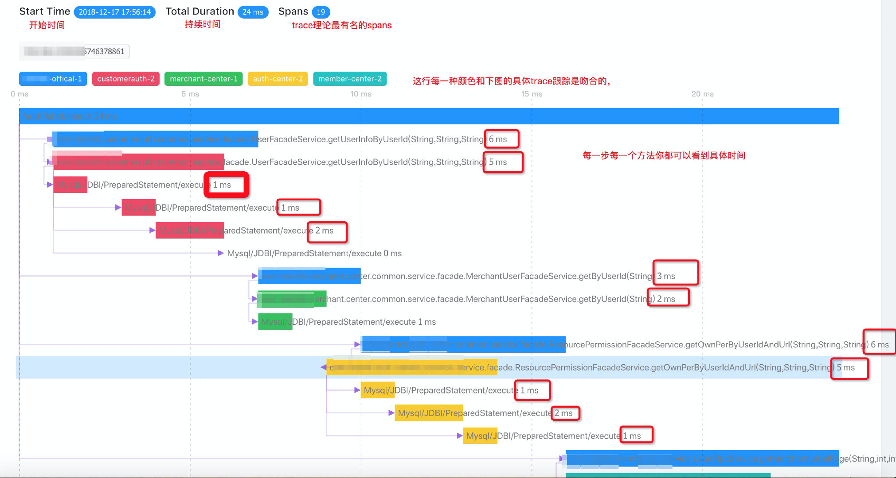

# 9.3.3 分布式链路追踪

Uber 是实施微服务架构的先驱，他们曾经撰写博客介绍过它们的打车系统，该系统约由 2,200 个相互依赖的微服务组成。引用资料中的配图，直观感受铺面而来的复杂性。
:::center
   
  图 9-10 Uber 使用 Jaeger 生成的追踪链路拓扑 [图片来源](https://www.uber.com/en-IN/blog/microservice-architecture/)
:::

上述微服务由不同团队使用不同编程语言开发，部署在数千台服务器上，横跨多个数据中心。这种规模使系统行为变得难以全面掌控，且故障排查路径异常复杂。因此，理解复杂系统的行为状态，并析性能问题的需求显得尤为迫切。

2010 年 4 月，Google 工程师发表了论文《Dapper, a Large-Scale Distributed Systems Tracing Infrastructure》[1]，论文总结了他们治理分布式系统的经验，并详细介绍了 Google 内部分布式链路追踪系统 Dapper 的架构设计和实现方法。

Dapper 论文的发布，让治理复杂分布式系统迎来了转机，链路追踪技术开始在业内备受推崇！

## 1. 链路追踪核心概念

Dapper 论文中提出了一些很重要的核心概念：Trace、Span、Annonation 等，搞明白这些概念是理解链路追踪技术前提。

- **追踪（trace）**：表示一次完整的请求，从客户端发起到收到响应的全过程。请求流转时，第一层服务会生成一个全局唯一的 Trace ID，随后该 ID 会随请求传递至各层服务。通过 Trace ID，可以串联起请求在系统中所有服务的调用链路。
- **跨度（Span）**：表示一次调用，是链路追踪的基本单元。每个 Trace 可能涉及多个服务调用，且数量和顺序不固定。为记录具体调用的服务、调用顺序、开始时间和执行时长等信息，每次调用服务前需生成一条记录，称为 Span。Span 的数据结构应简单，便于嵌入日志或网络协议报文头；同时要足够完整，至少包括时间戳、起止时间、Trace ID、当前 Span ID、父 Span ID 等信息，以满足追踪需求。
- **Annotation**：记录业务自定义数据，如请求用户 ID、支付订单 ID 等。

总结 Dapper 系统的基本原理是，为每个跨度记录一个可读的 span name、span id 和 parent id，一个请求内的跨度共享一个 trace id。通过 trace id，便可重建分布式系统服务间调用的因果关系。换言之，链路追踪（Trace）是由若干具有顺序、层级关系的跨度（Span）组成一棵追踪树（Trace Tree），如图 9-1 所示。

:::center
   
  图 9-11 由不同跨度组成的追踪树
:::

从链路追踪系统的实现来看，其核心是通过在服务调用过程中收集 trace 和 span 信息，并汇总生成追踪树结构。收集数据并不复杂，但要同时满足以下两大目标时，难度显著增加：

- **低消耗**：追踪系统需尽量降低对业务性能的影响，尤其是对延迟敏感的场景，哪怕微小的额外开销都可能被察觉，从而迫使业务团队停用该功能。
- **对业务透明**：对于业务工程师而言，是不需要知道有追踪系统这回事。如果追踪系统必须依赖业务工程师的主动配合，那这个追踪系统也未免太脆弱了。

接下来，笔者从数据采集、采集后展示两个方面，阐述当前主流链路追踪系统的设计逻辑与实现方法。

## 2. 数据采集

当前追踪数据采集有三种主流的实现方式，分别是基于日志的追踪（Log-Based Tracing），基于服务的追踪（Service-Based Tracing）和基于边车代理的追踪（Sidecar-Based Tracing）。笔者分别介绍如下：

- 基于日志的追踪的思路是：将 Trace、Span 等信息直接输出到应用日志中，然后随着所有节点的日志采集汇聚到一起，再从全局日志信息中反推出完整的调用链拓扑关系。基于日志收集追踪数据的优势在于没有网络调用的开销，对应用程序只有很少的侵入性，对性能的影响也很低。但其缺点是，日志本身不追求绝对的连续与一致，这使得基于日志的追踪往往不精准。另外业务调用与日志归集并不是同时完成的，有可能发生业务调用已经结束了，但日志归集不及时或者缺失记录，导致追踪失真。
  
  Dapper 的追踪记录以及日志归集的实现如图 9-13 所示，总结为三个步骤。
  1. 把 span 数据写入本地日志文件（log file）。
  2. Dapper 守护进程（Dapper daemon）和采集器（Dapper Collectors）将日志从主机拉取出来。
  3. 将拉取的日志写入 Dapper 的 Bigtable 仓库中，其中 Bigtable 中一行表示一个 trace，列表示 span。   
:::center
   
  图 9-13 基于日志实现的追踪
:::

- 基于服务追踪的实现思路是：通过某些手段给目标应用注入追踪探针（Probe），通过探针收集服务调用信息并发送给链路追踪系统。
  探针在结构上可视为一个寄生在目标服务身上的小型微服务系统，它一般会有自己专用的服务注册、心跳检测等功能，有专门的数据收集协议，把从目标系统中监控得到的服务调用信息，通过另一次独立的 HTTP 或者 RPC 请求发送给追踪系统。

  以追踪系统 SkyWalking 的 Java 追踪探针为例，它实现的原理是通过字节码注入，将需要注入的类文件（追踪逻辑的代码）转换成 byte 数组，通过设置好的拦截器注入到正在运行的应用程序中。这类探针通过控制 JVM 中类加载器的行为，侵入运行时环境实现分布式链路追踪。使用探针的方式，无需修改业务源代码，所以对业务工程师基本无感知。

  比起基于日志实现的追踪，基于服务追踪的劣势是消耗更多的资源，也有更强的侵入性。优势是这些资源消耗带来的直接受益是精确性更高，也更稳定。现在，基于服务的追踪是目前最为常见的实现方式，被 Zipkin、Pinpoint、SkyWalking 等主流链路追踪系统广泛采用。

- 基于边车代理（sidecar）的追踪方式，这是服务网格中的专属方案。Sidecar 可以抓取进出容器的网络请求和响应数据，这些数据可记录该服务所完成的一个操作，与追踪中的跨度信息对应。总结该模式的优势如下：
    - **边车代理对应用完全透明**：有自己独立数据通道，追踪数据通过控制平面上报，不会有任何依赖或干扰；
    - **与编程语言无关**：无论应用采用什么编程语言，只要它通过网络（如 HTTP 或 gRPC）访问服务，就可以被追踪到。

  Sidecar 无需修改业务逻辑代码，也没有额外的开销，因此是最理想的分布式追踪模型。目前，市场占有率最高 Envoy 就提供了链路追踪数据采集功能，但 Envoy 没有自己的界面端和存储端，需要配合专门的 UI 与存储系统来使用。现在 Zipkin、SkyWalking 、Jaeger、LightStep Tracing 等系统都可以接受来自于 Envoy 的追踪数据，充当它的界面端和存储端。

## 3. 数据展示

数据展示的作用是将处理后的链路信息以图形化的方式展示给用户，实际主要用到两种图形展示：调用链路图和调用拓扑图。笔者分别介绍如下：

- **调用链路图**一般展示服务总耗时、服务调用的网络深度、每一层经过的系统，以及多少次调用。调用链路图在实际项目中，主要是被用来做故障定位，比如某一次用户调用失败了，可以通过调用链路图查询这次用户调用经过了哪些环节，到底是哪一层的调用失败所导致。图 9-14 展示了 Skywalking 服务调用链路图，根据调用链路图中 Span 记录的时间信息和响应结果，我们可以很容易定位到出错或者缓慢的服务。
:::center
   
  图 9-14 Skywalking 调用链路图
:::

- **调用拓扑图**一般展示系统内都包含哪些应用，它们之间是什么关系，以及依赖调用的 QPS、平均耗时情况。调用拓扑图是一种全局视野图，在实际项目中，主要用作全局监控，用于发现系统中异常的点，从而快速做出决策。比如，某一个服务突然出现异常，在调用链路拓扑图中可以看出对这个服务的调用耗时都变高了（一般用醒目的颜色标记），用作监控报警。
:::center
   
  图 9-15 Pinpoint 调用拓扑图
:::

[^1]: 参见《Dapper, a Large-Scale Distributed Systems Tracing Infrastructure》https://research.google/pubs/dapper-a-large-scale-distributed-systems-tracing-infrastructure/
