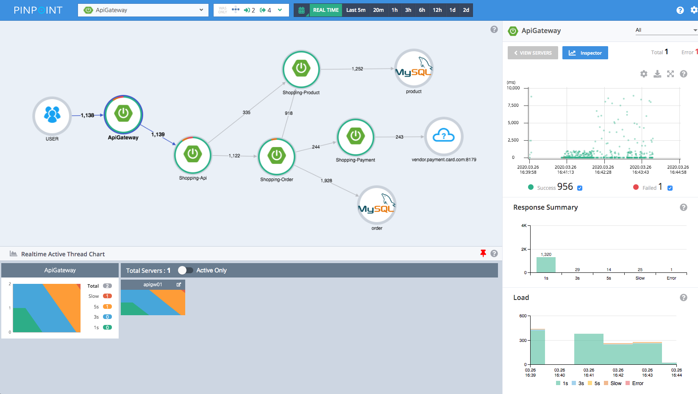

# 9.3.3 分布式链路追踪

微服务架构的先驱 Uber，曾经在公开的资料中介绍过他们的微服务架构的规模，整个系统大约有 2,200 个服务互相依赖，引用资料中的配图，感受扑面而来的复杂。

:::center
   
  图 9-17 Uber 使用 Jaeger 生成的追踪链路拓扑 [图片来源](https://www.uber.com/en-IN/blog/microservice-architecture/)
:::

上述各个子服务可能由不同团队开发、使用不同编程语言实现，并部署在数千台服务器上，横跨多个数据中心。因此，理解复杂系统行为并分析性能问题的需求变得尤为迫切。

2010年4月，Google 的工程师们总结了他们在治理分布式系统中的经验，发表了论文《Dapper, a Large-Scale Distributed Systems Tracing Infrastructure》[^1]。论文中详细阐述了 Google 治理复杂分布式系统的经验，以及它们内部分布式链路追踪系统 Dapper 的设计理念。Dapper 论文几乎成了现代链路追踪的理论基石，主流的链路追踪系统都是基于 Dapper 衍生出来的。

## 1. 链路追踪核心概念

Dapper 论文中提出了一些很重要的核心概念：Trace、Span、Annonation 等，这是理解链路追踪原理的前提。

- Trace：代表一次完整的请求。一次完整的请求是指，从客户端发起请求，记录请求流转的每一个服务，直到客户端收到响应为止。整个过程中，当请求分发到第一层级的服务时，就会生成一个全局唯一的 Trace ID，并且会随着请求分发到每一层级。因此，通过 Trace ID 就可以把一次用户请求在系统中调用的链路串联起来；
- Span：代表一次调用，也是链路追踪的基本单元。由于每次 Trace 都可能会调用数量不定、坐标不定的多个服务，为了能够记录具体调用了哪些服务，以及调用的顺序、开始时点、执行时长等信息，每次开始调用服务前都要先埋入一个调用记录，这个记录称为一个 Span。Span 的数据结构应该足够简单，以便于能放在日志或者网络协议的报文头里；也应该足够完备，起码应含有时间戳、起止时间、Trace 的 ID、当前 Span 的 ID、父 Span 的 ID 等能够满足追踪需要的信息。
- Annotation：用于业务自定义埋点数据，例如：一次请求的用户 ID，某一个支付订单的订单 ID 等

Trace 实际上都是由若干个有顺序、有层级关系的 Span 所组成一颗 Trace Tree (追踪树)。，如图 9-18 所示。

:::center
   
  图 9-18 Trace 和 Spans
:::

总结 Dapper 原理就是在分布式应用的接口方法中设置一些观察点，在入口节点给每个请求分配一个全局唯一的标识 TraceId，当请求流经这些观察点时就会记录一条对应的链路日志（Span），最后通过 TraceId 将一次请求的所有链路日志进行组装，还原出该次请求的链路轨迹。

一个完整的数据链路系统大致可以分为三个相对独立的模块：

- 数据采集 - 负责数据埋点并上报。
- 数据处理 - 负责数据的存储与计算。
- 数据展示 - 负责数据的可视化展示。

## 2. 数据采集

由于数据采集需要深入获取内部信息，就不可避免地会侵入业务逻辑代码中，微服务架构本身已经集成了多种服务治理逻辑，再加入链路追踪逻辑必然进一步加剧其复杂性。因为数据采集的设计原则必须满足以下两个关键条件：

- 应用级透明：开发者不需要修改业务代码或者仅需要极少的修改即可实现埋点，这意味着追踪逻辑对应用层不可见或者几乎不可见。
- 低开销：埋点操作对系统的性能影响应当尽可能小，以避免追踪逻辑本身成为系统性能的瓶颈。

数据采集有三种主流的实现方式，分别是基于日志的追踪（Log-Based Tracing），基于服务的追踪（Service-Based Tracing）和基于边车代理的追踪（Sidecar-Based Tracing）。

基于日志的追踪的思路是：将 Trace、Span 等信息直接输出到应用日志中，然后随着所有节点的日志采集汇聚到一起，再从全局日志信息中反推出完整的调用链拓扑关系。

基于服务的追踪是目前最为常见的实现方式，被 Zipkin、Pinpoint、SkyWalking 等主流链路追踪系统广泛采用。其实现思路是：通过某些手段给目标应用注入追踪探针（Probe），针对 Java 应用一般就是通过 Java Agent 注入的。探针在结构上可视为一个寄生在目标服务身上的小型微服务系统，它一般会有自己专用的服务注册、心跳检测等功能，有专门的数据收集协议，把从目标系统中监控得到的服务调用信息，通过另一次独立的 HTTP 或者 RPC 请求发送给追踪系统。

基于服务的追踪有以下特点：

- 侵入性强，会有性能损耗。
- 追踪更加精准、稳定。

基于边车代理的追踪方式，这是服务网格中的专属方案，也是理想的分布式追踪模型：
 - 边车代理对应用完全透明：有自己独立数据通道，追踪数据通过控制平面上报，不会有任何依赖和干扰；
 - 与程序语言无法：无论应用采用什么编程语言，只要它通过网络（如 HTTP 或 gRPC）访问服务，就可以被追踪到。

目前，市场占有率最高 Sidecar 实现 Envoy 就提供了链路追踪数据采集功能，但没有提供自己的界面端和存储端，需要配合专门的 UI 与存储来使用。现在 Zipkin、SkyWalking 、Jaeger、LightStep Tracing 等系统都可以接受来自于 Envoy 的追踪数据，充当它的界面端。

## 3. 数据展示

数据展示的作用就是将处理后的链路信息以图形化的方式展示给用户，实际项目中主要用到两种图形展示，一种是调用链路图，一种是调用拓扑图。

- 调用链路图一般展示服务总耗时、服务调用的网络深度、每一层经过的系统，以及多少次调用。调用链路图在实际项目中，主要是被用来做故障定位，比如某一次用户调用失败了，可以通过调用链路图查询这次用户调用经过了哪些环节，到底是哪一层的调用失败所导致。图 9-19 展示了 Skywalking 链路分析，根据调用链路图中 Span 记录的时间信息和响应结果，我们可以很容易定位到出错或者缓慢的服务。
:::center
   
  图 9-19 Skywalking 链路分析
:::

- 调用拓扑图一般展示系统内都包含哪些应用，它们之间是什么关系，以及依赖调用的 QPS、平均耗时情况。调用拓扑图是一种全局视野图，在实际项目中，主要用作全局监控，用于发现系统中异常的点，从而快速做出决策。比如，某一个服务突然出现异常，那么在调用链路拓扑图中可以看出对这个服务的调用耗时都变高了，可以用红色的图样标出来，用作监控报警。
:::center
   
  图 9-20 Skywalking 链路分析
:::

## 3. 代表性项目

受 Dapper 思想和协议的影响，市场上开始出现大量的链路追踪项目。

最开始是 Twitter 受到 Dapper 的启发，开发了自己的分布式追踪系统 Zipkin，Zipkin 是第一个被广泛采用的开源的分布式链路追踪系统，提供了数据收集（提供了 Java、Python、Go 等多种 SDK）、存储（如 Elasticsearch、Cassandra 和 MySQL）和查询的功能以及友好的 UI 界面来展示追踪信息。2017 年 Uber 在基于 Zipkin 思想和经验的基础上开源了 Jaeger，增加了自适应采样、提供了更加强大和灵活的查询能力等。

除以上两个项目外，国内的工程师应该非常熟悉 Skywalking，这是一款本土开源应用性能监控（APM）工具，它不仅支持分布式链路追踪，还涵盖应用性能监控、日志分析等多个方面。

:::center
   
  图 9-19 CNCF 下分布式链路追踪产品生态
:::

[^1]: 参见《Dapper, a Large-Scale Distributed Systems Tracing Infrastructure》https://research.google/pubs/dapper-a-large-scale-distributed-systems-tracing-infrastructure/
