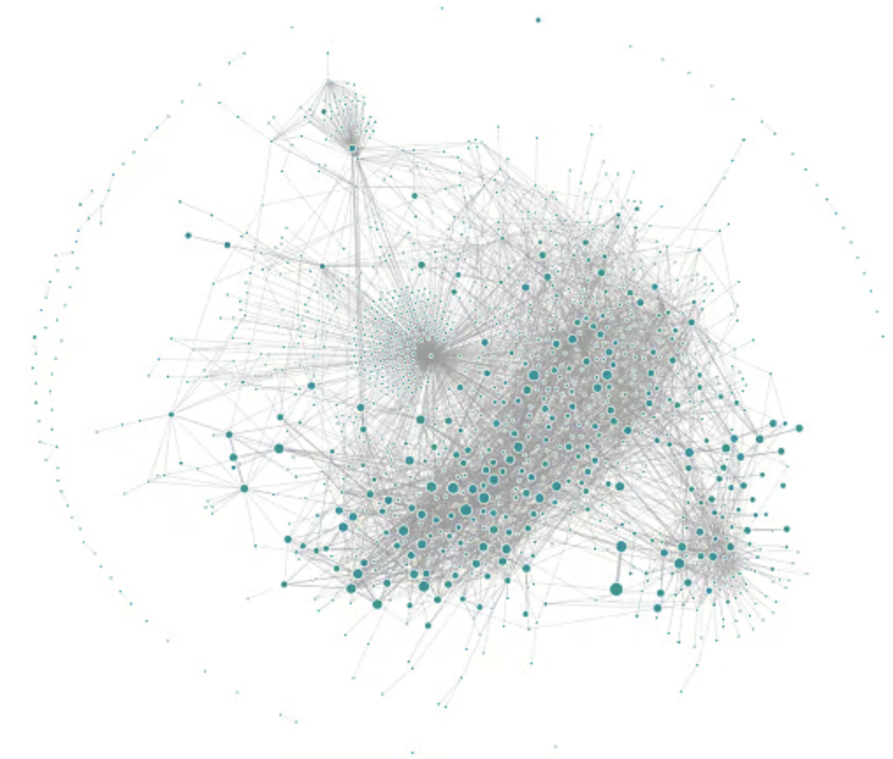

# 9.3.3 Dapper 与链路追踪

Uber 从公开过他们的微服务架构，里面大约有 2,200 个服务，引用内容中的配图，感受扑面而来的复杂。

:::center
   
  图 9-17 Uber 使用 Jaeger 生成的追踪链路拓扑 [图片来源](https://www.uber.com/en-IN/blog/microservice-architecture/)
:::

分布式链路追踪所要做的事情就是解决复杂系统问题排查困难的情况，**它的核心是通过请求粒度的轨迹追踪与数据透传，以实现这种规模下服务之间链路调用的确定性关联**。

分布式链路追踪诞生的标志性事件就是 Google Dapper 论文的发表。2010年4月，Benjamin H. Sigelman 等人在 Google Technical Report 上发表了《Dapper, a Large-Scale Distributed Systems Tracing Infrastructure》[^1]论文，文中详细阐述了 Google 内部分布式链路追踪系统 Dapper 的设计理念，还提出了成为后续链路追踪系统设计共识的两个术语 Trace（追踪）和 Span（跨度）。

## 1. Trace 和 Span

一条 Trace 代表一次入口请求在分布式系统内的完整调用轨迹及其关联数据集合，Span 代表系统中一个逻辑运行单元，Span 之间通过嵌套或者顺序排列建立因果关系。

Span 之内记录着请求在每一跳的接口方法上执行了什么动作、耗时多久、执行状态是成功还是失败，Span 包含的对象如下：

- Operation Name：描述当前接口的行为语义。比如 /api/createOrder 代表执行了一次创建订单的动作。
- SpanId/ParentSpanId：接口调用的层级标识，用来还原 Trace 内部的层调用关系。
- Start/FinishTime：接口调用的开始和结束时间，两者相减是该次调用的耗时。
- StatusCode：响应状态，标识该次调用是成功还是失败。
- Tags & Events：调用附加信息。

每一次 Trace 实际上都是由若干个有顺序、有层级关系的 Span 所组成一颗“追踪树”（Trace Tree），如图 9-18 所示。

:::center
   
  图 9-18 Trace 和 Spans
:::

总结 Dapper 原理就是**在分布式应用的接口方法中设置一些观察点，在入口节点给每个请求分配一个全局唯一的标识 TraceId，当请求流经这些观察点时就会记录一条对应的链路日志（Span），最后通过 TraceId 将一次请求的所有链路日志进行组装，就能还原出该次请求的链路轨迹**。

图 9-19 展示了 Skywalking 链路分析，根据拓扑图中 Span 记录的时间信息和响应结果，我们可以很容易定位到出错或者缓慢的服务。
:::center
   
  图 9-19 Skywalking 链路分析
:::

## 2. 追踪技术的核心

因为链路追踪需要获取更内部的信息，不可避免得侵入业务逻辑代码之中，微服务架构已经集成了多种治理 SDK，再加上链路追踪逻辑，进一步加重了微服务架构的复杂性。

因此，Dapper 论文中提出的链路追踪系统的设计原则须满足以下两个关键条件。

- **应用级透明**：开发者不需要修改业务代码或者仅需要极少的修改即可实现埋点，这意味着追踪逻辑对应用层不可见或者几乎不可见。
- **低开销**：埋点操作对系统的性能影响应当尽可能小，以避免追踪逻辑本身成为系统性能的瓶颈。

保证应用级透明，常见的是使用方法增强（通常也称为埋点），通过某些手段给目标应用注入“追踪探针”解决业务隔离的问题，譬如针对 Java 应用，一般就通过 Java Agent 注入，这种方式被 Zipkin、SkyWalking、Pinpoint 等主流追踪系统广泛采用。

:::tip 探针
探针可以看做是一个寄生在目标服务身上的一个小型微服务系统，它一般会有自己的专用服务注册、心跳检测等功能，有专门的数据收集协议，可以把从目标系统监控得到的服务调用信息，通过另一次独立的 HTTP 或者 RPC 请求发送给追踪系统。
:::

除了方法增强的方案外，还有**基于边车代理的追踪**，这是服务网格的专属方案，也是最理想的分布式追踪模型：
- **边车代理对应用完全透明**：有自己独立数据通道，追踪数据通过控制平面上报，不会有任何依赖和干扰；
- **与程序语言无法**：无论应用采用什么编程语言，只要它通过网络（如 HTTP 或 gRPC）访问服务，就可以被追踪到。

现在，市场占有率最高的 Envoy 就提供了兼容 OpenTelemetry 的追踪功能，通过配置 Istio 的 Telemetry API，OpenTelemetry Collector 会收集 Istio 生成的遥测数据并将其转发到 Prometheus、Jaeger 或任何其他兼容的后端。

## 3. 代表性项目

受 Dapper 思想和协议的影响，市场上开始出现大量的链路追踪项目。

最开始是 Twitter 受到 Dapper 的启发，开发了自己的分布式追踪系统 Zipkin，Zipkin 是第一个被广泛采用的开源的分布式链路追踪系统，提供了数据收集、存储和查询的功能以及友好的 UI 界面来展示追踪信息。2017 年 Uber 在基于 Zipkin 思想和经验的基础上开源了 Jaeger，增加了自适应采样、提供了更加强大和灵活的查询能力等，后来 Jaeger 成为 CNCF 的托管项目，并在 2019年 成为 graduated 级别。

:::center
   
  图 9-19 CNCF 下分布式链路追踪产品生态
:::

除以上两个项目外，国内的工程师应该非常熟悉 Skywalking，这是一款本土开源的调用链分析以及应用监控分析工具，特点是支持多种插件、UI 功能较强、接入端无代码侵入等。

[^1]: 参见《Dapper, a Large-Scale Distributed Systems Tracing Infrastructure》https://research.google/pubs/dapper-a-large-scale-distributed-systems-tracing-infrastructure/
