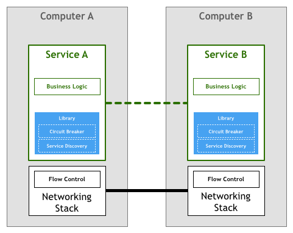
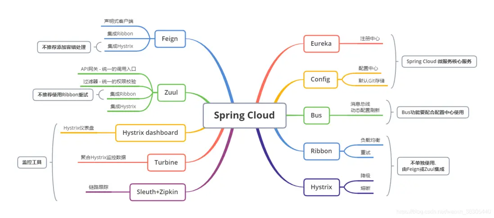

# 8.2 服务间通信的演化

本节，我们回顾计算机通信的历史、服务间通信的演变过程，从中了解服务网格诞生背景，以及解决了什么问题。内容中部分图片来源于 Phil Calçado 的博客，在此统一注明，后面不再单独列出。

## 8.2.1 原始的通信时代

先回到计算机的远古时代。大约在 50 年前，初代的开发人员如果要编写涉及网络的应用，需要在业务代码里处理各类网络通信的细节问题，例如实现可靠连接、超时重传以及拥塞控制等。此类通信逻辑和业务逻辑没有任何关系，但不得不混在一起编写。

为了避免每个应用都需要自己实现一套相似的网络传输处理逻辑，TCP/IP 协议出现了，它将通用的通信控制逻辑从应用代码剥离出来，并将这部分逻辑下沉，成为操作系统网络层的一部分。

:::center
   
  图 8-1 业务逻辑与通信逻辑解耦
:::

从原始的通信时代 TCP/IP 协议的出现中，我们看到这样的变化：基础的、通用的通信逻辑，下沉成为基础设施层，业务与非业务的逻辑解耦。开发应用生产力被解放，于是互联网开始爆发。

## 8.2.2 第一代微服务

TCP/IP 协议出现之后，机器之间的网络通信不再是一个难题，分布式系统开始蓬勃发展。

此时，分布式系统特有的通信语义又出现了，例如熔断策略、负载均衡、服务发现、认证和授权、灰度发布、蓝绿部署以及版本控制等等。

:::center
   
  图 8-2 微服务特有的通信语义又出现了
:::

这个阶段，开发人员除实现业务逻辑之外，还需要根据业务需求来实现所需的通信语义。随着服务规模的扩大，就算最基础的服务发现逻辑也愈加变的复杂。其次，哪怕是同一种开发语言的另外一个应用，上述的微服务基础能力也要再重新实现一遍。

此刻，你是否想到了计算机远古时代前辈们处理网络通信的情形。

## 8.2.3 第二代微服务

为了避免每个服务都需要自己实现一套分布式系统的通信语义，一些面向微服务架构的开发框架出现了，例如 Twitter 的 Finagle、Facebook 的 Proxygen 以及 Spring Cloud 等等。

:::center
   
  图 8-3 第二代微服务框架以 Lib 库的形式封装了分布式系统的通信语义
:::

这些框架实现负载均衡、服务发现等各类分布式系统通用语义，使得开发人员使用较少的框架代码就能开发出健壮的分布式系统，而无需关注底层细节。

## 8.2.4 微服务的痛点显现

第二代微服务模式看似完美，但开发人员很快又发现，它也存在一些本质问题。

- **门槛高**：虽然框架本身屏蔽了通用功能的实现细节，但开发者却要花更多精力去掌握和管理复杂的框架本身。以 SpringCloud 为例，如图 8-5 所示，它的官网上有满满一页实现各类通信功能的技术组件，实际应用中，追踪和解决框架出现的问题绝非易事。

:::center
   
  图 8-5 SpringCloud 全家桶
:::

- **无法跨语言**：框架通常只支持一种或几种特定的语言，回过头来看文章最开始对微服务的定义：一个重要的特性就是和语言无关。那些使用框架不支持的语言编写的服务，则很难融入面向微服务的架构体系。因此，微服务架构所提倡的因地制宜的用多种语言实现不同模块，也就成了空谈。

- **升级困难**：框架以 lib 库的形式和服务联编，复杂项目依赖时的库版本兼容问题非常棘手。同时，框架库的升级也无法对服务透明，服务会因为和业务无关的 lib 库升级而被迫升级。

站在企业组织的角度思考：技术重要还是业务重要？每个工程师都是分布式专家固然好，但又不现实。因此，你会看到业务团队每天处理大量的非业务逻辑，不同的部门反反复复上演同样的技术问题。

## 8.2.5 服务间通信的本质

微服务架构中，**那些需要解决的诸如：服务注册、服务发现、负载均衡、弹性等等问题，本质是实现请求的可靠传递**。整个服务间通信的处理流程上，**无论上述功能如何复杂，请求本身的业务语义与业务内容不会发生任何变化**，微服务架构的技术挑战和业务应用或者服务本身也没有任何关系。

回顾开篇提到的 TCP/IP 协议案例，我们思考是否服务间的通信也能像 TCP 协议栈那样：“人们基于 HTTP 协议开发复杂的应用，无需关心底层 TCP 如何控制包”。如果能把服务间通信剥离并下沉到微服务基础层，工程师也将不再浪费时间编写服务基础设施代码或者管理系统用到的软件库和框架，而是聚焦在业务逻辑处理上。

:::center
   
  图 8-6 将服务间通信剥离并下沉到微服务基础层
:::

## 8.2.6 代理模式的探索

最开始，探路者们尝试过使用代理（Proxy）的方案，例如常见的 Nginx、Haproxy、Apache 等代理。但这种方式和微服务关系不大，功能也简陋。例如使用 Nginx，配置上游、负载均衡等操作还得手动更新。但是它们提供了一个别出新颖的思路：“**在服务器端和客户端之间插入一个中间层，避免两者直接通讯**”。

:::tip 代理模式提供的思路
使用 Nginx 等反向代理，避免服务间直连，所有的流量都必须经过代理，代理来实现通信的必须特性。
:::

受限 Proxy 的功能不足，在参考代理模式的基础上，市场上开始陆陆续续出现 Sidecar 模式的产品。例如 Airbnb 的 Nerve & Synapse，Netflix 的 Prana，这些产品的思路在 Proxy 中对齐原侵入式框架在客户端实现的各类功能，实现上也大量重用了原客户端代码、类库。

:::center
   
  图 8-7 初代 Sidecar 模式的探索
:::

但是，此类 Sidecar 产品存在局限性：它们往往被设计为与特定的基础设施组件配合使用。例如 Airbnb 的 Nerve & Synapse 假设服务在 Zookeeper 中注册，而对于 Prana，应该使用 Netflix 自己的 Eureka 服务注册表，这就只能局限在原有的架构体系中，无法实现通用。

## 8.2.7 第一代服务网格

2016年1月，William Morgan 和 Oliver Gould 在 Github 上发布了 Linkerd 0.0.7 版本。

早期的 Linkerd 借鉴了 Twtter 开源的 Finagle 项目，并重用了大量的 Finagle 代码。

- 逻辑上：Linkerd 将分布式服务的通信抽象为单独一层，在这一层中实现负载均衡、服务发现、认证授权、监控追踪、流量控制等分布式系统所需要的功能。
- 实现上：作为和服务对等的代理服务（Sidecar）和服务部署在一起，接管服务的流量。

Linkerd 开创先河的不绑定任何基础架构或某类体系，实现了通用型，成为业界第一个服务网格项目。同期的服务网格代表产品还有 lyft 公司的 Envoy（Envoy 是 CNCF 内继 Kubernetes、Prometheus 第三个孵化成熟的项目）。

:::center
   
  图 8-8 第一代服务网格产品
:::

## 8.2.8 第二代服务网格

第一代服务网格由一系列独立运行的单机代理服务（Sidecar）构成，但并没有思考如何系统化的管理这些代理服务。为了提供统一的上层运维入口，服务网格继续演化出了集中式的控制面板（Control Plane），所有的单机代理组件通过和控制面板交互进行网络拓扑策略的更新和单机数据的汇报。

典型的第二代服务网格产品以 Google、IBM、Lyft 联合开发的 Istio 为代表。

:::center
   
  图 8-8 增加了 Control Plane 的第二代服务网格
:::

只看单机代理组件（下发浅蓝色的方块）和控制面板（头部深蓝色的方块）的服务网格全局部署如图 8-9 所示，这也是服务网格如此形象命名的由来。

:::center
   
  图 8-9 服务网格的形象示例
:::

至此，见证了 5 个时代的变迁，大家一定清楚了服务网格技术到底是什么，以及是如何一步步演化到今天这样一个形态。

现在，我们回过头重新看 William Morgan 对服务网格的定义。

:::tip 服务网格的定义

服务网格是一个**基础设施层**，用于处理服务间通信。云原生应用有着复杂的服务拓扑，服务网格保证**请求在这些拓扑中可靠地穿梭**。在实际应用当中，服务网格通常是由一系列轻量级的**网络代理**组成的，它们与应用程序部署在一起，但**对应用程序透明**。

:::

再来理解定义中的 4 个关键词：

- **基础设施层+请求在这些拓扑中可靠穿梭**：这两个词加起来描述了服务网格的定位和功能，是否似曾相识？没错，你一定想到了 TCP。
- **网络代理**：描述了服务网格的实现形态。
- **对应用透明**：描述了服务网格的关键特点，正是由于这个特点，服务网格能够解决以 Spring Cloud 为代表的第二代微服务框架所面临的三个本质问题。
