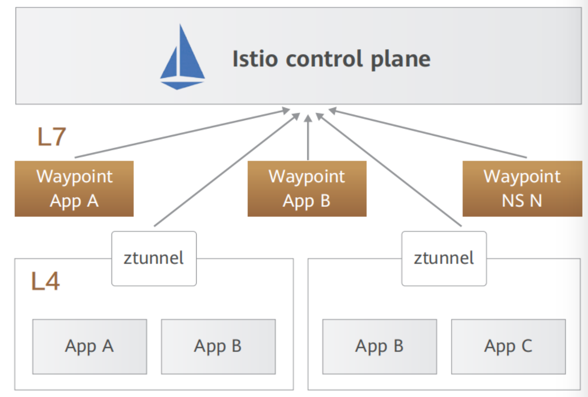
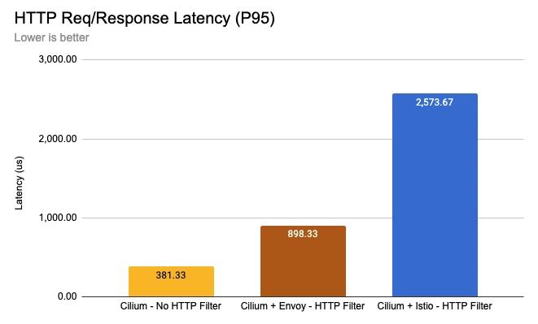

# 8.5 服务网格的未来

服务网格的核心是 Sidecar 本质上是一个网络代理，通过劫持发送到应用容器的流量从而实现对流量的控制。随着服务网格落地实践，Sidecar 的缺点也逐渐被暴露：

- **网络延迟问题**：Sidecar 常规的做法是使用 iptables 实现请求的拦截。服务之间的通信原本是 A->B，现在变成 A->iptables+sidecar->iptables+sidecar->B，调用链的增加也带来了额外的性能损耗。一些服务网格产品的性能测试报告表明，Sidecar 的引入只会增加毫秒级（个位数）延迟。然而，对性能有极高要求的业务场景来说，延迟损耗成为了放弃服务网格最主要的原因。
- **资源占用问题**：Sidecar 作为一个独立的容器必然会占用一定的系统资源，对于超大规模集群，例如有数万 Pod，巨大的基数使得 Sidecar 占用资源总量变成了不小的数目，控制面板向 Sidecar 下发配置的规模也会让 Sidecar 占用的内存剧烈的增长。

考虑解决以上的问题，社区的开发者开始思考：“是否应该将服务网格和 Sidecar 划上等号”，同时也开始探索服务网格形态上的其他可能性。

## 8.5.1 Proxyless 模式

既然问题是代理，那就把代理去掉，这就是 Proxyless（无代理）模式。

Proxyless 模式的设计理念是，服务间通信总是要选择一种协议进行，那么将协议的类库（SDK）扩展，使其具有流量控制的能力，不就能代替 Sidecar 代理了吗？且 SDK 和应用同属于一个进程，必然有更优秀的性能表现，Sidecar 诟病的延迟问题也将迎刃而解。

2021 年 Istio 官方博客发表了一篇文章 《基于 gRPC 的无代理服务网格》，文中介绍了基于 gRPC 实现的一种 Proxyless 模式的服务网格。Proxyless 模式的工作原理如图 8-18 所示，服务网格不再使用代理进行数据面通信，核心的流控能力被集成在 gRPC 库中。但这种方案仍然需要一个 Agent，这个 Agent 通过xDS 协议与控制平面交互，负责告知 gRPC 库如何连接到 istiod、如何获取证书等。

:::center
   
 图 8-18 Proxyless 模式
:::

相比部署独立的 Sidecar 代理实现的服务间通信，Proxyless 模式实现的服务间通信具有性能、稳定性、资源消耗低等明显的优势。从官方博客给出的性能测试报告来看：gRPC Proxyless 模式下的延迟情况接近基准测试，资源消耗也相对较低。

:::center
   
 图 8-18 Proxyless 性能测试报告
:::

不过，回过头再看，所谓 Proxyless 其实和传统的 SDK 并无二致，只是将流控能力内嵌到负责通信协议的类库中，因此它具有和传统 SDK 服务框架相同的缺点。

所以，业内很多人认为 Proxyless 模式本质上是一种倒退，是回归到传统的方式去解决服务间通信的问题。

## 8.5.2 Ambient Mesh 模式

2022 年 9 月 Istio 发布了一个名为 “Ambient Mesh” 的无边车数据平面模型，宣称用户无需使用 Sidecar 代理，就能将网格数据平面集成到其基础设施中，同时还能保持 Istio 零信任安全、遥测和流量治理等特性。

为了避免 Sidecar 种种缺陷，Ambient Mesh 不再为任何 Pod 注入 Sidecar，而是将网格功能的实现进一步下沉到 Istio 的自有组件中。Ambient将原本 Envoy 处理的功能分成两个不同的层次：安全覆盖层（ztunnel）和七层处理层（waypoint），如图 1-28 所示。

- ztunnel（Zero Trust Tunnel，零信任隧道）是 Ambient 新引入的组件，以 Daemonset 的方式部署在每个节点上，处于类似 CNI 网格底层 。ztunnel 为网格中的应用通信提供 mTLS、遥测、身份验证和 L4 授权功能，但不执行任何七层协议相关的处理。
- 七层治理架构中新增了 waypoint 组件，为用户按需启用 L7 功能提供支持，以获得 Istio 的全部功能，例如限速、故障注入、负载均衡、熔断等。

:::center
   
 图 8-19 Ambient Mesh 模式
:::

Ambient Mesh 可以被理解为一种无 Sidecar 模式，但笔者认为将其描述为“中心化代理模式”更为准确，这是因为这种模式侧重于通过共享和中心化的代理进行流量管理，以替代位于应用容器旁边的 Sidecar 代理。

从官方的博客来看，Istio 在过去的半年中一直在推进 Ambient Mesh 的开发，并于 2023 年 2 月将其合并到了 Istio 的主代码分支。这也从一定程度上说明 Istio 未来的发展方向之一就是持续的对 Ambient Mesh 改进并探索多种数据平面的可能性。

## 8.5.3 Sidecarless 模式

2022 年 Cilium 基于 eBPF 技术发布了具有服务网格能力的产品。Cilium 的服务网格产品提供了两种模式：对于 L3/L4 层的能力直接由 eBPF 支持；L7 层能力由一个公共的代理负责，以 DaemonSet 方式部署，如图 8-20 所示。

:::center
   
 图 8-20 Sidecarless 模式
:::

Cilium 认为，内核加上共享型代理的引入可以极大的减少代理的数量，从而降低资源消耗和维护成本，而在内核层面进行通信管理也提高了性能。

基于 eBPF 的服务网格在设计思路上其实和 Proxyless 如出一辙，即找到一个非 Sidecar 的地方去实现流量控制能力，它们一个是基于通信协议类库，一个是基于内核的扩展性。eBPF 通过内核层面提供的可扩展能力，在流量经过内核时实现了控制、安全和观察的能力，从而构建出一种新形态的服务网格。

:::center
   
 图 8-21 Sidecarless 在内核实现流量观察、控制能力
:::

图 8-22 的基准测试，由于 Cilium 中使用无边车模式模式，本身少了一次代理，每一次代理基本会加大 400-500us 左右的延迟，对于延迟要求很高的系统是无法接受的。以及 eBPF 传递数据的 CTX Redirect / CTX Redirect Peer / CTX Redirect Neight 的能力 (eBPF 加速 packet 传递，bypass 内核网络协议栈，不会使用 iptables，加速网络，降低延时) 等。所以性能上 Cilium Service Mesh 是比默认没有任何加速方案的 Istio (基于 iptables 和内核网络栈的方案) 要好很多。

:::center
   
 图 8-22 使用 Cilium Sidecarless 模式及 Istio Sidecar 模式的基准测试 [图片来源](https://isovalent.com/blog/post/2022-05-03-servicemesh-security/)
:::

但同样，软件领域没有银弹，Sidecarless 是取舍后的结果，eBPF 并不是万能钥匙，也存在内核版本要求、编写难度大、安全等方面的问题。

[^1]: 参见 https://istio.io/latest/zh/blog/2021/proxyless-grpc/