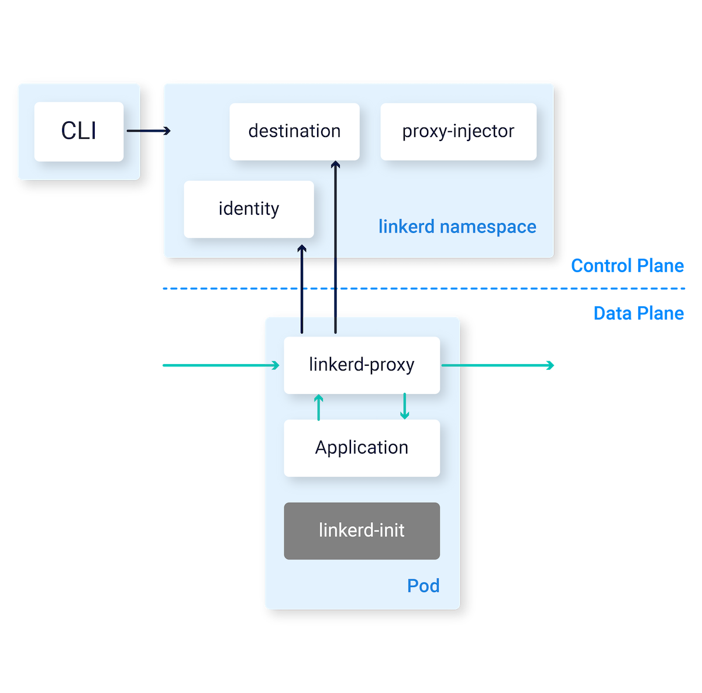

# 8.5 服务网格的产品与生态

2016 年，Buoyant 公司发布了 Linkerd。Matt Klein 离开 Twitter 并加入 Lyft，启动了 Envoy 项目。第一代服务网格稳步发展时，世界另一角落，Google 和 IBM 两个巨头联手，与 Lyft 一起启动了第二代服务网格 Istio。

- 以 Linkerd 为代表的第一代服务网格，通过边车代理控制微服务间的流量；
- 以 Istio 为代表的第二代服务网格，新增控制平面，管理了所有边车代理。于是，Istio 对微服务系统掌握了前所未有的控制力。

依托行业巨头的背书与创新的控制平面设计理念，让 Istio 得到极大关注和发展，并迅速成为业界落地服务网格的主流选择。

## 8.5.1 Linkerd2 出击

在 Istio 受到广泛追捧的同时，服务网格概念的创造者 William Morgan 自然不甘心出局。William Morgan 瞄准 Istio 的缺陷（过于复杂）、借鉴 Istio 的设计理念（新增控制平面），开始重新设计他们的服务网格产品。

Buoyant 公司的第二代服务网格使用 Rust 构建数据平面 linkerd2-proxy ，使用 Go 开发了控制平面 Conduit，主打轻量化，目标是世界上最轻、最简单、最安全的 Kubernetes 专用服务网格。该产品最初以 Conduit 命名，Conduit 加入 CNCF 后不久，宣布与原有的 Linkerd 项目合并，被重新命名为 Linkerd 2[^1]。

Linkerd2 的架构如图 8-13 所示，增加了控制平面，但整体相对简单：
- 控制层面组件只有 destination（类似 Istio 中的 Pilot 组件）、identity（类似 Istio 中的 Citadel）和 proxy injector（代理注入器）；
- 数据平面中 linkerd-init 设置 iptables 规则拦截 Pod 中的 TCP 连接，linkerd-proxy 实现对所有的流量管控（负载均衡、熔断..）。

:::center
   
  图 8-13 Linkerd2 架构及各个组件
:::

## 8.5.2 其他参与者

能明显影响微服务格局的新兴领域，除了头部的 Linkerd2、Istio 玩家外，又怎少得了传统的 Proxy 玩家。

先是远古玩家 Nginx 祭出自己新一代的产品 Nginx ServiceMesh，理念是简化版的服务网格。接着，F5 Networks 公司顺势推出商业化产品 Aspen Mesh，定位企业级服务网格。随后，API 网关独角兽 Kong 推出了 Kuma，主打通用型服务网格。有意思的是，Kong 选择了 Envoy 作为数据平面，而非它自己内核 OpenResty。

与 William Morgan 死磕 Istio 策略不同，绝大部分在 Proxy 领域根基深厚玩家，从一开始就没有想过做一套完整服务网格，而是选择实现 xDS 协议或基于 Istio 扩展，作为 Istio 的数据平面出现。

至 2023 年，经过 8 年的发展，服务网格的产品生态如图 8-14 所示。虽然有众多的选手，但就社区活跃度而言，Istio 和 Linkerd 还是牢牢占据了头部地位。

:::center
   
  图 8-14 CNCF 下 服务网格领域生态
:::

## 8.5.3 Istio 与 Linkerd2 性能对比

2019 年，云原生技术公司 Kinvolk 发布了一份 Linkerd2 与 Istio 的性能对比报告。报告显示，Linkerd 在延迟和资源消耗方面明显优于 Istio[^2]。

两年之后，Linkerd 与 Istio 都发布了多个更成熟的版本，两者的性能表现如何？笔者引用 William Morgan 文章《Benchmarking Linkerd and Istio》[^3]中的数据，向读者介绍 Linkerd v2.11.1、Istio v1.12.0 两个项目之间延迟与资源消耗的表现。

首先是网络延迟的对比。如图 8-15 所示，在中位数（P50）延迟上，Linkerd 在 6ms 的基准延迟基础上增加了 6ms，而 Istio 增加了 15ms。值得注意的是，从 P90 开始，两者的差异明显扩大。在最极端的 Max 数据上，Linkerd 在 25ms 的基准延迟上增加了 25ms，而 Istio 则增加了 5 倍，达到 253ms 的额外延迟。

:::center
   
  图 8-15 Linkerd 与 Istio 的延迟对比
:::

接下来是资源消耗的对比。如图 8-16 所示，Linkerd 代理的最大内存消耗为 26MB，而 Istio 的 Envoy 代理则为 156.2MB，是 Linkerd 的 6 倍。此外，Linkerd 的最大代理 CPU 时间为 36ms，而 Istio 的代理 CPU 时间为 67ms，比前者多出 85%。

:::center
   
  图 8-16 Istio 与 Linkerd 资源消耗对比 
:::

Linkerd 和 Istio 在性能和资源成本上的显著差异，要归因于 Linkerd2-proxy，该代理为 Linkerd 的整个数据平面提供动力。因此。上述基准测试很大程度上反映了 Linkerd2-proxy 与 Envoy 之间的性能和资源消耗对比。

虽然 Linkerd2-proxy 性能卓越，但使用的编程语言 Rust 相对小众，开源社区的贡献者数量稀少。截至 2024 年 6 月，Linkerd2-proxy 的贡献者仅有 53 人，而 Envoy 的贡献者则高达 1,104 人。此外，Linkerd2-proxy 不支持服务网格领域的 xDS 控制协议，其未来发展将高度依赖于 Linkerd 本身的进展。

[^1]: 参见 https://github.com/linkerd/linkerd2
[^2]: 这项测试工作还诞生服务网格基准测试工具 service-mesh-benchmark，以便任何人都可以复核结果。https://github.com/kinvolk/service-mesh-benchmark，以便任何人都可以复核结果。
[^3]: 基于 Kinvolk 模仿现实场景，延迟数据从客户端的角度测量，而不是内部的代理时间。详见 https://linkerd.io/2021/05/27/linkerd-vs-istio-benchmarks/