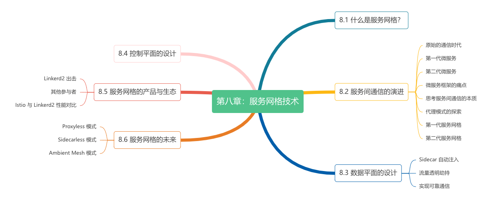

# 第八章：服务网格技术

:::tip <a/>
计算机科学中的所有问题都可以通过增加一个间接层来解决。如果不够，那就再加一层。

:::right
—— by David Wheeler[^1]
:::

Kubernetes 的崛起意味着虚拟化的基础设施，开始解决分布式系统软件问题。但 Kubernetes 管理的最细粒度只能到达容器层次，在此粒度之下的细节仍然需要工程师亲自管理。历经 SOA、微服务架构、云原生架构洗礼的工程师，想必深谙服务发现、容错、路由、限流、加密等问题在分布式系统中是不可回避的。

当要解决上述这类细粒度技术问题，借助容器 Sidecar 模式无疑是最“Kubernetes Native”的方式。**在应用 Pod 内注入对应功能的 Sidecar，显然弥补了 Kubernetes 对服务间通信管控能力不足的缺憾**。利用 Sidecar 把与业务无关的逻辑从应用中剥离，服务间的通信治理也开启了全新的进化，并最终演化出全新基础设施层 —— 服务网格（ServiceMesh）。

本章我们根据服务间通信的演化历程（8.2 节），深刻理解服务网格出现的背景，以及解决的问题。在 8.3 节，了解当前服务网格领域的产品生态（主要介绍 Linkerd 和 Istio）。最后，我们直面服务网格实践中的问题（网络延迟和资源占用问题），讨论解决此类问题的方式，并展望服务网格的未来。本章内容组织如图 8-0 所示。

:::center
   
  图 8-0 本章内容导读
:::

[^1]: David Wheeler 计算机科学的先驱之一，子程序（subroutine）发明者，在数据压缩、安全性和加密领域有杰出的贡献。