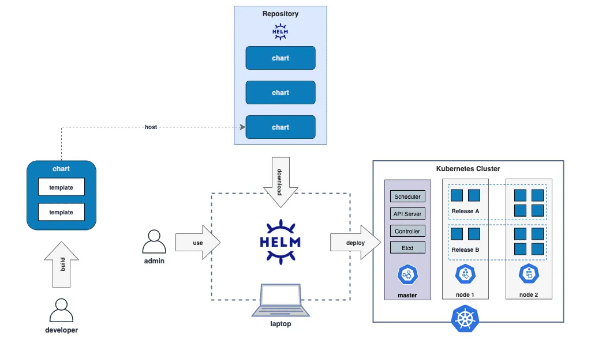

# 10.3.2 Helm 与 Chart

相信读者朋友们知道 Linux 的包管理工具和封装格式，如 Debian 系的 apt-get 和 dpkg，RHEL 系的 yum 和 rpm。在 Linux 系统中，有了包管理工具，我们只要知道应用名称，就能从仓库中下载、安装、升级或回滚。而且，包管理工具掌握应用的依赖和版本信息，应用依赖的第三方库，在安装时都会一并处理好。

Helm 于 2015 年由 Deis（后被 Microsoft 收购）创建，借鉴了各大 Linux 发行版的应用管理方式，引入了与 Linux 包管理对应的 Chart 格式和 Repository 仓库概念。对于用户而言，使用 Helm 无需手动编写部署文件、无需了解 Kubernetes 的 YAML 语法，只需一行命令，即可在 Kubernetes 集群内安装所需应用。

:::center
  <br/>
  图 Helm 的工作原理
:::

Chart 是一个包含描述 Kubernetes 相关资源的文件集合。以官方仓库中 WordPress 应用为例，它的 Chart 目录结构是这样的。

```bash
WordPress
 |—— charts                           // 存放依赖的chart
 ├── templates                        // 存放应用一系列 Kubernetes 资源的 YAML 模板，通过渲染变量得到部署文件
 │     ├── NOTES.txt                  // 为用户提供一个关于 chart 部署后使用说明的文件
 |     |—— _helpers.tpl               // 存放能够复用的模板
 │     ├── deployment.yaml
 │     ├── externaldb-secrets.yaml
 │     └── ingress.yaml
 │     └── ....
 └── Chart.yaml                       // chart 的基本信息（名称、版本、许可证、自述、说明、图标，等等）
 └── requirements.yaml                // 应用的依赖关系，依赖项指向的是另一个应用的坐标（名称、版本、Repository 地址）
 └── values.yaml                      // 存放全局变量，templates 目录中模板文件中用到变量的值
```

以模版目录中的 deployment.yaml 为例，它的内容如下。

```yaml
apiVersion: apps/v1
kind: Deployment
metadata:
  name: {{ .Release.Name }}-nginx
spec:
  replicas: {{ .Values.replicaCount }}
  template:
    spec:
      containers:
      - name: nginx
        image: "{{ .Values.image.repository }}:{{ .Values.image.tag }}"
        ports:
        - containerPort: 80
```
部署应用时，Helm 会先将管理员指定的值覆盖 values.yaml 中的默认值，然后通过字符串替换将这些值传递给 templates 目录中的资源模板，最终渲染为 Kubernetes 资源文件，在 Kubernetes 集群中以 Release 的形式管理。

Release 是 Helm Chart 的运行实例，它将多个 Kubernetes 资源抽象为一个整体，用户无需单独操作每个资源，而是通过 Helm 提供的命令（如 helm install、helm upgrade、helm rollback 等）进行统一管理。


Helm 提供了应用生命周期、版本、依赖项的管理能力，还支持与 CI/CD 流程的集成，强大的功能使它在业内备受瞩目，业内流行的应用纷纷提供 Helm Chart 格式的版本。2020 年，由云原生计算基金会（CNCF）牵头开发的 Artifact Hub，全球规模最大的 Helm 仓库，用户可以在这里找到数以千计的 Helm Charts，一键部署各种应用（如数据库、消息队列、监控工具、CI/CD 系统、日志处理工具）。

不过，需要明确的是，Helm 本质是简化 Kubernetes 应用安装与配置的工具。对于“有状态应用”（Stateful Application）来说，Helm 无法进行精细的生命周期管理。例如，它无法处理数据备份、扩缩容、分区重平衡、动态扩展等操作，这些都是在管理复杂有状态应用时所必须考虑的细节！

如何对复杂有状态应用提供全生命周期的管理，是接下介绍的 Operator 的课题。


