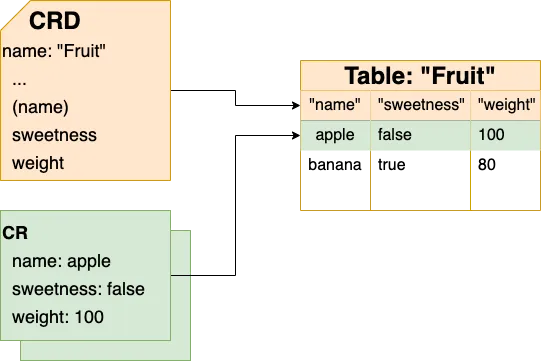

# 10.2 基础设施即数据思想


举个例子，

因此，我们需要做的只是描述想要创建的资源，

```bash
"...基础设施最好的建模方式不是代码，也不是 GUI，而是基于文本的、中立的、数据驱动的策略。"
```

传统上，基础设施是通过各种工具和手动操作来部署和维护的，而 IaD 强调把基础设施的各个方面进行数据化抽象，所有元素都能够以数据的形式被精确地描述。这样的思想还衍生出了 GitOps、管道式的 YAML 操作工具 Kustomize、kpt 等。 


IaD 思想在 Kubernetes 上的体现，就是执行任何操作，只需要提交一个 YAML 文件，然后对 YAML 文件增删查改即可。这个 YAML 文件其实就对应了 IaD 中的 Data。 

上述 Kubernetes，而非传统意义上的分布式系统。

|关系型数据库|Kubernetes (as a database)|说明|
|:--|:--|:--|
|DATABASE|cluster|一套 K8s 集群就是一个 database |
|TABLE| Kind |每种资源类型对应一个表|
|COLUMN|property|表里面的列，有 string、boolean 等多种类型|
|rows|resources|表中的一个具体记录|


Kubernetes 在 v1.7 版本开始支持 CRD（Custom Resource Definitions，自定义资源定义），实质上是允许用户定义自己的资源类型，扩展 Kubernetes API，将复杂的业务需求抽象为 Kubernetes 的原生对象。


:::center
  <br/>
  图 10-10 CRD
:::

加上自定义的“控制器”，那么，各个领域的专家就可以将它们治理数据库、CI/CD、存储、大数据、机器学习、微服务的“能力”移植到 Kubernetes 中，构建出符合未来云计算形态的应用基础设施平台。


至此，相信读者已经理解了：IaD 思想中的 Data 具体表现其实就是声明式的 Kubernetes API 对象，而 Kubernetes 中的控制循环确保系统状态始终跟这些 Data 所描述的状态保持一致。从这一点讲，Kubernetes 的本质是一个以“数据”（Data）表达系统的设定值，通过“控制器”（Controller）的动作来让系统维持在设定值的调谐系统。