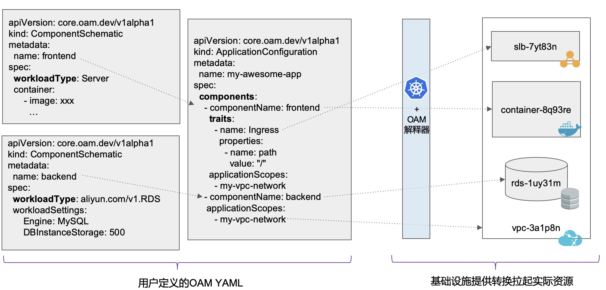

# 10.3.4 OAM 与 KubeVela

2019 年 10 月，阿里云与微软在上海 QCon 大会上联合发布了全球首个开放应用模型（OAM，Open Application Model）。该项目有两个部分：OAM 规范以及 OAM 规范的 Kubernetes 实现。

在 OAM 的规范中，应用由一组具有运维特征（Trait）的组件（Component）组成，并且限定在一个或多个应用边界（Application Scope）内。上述并非是完全抽象的概念，而是可实际使用的自定义资源（CRD）。这些概念的具体含义如下：

- **组件**（Component）：组件定义一个应用包含的待交付制品（二进制、Docker 镜像、Helm Chart...）或云服务。我们认为一个应用部署计划部署的是一个微服务单元，里面主要包含一个核心的用于频繁迭代的服务，以及一组服务所依赖的中间件集合（包含数据库、缓存、云服务等），一个应用中包含的组件数量应该控制在约 15 个以内。
- **运维特征**（Trait）：运维特征是可以随时绑定给待部署组件的、模块化、可拔插的运维能力，比如：副本数调整（手动、自动）、数据持久化、 设置网关策略、自动设置 DNS 解析等。
- **应用边界**（Application Scopes）:定义应用级别的部署特征，比如健康检查规则、安全组、防火墙、SLO、检验等模块。相对于运维特征而言，应用边界作用于一个应用的整体，而运维特征作用于应用中的某个组件。
- **应用**（Application）：将 Component（必需）、Trait（必需）和 Scope（可选）组合并实例化，形成了一个完整的应用描述。

OAM 通过上述自定义资源将原本复杂的 Kubernetes All-in-one 配置进行了一定程度的解耦。应用研发人员负责管理 Component，运维人员将 Component 组合并绑定 Trait，形成 Application。平台或基础设施提供方则负责 OAM 的解释能力，将这些自定义资源映射到实际的基础设施上。各种角色的关注点恰当地分离，不同角色更聚焦更专业的做好本角色的工作。

整个过程如图 10-3 所示。
:::center
   
  图 10-3 OAM 工作原理
:::

KubeVela 是 OAM 规范在 Kubernetes 上的完整实现，它起源于 OAM 社区，由阿里巴巴、微软等技术专家共同维护。

对于平台工程师（Platform Builder）来说，KubeVela 是一个具备无限扩展性的 Kubernetes 原生应用构建引擎。他们负责准备应用部署环境、维护稳定可靠的基础设施，并将这些基础设施能力作为 KubeVela 模块注册到集群中。对于最终用户（End User，研发人员或运维人员）来说，只需选择部署环境、挑选能力模块并填写业务参数，就可以在不同运行环境上把应用随时运行起来！

KubeVela 工作流程如图 10-4。
:::center
   
  图 10-4 KubeVela 工作原理
:::

:::tip 企业落地 Kubernetes 的难题

很多企业落地 Kubernetes 的时候采用了 “PaaS” 化的思路，即在 Kubernetes 之上，开发一个类 PaaS 平台。但这个平台设计理念、模型和使用方式往往都是自己的，这些设计会“盖住” Kubernetes 的能力，使其声明式 API、容器设计模式、控制器模式根本无法发挥原本的实力，也难以与广泛的生态系统对接。

上述问题的直接表现就是，这个 PaaS 系统不具备扩展性。假设我们要满足以下诉求：

- 能不能帮我运行一个定时任务
- 能不能帮我运运行一个 MySQL Operator
- 能不能根据自定义 metrics 定义水平扩容策略
- 能不能基于 Istio 来帮我做渐进式灰度发布

这里的关键点在于，上述能力在 Kubernetes 生态中都是常见且广泛支持的，有些甚至是 Kubernetes 内置功能。但是到了 PaaS 这里，要实现这些能力往往需要重新开发，而且由于先前的设计假设，可能还需要进行大规模的重构。
:::

KubeVela 本质上是在 Kubernetes 上安装了一个 OAM 插件，使平台工程师能够依据 OAM 规范，将 Kubernetes 生态中的各种能力和插件整合成一个应用交付平台。所以说，KubeVela 为最终用户提供了类似 PaaS 的使用体验，同时也为平台工程师带来了 Kubernetes 原生的高可扩展性和平台构建规范。

不过，目前来看，KubeVela 背后的理论还是过于抽象，落地有一定的技术门槛！但 KubeVela 这种构建以”应用为中心“的上层平台的思想，毫无疑问代表着云原生技术未来的发展方向！

[^1]: https://zh.wikipedia.org/wiki/%E4%BF%A1%E6%81%AF%E7%83%9F%E5%9B%B1
