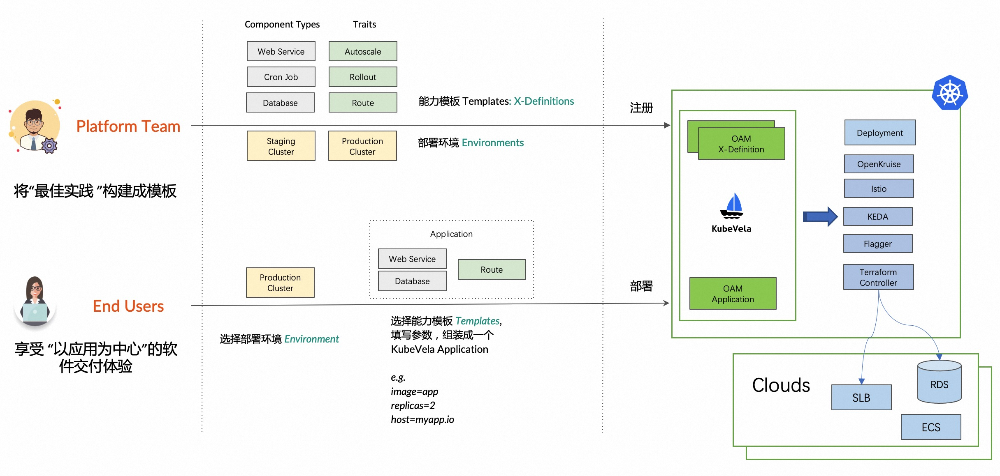

# 10.3.4 OAM 与 KubeVela

2019 年 10 月，阿里云与微软在上海 QCon 大会上联合发布了全球首个开放应用模型（OAM，Open Application Model）。该项目有两个部分：OAM 规范以及 OAM 规范的 Kubernetes 实现。

在 OAM 的规范中，应用由一组具有运维特征（Trait）的组件（Component）组成，并且限定在一个或多个应用边界（Application Scope）内。上述并非是完全抽象的概念，而是可实际使用的自定义资源（CRD）。这些概念的具体含义如下：

- **组件**（Component）：无论是前端还是后端，组件化构建应用的思想屡见不鲜。平台架构师将应用分解成成一个个可被复用的模块、每个组件都具有明确的功能和接口，开发人员通过配置文件填写组件参数、与其他服务的关系。
- **运维特征**（Trait）：与组件绑定的运维行为，比如服务发布、访问、治理、弹性、可观测性、灰度发布等。一个组件可以绑定任意个运维特征。
- **应用边界**（Application Scopes）:定义应用级别的部署特征，比如健康检查规则、安全组、防火墙、SLO、检验等模块。相对于运维特征而言，应用边界作用于一个应用的整体，而运维特征作用于应用中的某个组件。
- **应用**（Application）：将 Component（必需）、Trait（必需）和 Scope（可选）组合并实例化，形成了一个完整的应用描述。

OAM 使用上述自定义资源将原先 Kubernetes All-in-one 的复杂配置做了一定层次的解耦，应用研发人员负责管理 Component，运维人员 Component 组合并绑定 Trait 变成 Application，平台或基础设施提供方提供 OAM 的解释能力，将这些自定义资源映射到实际的基础设施。

整个过程如图所示。
:::center
   
  图 4-0 OAM 应用部署计划
:::

KubeVela 是 OAM 规范在 Kubernetes 上的完整实现，它起源于 OAM 社区，由阿里巴巴、微软等技术专家共同维护。

对于平台工程师（latform Builder）来说，他们按照 OAM 模型，把 Kubernetes 生态中的各种能力，无缝转换为 KubeVela 的能力；而对于最终用户（End User，研发人员或者运维人员）来说，他们选择部署环境、挑选能力模块并填写业务参数，就可以在不同运行环境上把应用随时运行起来！所以说，KubeVela 对最终用户提供媲美 PaaS 的使用体验，又为平台工程师带来 Kubernees 原生的高可扩展性和平台构建规范！

KubeVela 工作流程如下图。
:::center
   
  图 4-0 KubeVela 工作流程
:::

不过，目前来看，KubeVela 背后的理论还是过于抽象，落地有一定的技术门槛！但 KubeVela 这种构建以”应用为中心“的上层平台的思想，无疑代表着云原生技术未来发展的趋向！

[^1]: https://zh.wikipedia.org/wiki/%E4%BF%A1%E6%81%AF%E7%83%9F%E5%9B%B1