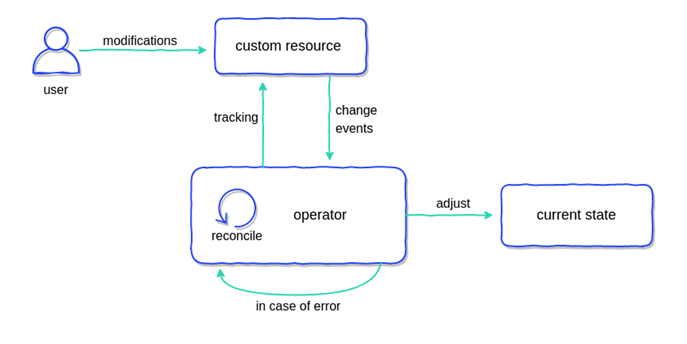

# 10.5 Operator

Operator 其实并不算一个工具，而是为了解决一个问题而存在的一个思路。

由 CoreOS 公司在 2016 年提出。

Operator 属于 Kubernetes 中的高级应用，理解 Operator 所做的工作，需要先弄清楚“有状态服务”和无状态服务的含义。

无状态服务是一种不依赖于之前请求状态来处理新请求的服务。从一个请求到下一个请求，服务不会记住任何信息，每个请求都是独立的，就好像每次服务都是在全新的状态下开始处理一样。它们互相之间没有顺序，也无所谓运行在哪台宿主机上。需要的时候，Deployment 就可以通过 Pod 模板创建新的 Pod；不需要的时候，Deployment 就可以“杀掉”任意一个 Pod。

对应有状态服务，需要考虑的细节就多了。服务运行的实例需要在本地存储持久化数据，比如上面的MySQL数据库，你现在运行在节点A，那么他的数据就存储在节点A上面的，如果这个时候你把该服务迁移到节点B去的话，那么就没有之前的数据了。

容器化应用程序最困难的任务之一，就是设计有状态分布式组件的部署体系结构。


- **有序部署和删除**：StatefulSet 中的 Pod 会按照顺序创建和删除。每个 Pod 都有一个唯一的、持久的网络标识符（通常是 Pod 的名称），这使得它们可以被用作长期服务。
- **稳定的持久化存储**：StatefulSet 确保每个 Pod 都能够挂载一个持久化存储卷，这个存储卷的生命周期独立于 Pod，即使 Pod 被删除或重新创建，存储卷也会保持不变。
- **唯一性和顺序性**：StatefulSet 中的每个 Pod 都有一个唯一的标识（通常是 Pod 名称），并且它们会按照顺序启动和停止。这对于需要严格顺序或唯一性的场景（如分布式数据库的复制集群）非常重要。


假设我们要部署一套 etcd 集群，通常要在 StatefulSet 中定义相当多的细节。比如节点通信端口、环境变量配置、持久化存储、网络策略、安全证书、健康检查等等。

```yaml
apiVersion: apps/v1
kind: StatefulSet
metadata:
  name: etcd
  namespace: default
spec:
  serviceName: "etcd"
  replicas: 3  # etcd 集群的副本数
  selector:
    matchLabels:
      app: etcd
  template:
    metadata:
      labels:
        app: etcd
    spec:
      containers:
        - name: etcd
          image: quay.io/coreos/etcd:v3.5.0  # 替换为适合版本的镜像
          env:
            - name: ETCD_NAME
              valueFrom:
                fieldRef:
                  fieldPath: metadata.name  # 使用 Pod 名作为 etcd 节点名
            - name: ETCD_DATA_DIR
              value: /etcd-data  # 数据存储目录
            - name: ETCD_INITIAL_CLUSTER
              value: "etcd-0=etcd-0.etcd.default.svc.cluster.local:2380,etcd-1=etcd-1.etcd.default.svc.cluster.local:2380,etcd-2=etcd-2.etcd.default.svc.cluster.local:2380"
            - name: ETCD_INITIAL_CLUSTER_STATE
              value: "new"  # 如果是新集群，设置为 'new'
            - name: ETCD_INITIAL_CLUSTER_TOKEN
              value: "etcd-cluster"
            - name: ETCD_LISTEN_PEER_URLS
              value: "http://0.0.0.0:2380"  # 节点间通信的地址
            - name: ETCD_LISTEN_CLIENT_URLS
              value: "http://0.0.0.0:2379"  # 客户端访问的地址
            - name: ETCD_ADVERTISE_CLIENT_URLS
              valueFrom:
                fieldRef:
                  fieldPath: status.podIP  # 将 Pod 的 IP 地址作为客户端访问地址
            - name: ETCD_NAME
              valueFrom:
                fieldRef:
                  fieldPath: metadata.name  # 使用 Pod 名作为 etcd 节点名
          volumeMounts:
            - name: etcd-data
              mountPath: /etcd-data
  volumeClaimTemplates:
    - metadata:
        name: etcd-data
      spec:
        accessModes: ["ReadWriteOnce"]
        resources:
          requests:
            storage: 8Gi  # 每个 Pod 请求的持久化存储大小
---
apiVersion: v1
kind: Service
metadata:
  name: etcd
  namespace: default
spec:
  clusterIP: None  # 使用 None 保证 Pod 可以通过 DNS 名称直接访问
  ports:
    - port: 2379
      name: client
    - port: 2380
      name: peer
  selector:
    app: etcd
---
apiVersion: v1
kind: Service
metadata:
  name: etcd-client
  namespace: default
spec:
  ports:
    - port: 2379
      targetPort: 2379
  selector:
    app: etcd
```


将特定应用程序的操作逻辑编码，


在 Kubernetes 实现容器编排的核心思想中，会使用控制器（Controller）模式对 etcd 里的 API 模型对象变化保持不断的监听（Watch），并在控制器中对指定事件进行响应处理，针对不同的 API 模型可以在对应的控制器中添加相应的业务逻辑，通过这种方式完成应用编排中各阶段的事件处理。而 Operator 正是基于控制器模式，允许应用开发者通过扩展 Kubernetes API 对象的方式，将复杂的分布式应用集群抽象为一个自定义的 API 对象，通过监听 API 对象，实现。


:::center
  <br/>
  图 10-6 使用 Tekton 进行持续集成的流程
:::


- 稳定的标识符：

通过 StatefulSet，最多只能做到安装、基础的运维操作。对于其他高级运维操作，例如升级、扩容、备份、恢复、监控和故障转移，StatefulSet 并不能提供有效的帮助。

Operator 本身在实现上，其实是在 Kubernetes 声明式 API 基础上的一种“微创新”。它合理的利用了 Kubernetes API 可以添加自定义 API 类型的能力，然后又巧妙的通过 Kubernetes 原生的“控制器模式”，完成了一个面向分布式应用终态的调谐过程。


```yaml
apiVersion: operator.etcd.database.coreos.com/v1beta2
kind: EtcdCluster
metadata:
  name: my-etcd-cluster
  namespace: default
spec:
  size: 3
  version: "3.4.15"
  storage:
    volumeClaimTemplate:
      spec:
        accessModes:
          - ReadWriteOnce
        resources:
          requests:
            storage: 8Gi
```

有了 Elasticsearch 自定义资源，相当于 Kubernetes 已经知道了


如果说 Docker 是奠定的单实例的标准化交付，那么 Helm 则是集群化多实例、多资源的标准化交付。Operator 则在实现自动化的同时实现了智能化，

而处于第三方视角的 Operator，则可以解决这个问题。


就是把运维的经验沉淀为代码，实现运维的代码化、自动化、智能化。以往的高可用、扩展收缩，以及故障恢复等等运维操作，都通过 Operator 进行沉淀下来。


现在很多复杂分布式系统都有了官方或者第三方提供的 Operator，从数据库（如 MySQL、PostgreSQL、MongoDB）到消息队列（如 RabbitMQ、Kafka），再到监控系统（如 Prometheus）

这些 Operator 提供了 Kubernetes 集群中各种服务和应用程序的生命周期管理，