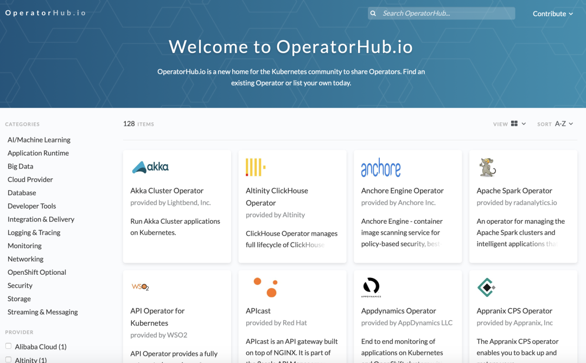

# 10.5 Operator

Operator 的概念由 CoreOS 于 2016 年提出，它并非一个具体的工具或系统，而是一种封装、部署和管理 Kubernetes 应用的方法，尤其适合需要特定领域知识的复杂有状态应用，如数据库、分布式缓存和消息队列等。

理解 Operator 所做的工作，需要先弄清楚“无状态应用”和“有状态应用”的含义。

无状态应用（Stateless Applications）在运行时不依赖特定的状态信息，其实例之间没有区别。Kubernetes 使用 Deployment 编排无状态应用，假设所有 Pod 完全相同，没有顺序依赖，也无需关心运行在哪台宿主机上。相反的，有状态应用（Stateful Applications）每个实例都需要维护特定的状态：
- **拓扑状态**：应用的多个实例之间并非完全对等关系。例如，在“主从”（Master-Slave）架构中，主节点 A 必须先于从节点 B 启动。若 A 和 B 两个 Pod 被删除后重新创建，也需严格遵循这一启动顺序。此外，新创建的 Pod 必须保留与原 Pod 相同的网络标识，以确保现有访问者能够通过原有的访问方式连接到新的 Pod。
- **存储状态**：应用的多个实例分别绑定了独立的存储数据。对于这些实例而言，Pod A 无论是首次读取数据还是在被重新创建后再次读取，所获取的数据都必须保持一致。最典型的例子，就是一个数据库应用的多个存储实例，每个实例需要持久化数据到本地存储，如果实例迁移到了其他节点，服务就无法正常使用。

Kubernetes v1.9 版本引入 StatefulSet 的核心功能就是用某种方式记录这些状态，当有状态应用的 Pod 重建后，仍然满足上一次运行状态的需求。

通过 StatefulSet，有状态应用实现了安装、启动、停止等基础的运维操作。但对于其他高级运维操作，例如升级、扩容、备份、恢复、监控和故障转移，StatefulSet 并不能提供有效的帮助。其次，通过 StatefulSet 管理有状态应用，要定义相当多的配置，比如部署一套 etcd 集群，要设置节点通信端口、环境变量配置、持久化存储、网络策略、安全证书、健康检查等大量细节。


如果使用 Operator，情况就简单得多。Etcd 的 Operator 提供了 EtcdCluster 自定义资源，在它的帮助下，仅用几十行代码，安装、启动、停止等基础的运维操作。但对于其他高级运维操作，例如升级、扩容、备份、恢复、监控和故障转移，如下面代码所示。

```yaml
apiVersion: operator.etcd.database.coreos.com/v1beta2
kind: EtcdCluster
metadata:
  name: my-etcd-cluster
  namespace: default
spec:
  size: 3
  version: "3.4.15"
  storage:
    volumeClaimTemplate:
      spec:
        accessModes:
          - ReadWriteOnce
        resources:
          requests:
            storage: 8Gi
```

Operator 本身在实现上，其实是在 Kubernetes 声明式 API 基础上的一种“微创新”。它利用了 CRD 构建“高层抽象”，又通过 Kubernetes 原生的“控制器模式”，完成了一个面向分布式应用终态的“调谐”过程。

使用 CRD 构建“高层抽象”、使用配套的控制器来维护期望状态，带来的好处远不止使用简单。

就是把运维的经验沉淀为代码，实现运维的代码化、自动化、智能化。以往的高可用、扩展收缩，以及故障恢复等等运维操作，都通过 Operator 进行沉淀下来。


:::center
  <br/>
 图 3-14 operatorhub.io
:::


现在很多复杂分布式系统都有了官方或者第三方提供的 Operator，从数据库（如 MySQL、PostgreSQL、MongoDB）到消息队列（如 RabbitMQ、Kafka），再到监控系统（如 Prometheus）。

这些 Operator 提供了 Kubernetes 集群中各种服务和应用程序的生命周期管理，