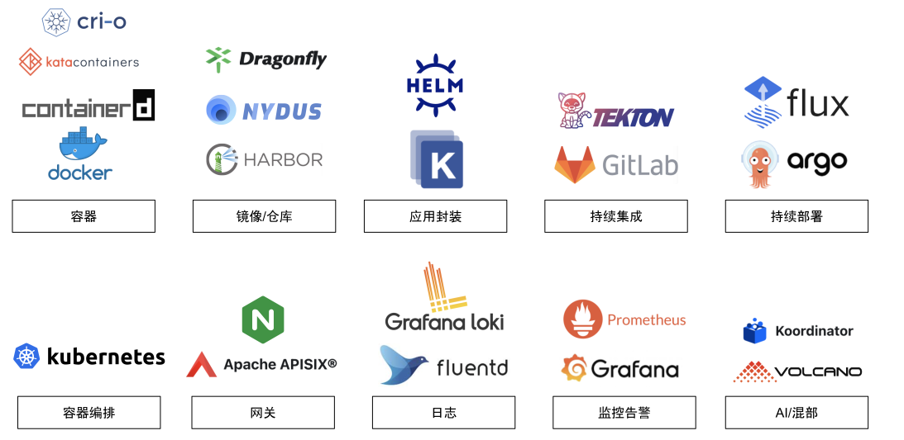

# 1.7 云原生架构技术栈

云原生架构是优雅的、灵活的、弹性的...，但不能否认这些优势的背后是它的学习曲线相当陡峭。

如果你有志投入云原生领域，并希望能构建一个高可用的云原生架构，对能力要求已提升到史无前例的程度。总结来说，云原生实践中除掌握 Docker 和 Kubernetes，如图 1-34 所示，知晓以下几个领域尤佳。

:::center
   
 图 1-34 云原生代表技术栈
:::

1. 容器运行时：Docker、Containerd、CRI-O、Kata Containers。
2. 镜像和仓库：Harbor、Dragonfly、Nydus。
3. 应用封装：Kustomize、Helm。
4. 持续集成：Gitlab、Tekton。
5. 持续部署：ArgoCD、FluxCD。
6. 容器编排：Kubernetes、Koordinator、Volcano。
7. 服务网格: Istio、Envoy、Linkerd。
7. 网关：Ingress-Nginx、Kong、APISIX。
8. 日志：Grafana Loki、Elastic Stack、ClickHouse。
9. 监控：Prometheus、Grafana。
10. 可观测：OpenTelemetry。
10. 机器学习/混合部署：volcano、Koordinator...。

以上方案或相似或不同，适应什么场景、解决了什么问题、方案设计如何权衡，待我在本书后续章节一一道来。

