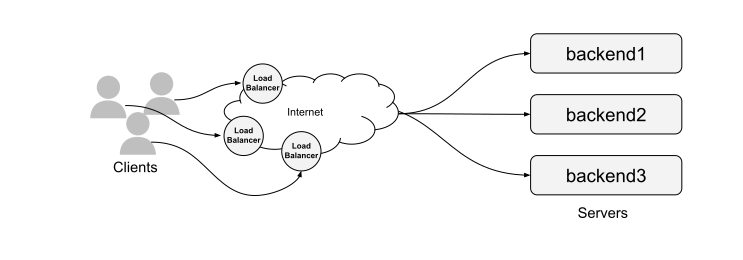
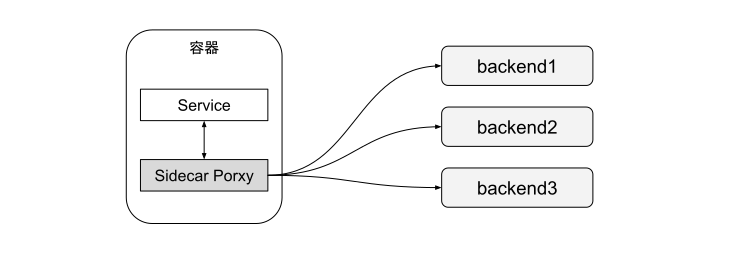

# 4.3 负载均衡部署拓扑

前面介绍了负载均衡高层概览、四层负载均衡与七层负载均衡的区别，接下来介绍四种部署拓扑。注意的是，下面介绍的每种拓扑都适用于四层和七层负载均衡器。

第一种是中间代理型拓扑，如图 4-5 所示。这是最常见的负载均衡部署模式，负载均衡器位于客户端和后端服务器之间，负责将客户端的请求转发至多个后端服务器。具有中间代理拓扑特征的负载均衡产品包括：

- 硬件设备：Cisco、Juniper、F5 Networks 等公司的产品。
- 纯软件方案：Nginx、HAProxy、Envoy、Traefik 等。
- 云软件解决方案：阿里云的 SLB（Server Load Balancer）、AWS 的 ELB（Elastic Load Balancer）、Azure 的 Load Balancer 和 Google Cloud 的 Cloud Load Balancing 等。

总结中间代理型拓扑的优缺点：
- 优点：配置简单，用户只需通过 DNS 连接到负载均衡器，无需关注其他细节。
- 缺点：中间代理存在单点故障风险，尤其是负载均衡器采用集中式设计时。如果负载均衡器出现问题，可能导致整个系统的访问中断。

:::center
   
 图 4-5 中间代理型负载均衡拓扑
:::

第二种边缘代理型拓扑实际上是中间代理型拓扑的一种变种。

一个典型的边缘代理示例是在本书第二章 2.7 节中提到的动态请求“加速”技术。Akamai 在全球多个数据中心部署了多个具有代理功能的边缘节点，用户的请求会被路由至距离最近的边缘节点。边缘节点收到请求后，会执行安全检查（如 DDoS 防护），根据缓存策略决定是否返回缓存内容（CDN 技术），或者将请求继续转发至源服务器（请求加速技术）。

总结边缘代理型拓扑的优缺点：
- 优点：将负载均衡逻辑、缓存、安全策略等集中在网络边缘，能够显著减少延迟，提高响应速度，并增强安全性（如 DDoS 防护）。
- 缺点：尽管边缘代理能够减少单点故障问题，但若某个边缘节点发生故障，仍会影响到该节点所服务的用户。

:::center
   
 图 4-6 网络边缘型负载均衡拓扑
:::

为了解决中间代理型拓扑模式的单点故障问题，出现了更为复杂的解决方案，其中之一是将负载均衡器以 SDK 库的形式嵌入客户端（如图 4-7 所示）。这些 SDK 库包括常见的微服务治理方案，如 Finagle、Eureka、Ribbon 和 Hystrix 等。尽管这些库的功能各有不同，但仍可以总结出它们的共同优缺点：

- 优点：将负载均衡器的功能完全下沉至客户端，避免了单点故障问题。
- 缺点：每种编程语言都需要实现相应的 SDK，而且在项目复杂时，处理版本依赖和兼容性问题将变得非常棘手（微服务框架的相关痛点将在本书第八章 8.2 节中详细讨论，读者可参考本节进一步了解）。

:::center
   
 图 4-7 客户端内嵌库实现负载均衡
:::

客户端内嵌库的一个变种是“边车代理”（sidecar）型拓扑。近年来这一拓扑在微服务架构中变得非常流行，并被称为“服务网格”（service mesh）。

边车代理的核心思想是将流量转发到另一个进程，通过牺牲少量性能（如延迟），实现客户端内嵌库模式的所有优势，同时避免了语言绑定的问题。目前，像 Envoy、Linkerd 等网络型边车代理广泛应用。有关服务网格的技术原理，笔者将在第八章进行详细介绍。

:::center
   
 图 4-8 Sidecar 代理实现负载均衡
:::

总体上讲，中间代理型的负载均衡器正在演变成功能更为强大的“网关”，所有请求通过唯一的入口（即网关）进入集群。这种架构中，作为网关的负载均衡器不仅负责基本的请求转发功能，还负责更高层次的请求管理与安全控制，如 TLS 卸载、请求限制、身份验证，以及复杂的内容路由等。另一方面，针对东西向流量（即服务间通信）的场景，边车代理模式通过将代理部署在服务实例旁边，透明地接管服务间的通信治理，正逐渐取代其他所有的拓扑类型。