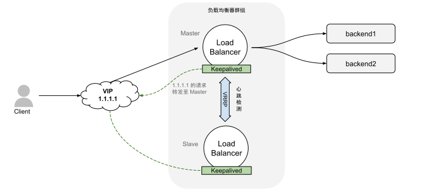

# 6.4 四层负载均衡技术

四层负载均衡器的典型代表是 LVS（Linux Virtual Server，Linux 虚拟服务器），由中国程序员章文嵩于 1998 年开发。

当时，章文嵩在读博士，正处于能熬通宵的年纪，他发现硬件负载均衡器价格昂贵，用了几周时间开发了 LVS（最初称为 IPVS）。2004 年，LVS（IPVS）被纳入 Linux 内核 2.4。从此之后，所有 Linux 系统都具备了变身为负载均衡器的能力。

LVS 的基本原理可以用一句话概述，通过修改 MAC 层、IP 层、TCP 层的数据包，实现一部分交换机和网关的功能，将流量转发至真正的服务器上。这三种数据包修改方式分别对应 LVS 提供的三种工作模式，接下来将详细介绍它们的工作原理。

## 6.4.1 直接路由模式

LVS 的直接路由模式，实际是一种链路层转发技术。

链路层负转发的原理是，负载均衡器（LVS）收到请求后，修改数据帧的目标 MAC 地址，再由交换机转发至某个“后端服务器”。

需要注意的是，后端服务器接收到的数据包中，IP 层的目标地址（即 VIP）并不属于后端服务器的物理网络接口，这些数据包会被丢弃。因此，必须将 VIP 地址绑定到本地回环接口（lo 接口）。

例如，若某个 VIP 地址为 1.1.1.1，可以通过以下命令将该 IP 绑定到后端服务器的 lo 接口：

```bash
$ ip addr add 1.1.1.1/32 dev lo
```

在直接路由模式中，请求通过负载均衡器转发至后端服务器，而后端服务器的响应无需再经过负载均衡器，请求、转发和响应之间形成“三角关系”，因此该模式也被称为“三角传输模式”，如图 6-9 所示。

:::center
  <br/>
 图 6-9 直接路由模式的三角传输示例
:::

直接路由模式优点在于，它特别适合响应流量远大于请求流量的场景。例如，在典型的 HTTP 请求/响应模式中，请求流量可能仅占总流量的 10%，而响应流量占 90%。通过三角传输模式，负载均衡器只需处理 1/10 的总流量。这种设计不仅显著降低了带宽成本，还提升了负载均衡器的可靠性（流量越少、负载越轻、越不容易出现问题）。

当然，直接路由模式也存在明显的缺点：
- **监控功能受限**：由于响应流量直接返回客户端，负载均衡器无法监控完整的 TCP 连接状态，这可能影响防火墙策略的实施。例如，负载均衡器只能捕获 TCP 连接的 SYN 包，而无法跟踪后续的 ACK 包。
- **网络架构要求高**：负载均衡器与后端服务器之间通过链路层通信，因此要求两者位于同一子网内，这对网络拓扑设计提出了较高的要求。

## 6.4.2 隧道模式

在直接路由模式中，请求通过修改链路层的 MAC 地址转发；而在网络层，当然也可以通过修改 IP 数据包实现请求转发。LVS 的隧道模式和 NAT 模式都属于网络层负载均衡，两者的区别是修改 IP 数据包的方式不同。

隧道模式的基本原理是，LVS 创建一个新的 IP 数据包，将原始 IP 数据包作为“负载”（payload）嵌入其中。新数据包随后被三层交换机路由到后端服务器，后者通过拆包机制移除额外的头部，恢复原始 IP 数据包并进行处理。

举一个具体例子，假设客户端（IP 203.0.113.5）向 VIP (1.1.1.1) 发送的数据包如下：
```go
{
  Source IP: 203.0.113.5,
  Destination IP: 1.1.1.1,
  Payload: "Request data"
}
```

负载均衡器收到数据包后，根据调度算法选择一台后端服务器（172.12.1.3），并对数据包进行封装处理。

```go
{
  Source IP: 172.12.1.2,
  Destination IP: 172.12.1.3,
  Payload: {
    Original Source IP: 203.0.113.5,
    Original Destination IP: 1.1.1.1,
    Original Data: "Request data"
  }
}
```

将一个 IP 数据包封装在另一个 IP 数据包内，并配合相应的解包机制，这是典型的 IP 隧道技术。在 Linux 中，IPIP 隧道实现了字面意义上的“IP in IP”。由于隧道模式工作在网络层，绕过了直接路由模式的限制，因此 LVS 隧道模式可以跨越子网进行通信。

如图 6-10 所示，由于源数据包信息完全保留，隧道模式因此也继承了三角传输的特性。

:::center
  <br/>
图 6-10 隧道模式的工作原理
:::


隧道模式可以视为直接路由模式的升级版，支持跨网通信。不过，由于涉及数据包的封装与解封，后端服务器必须支持相应的隧道技术（如 IPIP 或 GRE）。其次，隧道模式继承了三角传输的特性，因此后端服务器也需要处理虚拟 IP（VIP）与 lo 接口的关系。

## 6.4.3 网络地址转换模式

另一种对 IP 数据包的修改方式是**直接修改原始 IP 数据包的目标地址，将其替换为后端服务器的地址**。这种方式被称为“网络地址转换”（NAT）模式，其请求和响应的流程如图 6-11 所示。

:::center
  <br/>
图 6-11 网络地址转换（NAT）模式
:::

举例一个具体的例子，假设客户端（203.0.113.5:37118）请求负载均衡器（1.1.1.1:80），四层负载均衡器根据调度算法挑选了某个后端服务器（10.0.0.2:8080）处理请求。

此时，四层负载均衡器处理请求和响应的逻辑如下：
- 当客户端请求到达负载均衡器时，负载均衡器执行 NAT 操作：
	- 首先是 DNAT（目标地址转换） 操作：将目标 IP 和端口（1.1.1.1:80）改为后端服务器的 IP 和端口（10.0.0.2:8080），这使得**请求能够被路由至指定的后端服务器处理**。
	- 为了保持通信的完整性，负载均衡器还会执行 SNAT（源地址转换）操作。也就是原始源 IP 和端口（203.0.113.5:37118）改为四层负载均衡器的 IP 和端口（1.1.1.1:某个随机端口）。**SNAT 操作确保后端服务器认为请求是来自负载均衡器**，而不是直接来自客户端。
- 当后端服务器返回响应时，负载均衡器执行相反的 NAT 操作:
	- 将源 IP 和端口改回 1.1.1.1:80。
	- 将目标 IP 和端口改回客户端的 203.0.113.5:37118。

最终，客户端请求/接收的都是负载均衡器的 IP 和端口，并不知道实际的后端服务器信息。

从上述可见，网络地址转换模式下，负载均衡器代表整个服务集群接收和响应请求。因此，当流量压力较大时，系统的瓶颈就很容易体现在负载均衡器上。

## 6.4.4 主备模式

到目前为止，我们讨论的都是单个负载均衡器的工作模式。那么，如果负载均衡器出现故障呢？这将影响所有经过该负载均衡器的连接。为了避免因负载均衡器故障导致服务中断，负载均衡器通常以高可用模式进行部署。

图 6-12 展示了最常见的主备模式，其核心在于每台节点上运行 Keepalived 软件，该软件实现了 VRRP（Virtual Router Redundancy Protocol）协议，虚拟出一个对外提供服务的 IP 地址（VIP）。默认情况下，VIP 绑定在主节点（Master）上，由主节点处理所有流量请求。备用节点（Backup）则持续监控主节点的状态，当主节点发生故障时，备用节点会迅速接管 VIP，确保服务不中断。

:::center
  <br/>
  图 6-12 主备模式
:::

主备模式的设计在现代分布式系统中非常普遍，但这种方式存在以下缺陷：

- 在正常运行时，50% 的资源处于闲置状态，备用服务器始终处于空转状态，导致资源利用率低下。
- 现代分布式系统更加注重高容错性。理想情况下，即使多个实例同时发生故障，服务仍应能持续运行。然而，在主备模式下，一旦主节点和备用节点同时发生故障，服务将完全中断。

## 6.4.5 基于集群和一致性哈希的容错和可扩展模式

近些年，业界开始设计全新四层负载均衡系统，其设计目标是：
- 避免传统主备模式的缺点。
- 从依赖厂商的商业硬件方案，转向基于标准服务器和网卡的通用软件解决方案。

如图 6-13 所示，这种设计被称为“基于集群和一致性哈希的容错和可扩展性”（Fault Tolerance and Scaling via Clustering and Distributed Consistent Hashing）。其工作原理如下：

- N 个边缘路由器使用相同的 BGP 权重通告所有 Anycast VIP[^1]，确保同一流（flow）的所有数据包都通过相同的边缘路由器。
- N 个四层负载均衡器使用相同的 BGP 权重向边缘路由器通告 VIP，确保同一流的数据包始终经过相同的四层负载均衡器。
- 每个四层负载均衡器实例通过一致性哈希算法，为每个流选择一个后端服务器。

:::center
  <br/>
  图 6-13 基于集群和一致性哈希的容错和可扩展模式
:::

总结该模式的优点：

- 边缘路由器和负载均衡器实例可以根据需求动态扩展，数据流的转发不受影响。
- 通过预留足够的突发量和容错空间，系统资源的利用率可根据实际需求优化，确保最优配置。
- 无论是边缘路由器还是负载均衡器，都可以基于通用硬件构建，且其成本仅为传统硬件负载均衡器的一小部分。

[^1]: Anycast VIP 是一种通过 Anycast 路由协议分配的虚拟 IP 地址，用于在多个位置部署相同的 IP 地址，并根据路由选择将流量引导到最靠近的或最优的服务器节点。
