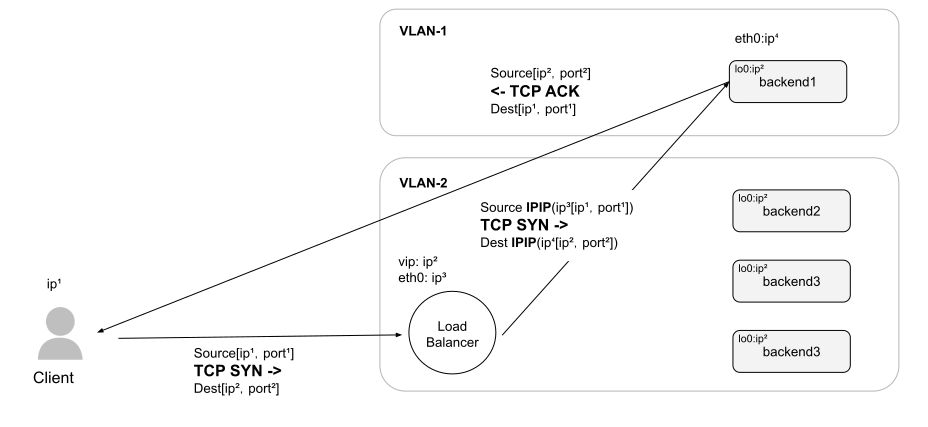
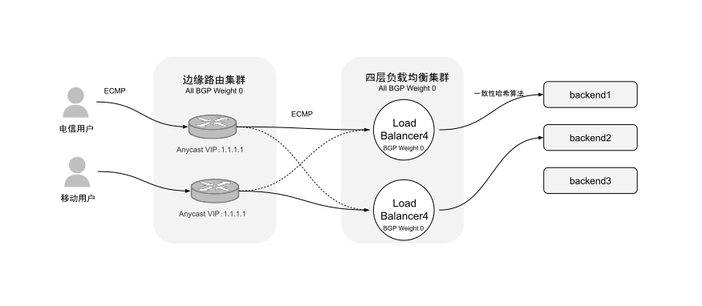

# 6.4 四层负载均衡技术

四层负载均衡器的典型代表是 LVS（Linux Virtual Server，Linux 虚拟服务器），由中国程序员章文嵩于 1998 年发起和开发。

1998 年，还在读博士的章文嵩觉得硬件负载均衡器十分昂贵，于是利用了几周的课余时间，创建并开源了 LVS（当时称为 IPVS）。2004 年，LVS（IPVS）被纳入了 kernel 2.4，从此之后，所有 Linux 系统都具备了变身为负载均衡器的能力。

LVS 的基本原理可以用一句话概述，通过修改 MAC 层、IP 层、TCP 层的数据包，实现一部分交换机和网关的功能，将流量转发至真正的服务器上。LVS 修改数据包的方式，让它有了三种工作模式，直接路由（DR，Direct Routing）模式、隧道（Tunnel）模式和网络地址转换（NAT，Network Address Translation）模式。

## 6.4.1 直接路由模式

LVS 的直接路由模式，实际是一种链路层负载均衡技术。

链路层负载均衡的原理是，负载均衡器（LVS）收到请求后，修改数据帧的目标 MAC 地址，再由交换机转发至某个“后端服务器”。

后端服务器接收到数据帧时，其 IP 层目标地址（该地址称 VIP）并不直接属于后端服务器的物理网络接口，会丢弃这些数据包。因此，还需要将 VIP 地址绑定到本地回环接口（lo 接口）。

如某个 VIP 为 1.1.1.1，通过以下命令将该 IP 绑定到后端服务器的 lo 接口：

```bash
// 这里 /32 表示单个 IP 地址，也即仅将 VIP 绑定到 lo 接口，不与其他 IP 地址共享子网。
$ ip addr add 1.1.1.1/32 dev lo
```

之后，后端服务器的网络协议栈会认为 1.1.1.1 是“本地可用地址”，从而正常接收和处理这些数据包。

在直接路由模式中，请求通过负载均衡器转发至后端服务器，而后端服务器的响应无需再经过负载均衡器，请求、转发和响应之间形成“三角关系”，因此该模式也被称为“三角传输模式”，如图 4-9 所示。

:::center
  <br/>
 图 4-9 直接路由模式的三角传输示例
:::


直接路由模式的主要优势在于，它特别适合响应流量远大于请求流量的场景。例如，在典型的 HTTP 请求/响应模式中，请求流量可能仅占总流量的 10%，而响应流量占 90%。通过三角传输模式，负载均衡器只需处理 1/10 的总流量。这种设计不仅显著降低了带宽成本，还提升了负载均衡器的可靠性，因为流量减少意味着负载更轻。

当然，直接路由模式也存在一些明显的缺点：
- 监控限制：由于响应流量直接返回客户端，负载均衡器无法监控完整的 TCP 连接状态，这可能影响防火墙策略的实施。例如，负载均衡器只能捕获 TCP 连接的 SYN 包，而无法跟踪后续的 ACK 包。
- 网络架构要求：负载均衡器与后端服务器之间通过链路层通信，因此要求两者位于同一子网内，这对网络拓扑设计提出了较高的要求。

## 6.4.2 隧道模式

在直接路由模式中，请求通过修改链路层的 MAC 地址转发；而在网络层，可以通过修改 IP 数据包实现请求转发。LVS 的隧道模式和 NAT 模式都属于网络层负载均衡，区别在于修改 IP 数据包的方式不同。

隧道模式的基本原理是，LVS 创建一个新的 IP 数据包，将原始 IP 数据包作为“负载”（payload）嵌入其中。新数据包随后被三层交换机路由到后端服务器，后者通过拆包机制移除额外的头部，恢复原始 IP 数据包并进行处理。

举一个具体例子，假设客户端（IP 203.0.113.5）向 VIP (1.1.1.1) 发送的数据包如下：
```go
{
  Source IP: 203.0.113.5,
  Destination IP: 1.1.1.1,
  Payload: "Request data"
}
```

负载均衡器收到数据包后，根据调度算法选择一台后端服务器（172.12.1.3），并对数据包进行封装处理。

```go
{
  Source IP: 172.12.1.2,
  Destination IP: 172.12.1.3,
  Payload: {
    Original Source IP: 203.0.113.5,
    Original Destination IP: 1.1.1.1,
    Original Data: "Request data"
  }
}
```

将一个 IP 数据包封装在另一个 IP 数据包内，并配合相应的解包机制，这是典型的 IP 隧道技术。在 Linux 中，IPIP 隧道实现了字面意义上的“IP in IP”。由于隧道模式工作在网络层，绕过了直接路由模式的限制，因此 LVS 隧道模式可以跨越子网进行通信。

隧道模式的请求与响应过程如图 4-10 所示。由于源数据包信息完全保留，隧道模式继承了三角传输的特性。

:::center
  <br/>
图 6-10 隧道模式的工作原理
:::

隧道模式可以看作是直接路由模式的升级，支持跨网通信：
- 由于需要封装和解封数据包，后端服务器必须支持某些隧道技术（如 IPIP、GRE）。
- 在三角模式下，必须确保后端服务器的 lo 接口与负载均衡服务器具有相同的虚拟 IP 地址。这是因为，在响应客户端的数据包时，必须使用 VIP 作为源地址，确保客户端能够正确处理返回的数据。

## 6.4.3 网络地址转换模式

另一种对 IP 数据包的修改方式是**直接修改原始 IP 数据包的目标地址，将其替换为后端服务器的地址**。

相信大多数读者都曾操作过类似的配置，如在家中设置路由器时，你希望外部设备可以访问家中某台运行服务器的电脑。假设家中的电脑 IP 是 192.168.1.100，并在端口 8080 上运行一个 Web 服务。你可以在路由器中设置端口转发（NAT），将外部访问路由器的 80 端口的请求转发到该电脑的 192.168.1.100:8080。这样，当外部设备通过路由器的公共 IP 访问 80 端口时，实际上就会连接到局域网内的服务器。

**四层负载均衡器对 IP 数据包的改写与路由器中的“端口转发”原理相同**。因此，这种负载均衡方式被称为“网络地址转换”（NAT）模式，其请求和响应的流程如图 6-11 所示。

:::center
  <br/>
图 6-11 网络地址转换（NAT）模式
:::

举例一个具体的例子，假设客户端（203.0.113.5:37118）请求负载均衡器（1.1.1.1:80），四层负载均衡器根据调度算法挑选了某个后端服务器（10.0.0.2:8080）处理请求。

此时，四层负载均衡器处理请求和响应的逻辑如下：
- 当客户端请求到达负载均衡器时，负载均衡器执行 NAT 操作：
	- 首先是 DNAT（目标地址转换） 操作：将目标 IP 和端口（1.1.1.1:80）改为后端服务器的 IP 和端口（10.0.0.2:8080），这使得**请求能够被路由至指定的后端服务器处理**。
	- 为了保持通信的完整性，负载均衡器还会执行 SNAT（源地址转换）操作。也就是原始源 IP 和端口（203.0.113.5:37118）改为四层负载均衡器的 IP 和端口（1.1.1.1:某个随机端口）。**SNAT 操作确保后端服务器认为请求是来自负载均衡器**，而不是直接来自客户端。
- 当后端服务器返回响应时，负载均衡器执行相反的 NAT 操作:
	- 将源 IP 和端口改回 1.1.1.1:80
	- 将目标 IP 和端口改回客户端的 203.0.113.5:37118

最终，客户端请求/接收的都是负载均衡器的 IP 和端口，并不知道实际的后端服务器信息。

从上述可见，网络地址转换模式下，负载均衡器代表整个服务集群接收和响应请求。因此，当流量压力较大时，系统的瓶颈就很容易体现在负载均衡器上。

## 6.4.4 主备模式

到目前为止，我们讨论的都是单个负载均衡器的工作模式。那么，如果负载均衡器出现故障呢？这将影响所有经过该负载均衡器的连接。为了避免因负载均衡器故障导致服务中断，负载均衡器通常以高可用模式进行部署。


图 6-12 展示的是最常见的主备模式，其核心是每台节点上运行 Keepalived 软件。该软件实现了 VRRP（Virtual Router Redundancy Protocol）协议，虚拟出一个对外服务的 IP 地址（VIP）。该 VIP 默认绑定在主节点（Master）上，由主节点处理所有流量请求。备用节点（Backup）则持续监控主节点的状态，并在主节点发生故障时迅速接管 VIP，从而确保服务不中断。

:::center
  <br/>
  图 6-12 主备模式
:::

主备模式的设计在现代分布式系统中非常普遍，但这种方式也存在以下缺陷：

- 在正常运行时，50% 的资源处于闲置状态，备用服务器始终处于空转状态，导致资源利用率低下。
- 现代分布式系统更加注重高容错性。理想情况下，即使多个实例同时发生故障，服务仍应能持续运行。然而，在主备模式下，一旦主节点和备用节点同时发生故障，服务将完全中断。

## 6.4.5 基于集群和一致性哈希的容错和可扩展模式

近些年，大型互联网基础设施系统开始设计和部署全新的大规模并行四层负载均衡系统。这些系统的设计目标是：
- 避免主备模式的缺点。
- 从厂商的商业硬件方案，迁移至基于标准服务器和网卡的通用软件方案。

如图 6-13 所示，这种设计被称“基于集群和一致性哈希的容错和可扩展”（fault tolerance and scaling via clustering and distributed consistent hashing）。它的工作原理如下：

- N 个边缘路由器使用相同的 BGP 权重通告所有 Anycast VIP。通过 ECMP（Equal-cost Multi-path Routing）确保同一流（flow）的所有数据包都经过相同的边缘路由器。一个流通常由 4 元组（源 IP/端口和目的 IP/端口）组成。简而言之，ECMP 是一种通过一致性哈希将流量均匀分发到多台权重相同的路由器的机制。虽然边缘路由器通常不关心每个数据包的具体去向，但它们希望同一流的所有包始终走相同路径，以避免因乱序而导致性能下降。
- N 个四层负载均衡器使用相同的 BGP 权重向所有边缘路由器通告所有 VIP。通过 ECMP，边缘路由器确保相同流（flow）的数据包始终选择相同的四层负载均衡器。
- 每个四层负载均衡器实例，使用一致性哈希算法为每个流（flow）选择一个后端。

:::center
  <br/>
  图 6-13 基于集群和一致性哈希的容错和可扩展模式
:::

综合上述，来看一致性哈希容错模式是如何避免主备方式的缺陷的：
- 边缘路由器和负载均衡器实例可以根据需求动态扩展。每一层都使用 ECMP，确保新实例加入时，受影响的数据流（flow）最小化。
- 在预留足够的突发量和容错空间的基础上，系统的资源利用率可以根据需求达到最优水平。
- 无论是边缘路由器，还是负载均衡器均可基于通用硬件构建，其成本仅为传统硬件负载均衡器的一小部分。

目前，绝大部分的现代四层负载均衡系统都在朝着这种设计演进。 