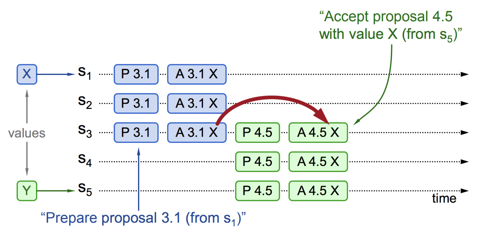
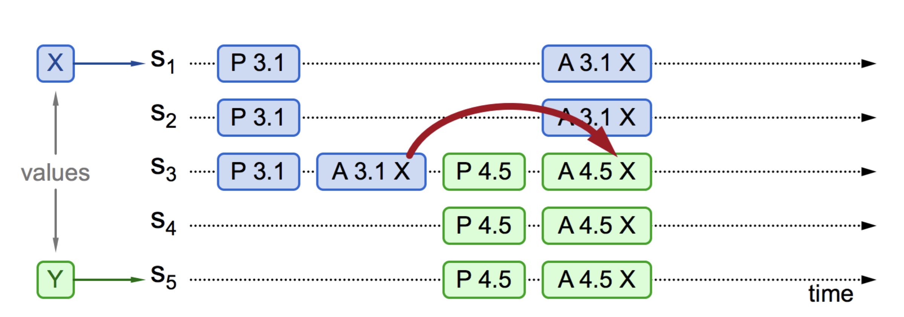

# 6.3.2 Paxos 算法

希望你没有对前篇 Paxos 的“复杂”做的铺垫所吓倒，共识问题已经算是一个古老的领域，30 余年间已经有无数简洁直白的视频、论文等资料进行过解读。网络中流传甚广的 raft 和 paxos 视频讲解[^1]，即使没有多少技术背景，也能通俗地理解 Paxos。


## 1. Paxos 算法背景

在 Paxos 算法中，节点分为三种角色。

- **提议者（Proposer）**：提议者是启动共识过程的节点，它提出一个值，并请求其他节点对这个值进行投票，提出值的行为被称为“提案"（Proposal）。注意的是，Paxos 算法是一个典型的为“操作转移”模型设计的算法，为简化表述，本文把提案类比成“变量赋值”操作，但你应该理解它是“操作日志”相似的概念，后面介绍的 Raft 算法中，直接就把“提案”称做“日志”了。
- **决策者（Acceptor）**：接受或拒绝 Proposer 的提案，如果一个提案被超过半数的 Acceptor 接受，那提案意味着被“批准”（accepted）。提案一旦被批准，意味着在所有节点中达到共识，便不可改变、永久生效。
- **记录者（Learner）**：记录者发不起提案，也不参与决策提案，但它们需要学习并知道哪些提案被接受作为最终决策。

在 Paxos 算法中，节点都是平等的，它们都可以承担一种或者多种角色。例如，一个节点即可发起提案，也可以就一个提案进行表决，但为了Quorum 的计算更加明确，表决提案的角色最好要有奇数个。

Paxos 是基于 Quorum 的算法，仅依靠“数服从多数原则”，一定会遇到提案冲突的问题。如图 6-5 所示，S~1~ 看到其他服务器没有接受某个值，之后提出 red 值。S~5~ 也没有看到其他服务器接受某个值，于是提出 blue 值。它们的提案 Quorum 都达成了，也就是说一个提案有两个值选中，这显然破坏了一致性原则。

:::center
   <br/>
  图 6-5 网络延迟导致冲突
:::

注意，你会发现矛盾点在于 S~3~，S~3~ 是两个多数派中的交集点，它的时间线上有两个不同的值被选中，这实际上是一个“并发”操作问题。

我们知道，程序设计中的一个基本常识是：并发操作一个共享变量，一定要加上互斥锁，不然会出现各种意外情况。所以，S~3~ 的问题本质是：“在分布式环境下并发操作共享变量”。

但我们不能简单“套用”进程加锁的方式，分布式环境下可能随时会出现通信故障，如果一个节点获得锁之后，释放锁之前故障了，那么整个系统都会被无限期等待阻塞。因此，必须提供一种可供其他节点抢占锁的机制，避免因通信故障出现的死锁问题。分布式抢占锁的设计思想和 5.4.2 节提到的“乐观锁”有“异曲同工之妙”。回顾乐观锁的示例 SQL，WHERE 条件的作用是判断在它操作之前，数据是否被修改。如果修改过，则请求最新的数据，更新版本号，然后用重试的方式再次修改。

```SQL
UPDATE accounts 
SET balance = balance + ?, 
    version = version + 1 
WHERE id = ? AND version = ?;
```

我们延续“乐观锁”的思路，我们讨论图 6-7 所示的因延迟导致的冲突如何解决。S~1~ 发起提案，S~3~ 收到 S~1~ 提案时，应该意识到 blue 的 Quorum 达成，S~1~ 的提案 red 太老。所以，为了提案达成一致，S~1~ 应该更新提案，把 red 修改为 blue（相当于乐观锁中的操作失败，请求最新数据），然后再次重试。


## 2. Paxos 算法描述

相信通过以上铺垫，你已经具备了足够的前置知识来理解 Paxos 算法。简而言之，Paxos 算法本质上是一个支持多次提案的二阶段提交协议。

Paxos 算法的第一个阶段称“准备阶段”（Prepare）。该阶段相当于提案的抢占，Proposer 选择一个提案编号 $\mathit{n}$（通常是单调递增的数字，相当于乐观锁中的 version，更高的编号意味着更高的优先级），向所有的 Acceptor 广播一个许可申请（称为 $\mathit{Prepare(n)}$ 请求），如果 Acceptor ：
- 尚未承诺 $\mathit{≥n}$ 编号的提案：则“承诺”（promise）不再接受任何编号小于 𝑛 的提案，返回一个响应，其中包含承诺的提案编号以及对应的提案值（如果有）；
- 已承诺 $\mathit{≥n}$ 编号的提案：拒绝当前的 Prepare 请求，不返回任何响应。

Proposer 从多数（Quorum）Acceptor 获得了“承诺”（Promise），则“准备阶段”达成。接着，Proposer 选择提案值：如果 Acceptor 的响应中返回了提案值，从中选择编号最高的提案值；如果没有返回的提案值，则使用 Proposer 自己设定的初始提案值。

完成以上操作后，Proposer 进入下一个阶段。

Paxos 算法的第二个阶段称“批准阶段”（Accept）。在该阶段，Proposer 向所有 Acceptor 广播一个批准申请（称为 $\mathit{accept(n, v)}$ 请求），请求批准：“提案编号 $\mathit{n}$ 提案值 $\mathit{v}$”。如果 Acceptor 发现提案编号 不小于它已承诺的最大编号，则“批准”（accepted）该提案；否则，Acceptor 拒绝该提案。当多数（Quorum）的 Acceptor 批准提案时，Proposer 认为本轮提案成功。一旦提案成功，Proposer 会将最终的决议广播给所有 Learner 节点，供它们学习并记录最终结果。

:::center
   <br/>
  图 6-8 Basic Paxos 流程
:::

## 3. Paxos 算法验证

Paxos 难以理解是指其推导过程复杂，证明 Paxos 的正确性比重新实现 Paxos 算法还难。我们没必须推导 Paxos 的正确性，通过以下几个例子来验证 Paxos 算法的运行机制。

假设有五个节点 S~1~、S~2~、S~3~、S~4~、S~5~，其中 S~1~、S~5~ 扮演 Proposer，它们同是又都是 Acceptor 角色。我们根据上述 Paxos 的二阶段算法，分析它们就一个“提案选取值 X 还是 Y ”进行决议，会出现什么情况。

**情况一：提案已达成**，假设 S~1~ 选定提案编号 3.1（节点编号加上自增 ID），优先取得了多数 Acceptor 的 Promise 和 Accepted 应答。另外，S~5~ 选定提案编号 4.5，广播 Prepare 消息，收到的应答中至少会包含 1 个此前应答过 S~1~ 的 Acceptor，假设是 S~3~，那么 S~3~ 的响应 Promise 中必将包含 S~1~ 已设定好的值 X。那么，S~5~ 就必须无条件地用 X 代替 Y 作为自己提案的值，由此整个系统对“取值为 X”这个事实达成一致。整个流程如下图所示。

:::center
   <br/>
  图 6-9 提案已 Chosen，P 代表 “Prepare 阶段”，A 代表“Accept 阶段”
:::

**情况二：事实上，对于情况一，也就是“取值为 X”并不是一定需要多数派批准，S~5~ 提案时 Promise 应答中是否包含了批准过 X 的 Acceptor 也影响决策**。例如。图 6-3 所示，S~5~ 广播 Prepare 请求，X 并未获得多数派批准，但由于 S~3~ 已经批准的关系，最终共识的结果仍然是 X。

:::center
   <br/>
  图 6-10 提案未 Chosen，Proposer 可见
:::

**情况三：另外一种可能得情况是 S~5~ 提案时 Promise 应答中并未包含批准过 X 的决策节点**。例如 S~5~ 提案期间，节点 S~2~ 、S~3~ 返回 Promise 应答，节点 S~1~ 批准了 X。此时，S~5~ 以更大的提案 ID 获得了 S~3~、S~4~、S~5~ 的 Promise，这 3 个节点均未批准过任何值。那么，因为 S~1~ 提案编号已经不是最大的了，S~3~ 将拒绝 S~1~ 的 Accept 请求，这 3 个节点将批准 Y 的取值，整个系统最终对“取值为 Y”达成一致，如下图所示。

:::center
   <br/>
  图 6-11 提案未提交，Proposer 不可见
:::

**情况四：从情况三可以推导出另一种极端的情况，如果 2 个提案节点交替使用更大的提案编号使得“准备阶段成功，但是批准阶段失败”的话，这个过程理论上可以无限持续下去，形成活锁**。例如，S~3~、S~4~、S~5~ 拿着更高的提案编号导致 S~1~、S~2~、S~3~ 的 accept 阶段失败重新发起的 Prepare 阶段，又把 S~3~、S~4~、S~5~ 给拒绝了，Proposer 没有看到先前提议的情况下，当 S~1~ 发现自己的提议没有通过，就会发起新一轮 Prepare RPC，然后就有可能又封锁了 S~5~ 的提议，S~5~ 又会回到 Prepare 阶段，有概率双方都轮流封锁对方的协议，导致无法达成共识。

:::center
   <br/>
  图 6-12 出现活锁问题
:::

在计算机工程领域解决这个问题并复杂，随机化重试时间减少这种巧合发生，或者把重试的时间指数增长等等。

Paxos Basic 的价值在于扩展了分布式共识算法的发展思路，但它有以下缺陷：只能对一个值形成决议，而且决议形成至少需要两次网络来回，高并发情况还有可能形成活锁，因此 Basic Paxos 几乎只是用来做理论研究，并不直接应用在实际工程中。

[^1]: 讲解作者是斯坦福教授 John Ousterhunt，他还指导了 Diego Ongaro 写出了 Raft 的论文。本章配图也多来源于 John Ousterhunt 所发表的内容。
[^2]: 参见 https://lamport.azurewebsites.net/pubs/time-clocks.pdf
