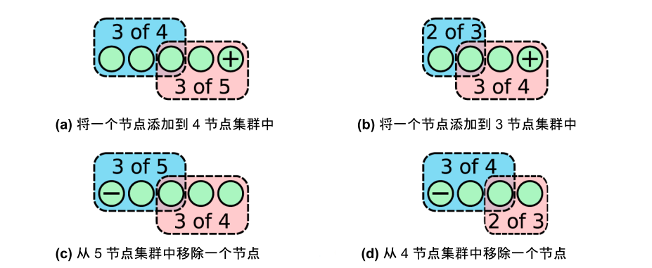

# 6.3.3 成员变更

生产环境中，有很多集群节点变更的情况，譬如服务器故障需要移除副本、集群扩容增加副本等等。如果 Leader 选举过程中，集群成员变更了怎么办？

停机，是最简单的办法。但一个为容错而生的算法，使用终止服务的方式，岂不是

先假设有这么个 **configuration（配置）** 来管理所有的成员信息。

:::tip 配置
配置是成员变更中的一个重要概念，用于说明集群由哪些节点组成。如图 6-21，由 Server 1、Server 2、Server 3 组成的集群**配置**就是 [Server1、Server2、Server3] 集合。
:::

你可能会想到把“配置”当成 Raft 中的“特殊日志”。由此，成员动态变更的问题不就变成了**配置日志一致性问题么？**。

但成员变更有个特殊性，如果处理方式不当，可能会导致两个多数派（变更前的多数派 C~old~（旧配置）和变更的多数派 C~new~（新配置））之间不存在相交的成员，产生两个 Leader 在各自认为的“多数派”中工作的问题。

假设当前 Raft 集群由 Server1（Leader）、Server2 和 Server3 组成，配置称为 C~old~。现在我们计划增加两个副本，扩展为由 Server1、Server2、Server3、Server4 和 Server5 组成的新集群，新的配置称为 C~new~。

由于网络延迟等原因，无法保证各节点同时从 C~old~ 切换到 C~new~。假设成员变更的过程中，节点 Server1 和 Server2 发生了网络分区故障：
- 节点 Server1 维护的是 C~old~，那么节点 Server1 依旧是 Leader。
- 其他节点已经变更为 C~new~，触发选举，并成功选出一个新的 Leader。

一个集群有两个 leader（也就是脑裂），有可能在一个日志索引上会提交两个不同的日志项，破坏了 Raft 的安全性。

:::center
    
  图 6-21 成员变更的某一时刻 C~old~ 和 C~new~ 中同时存在两个不相交的多数派
:::

最初，Diego Ongaro 在论文中提出了一种基于两阶段的联合共识（Joint Consensus）成员变更方法，但这种方式实现起来很复杂。后来，Diego Ongaro 又提出的一种更简单的方案 —— 单成员变更（Single Server Changes）。

单成员变更的思路是，既然同时提交多个成员变更会存在问题，那每次就提交一个成员变更，如果要添加多个成员，那就执行多次单成员变更。这样 C~old~ 的多数派和 C~new~ 的多数派始终会有一个节点重叠。节点不相交导致脑裂的问题就消失了。

使用单节点变更的方法很容易穷举出所有情况，如图 6-22 所示，穷举一个集群奇/偶数节点下添加和删除一个节点的情况。如果每次只增加和删除一个节点，那么 **C~old~ 的多数派和 C~new~ 的多数派之间一定存在交集。也就是说，同一个 term 中，C~old~ 和 C~new~ 中交集的那一个节点只会进行一次投票，要么投票给 C~old~，要么投票给 C~new~，这样就避免了同一 term 下出现两个 Leader**。

:::center
    
  图 6-22 穷举集群添加节点的情况
:::

目前，绝大多数 Raft 算法的实现或系统，如 Hashicrop Raft、Etcd 等都是使用单节点变更方法。联合共识方案由于其复杂性和落地难度笔者就不再过多介绍，有兴趣的读者可以阅读 Raft 论文了解相关内容。