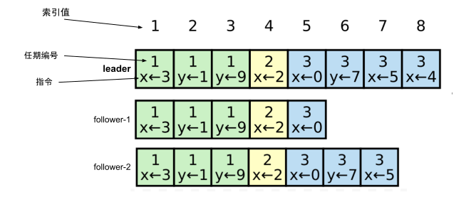

# 5.4.2 日志复制

一旦选出一个公认的领导者，那领导者顺理其章地承担起“**处理系统发生的所有变更，并将变更复制到所有跟随者节点**”的职责。

在 Raft 算法中，日志承载着系统所有变更。图 5-13 展示了 Raft 集群的日志模型，每个“日志条目”（log entry）包含索引、任期、指令等关键信息：

- **指令**: 表示客户端请求的具体操作内容，也就是待“状态机”（State Machine）执行的操作。
- **索引值**：日志条目在仓库中的索引值，是单调递增的数字。
- **任期编号**：日志条目是在哪个任期中创建的，用于解决“脑裂”或日志不一致问题。

:::center
   <br/>
 图 5-13 Raft 集群的日志模型（x ← 3 代表x赋值为3）
:::

Raft 算法中，领导者通过广播消息（AppendEntries RPC）将日志条目复制到所有跟随者。AppendEntries RPC 的示例如下：
```json
{
  "term": 5, // 领导者的任期号
  "leaderId": "leader-123",
  "prevLogIndex": 8, // 前一日志条目的索引
  "prevLogTerm": 4, // 前一日志条目的任期
  "entries": [
    { "index": 9, "term": 5, "command": "set x=4" }, // 要复制的日志条目
  ],
  "leaderCommit": 7// Leader 的“已提交”状态的日志条目索引号
}
```

根据图 5-14 所示，当 Raft 集群收到客户端请求（例如 set x=4）时，日志复制的过程如下：

- 若当前节点非领导者，将请求转发至领导者；
- 领导者接收请求后：
  - 将请求转化为日志条目，写入本地存储系统，初始状态为“未提交”（uncommitted）；
  - 生成日志复制消息（AppendEntries RPC），并广播至所有跟随者；
- 跟随者收到日志复制消息后，验证任期（确保本地任期不大于领导者任期）、日志一致性（通过 prevLogIndex 检查日志是否匹配）。若验证通过，跟随者将日志条目追加至本地存储系统，并发送确认响应；。
- 领导者确认日志条目已成功复制至多数节点后，将其状态标记为“已提交”（committed），并向客户端返回结果。已提交的日志条目不可回滚，指令永久生效，且可安全地“应用”（apply）至状态机。

:::center
   <br/>
 图 5-14 日志复制的过程
:::


领导者向客户端返回结果，并不意味着日志复制过程已完全结束，跟随者尚不清楚日志条目是否已被大多数节点确认。Raft 的设计通过心跳或后续日志复制请求中携带更新的提交索引（leaderCommit），通知跟随者提交日志。此机制将“达成共识的过程”优化为一个阶段，减少了客户端约一半的等待时间。

:::tip 如何选择节点的数量

Raft 日志复制过程需要等待多数节点确认。节点越多，等待的延迟也相应增加。所以说，以 Raft 构建的分布式系统并不是节点越多越好。如 etcd，推荐使用 3 个节点，对高可用性要求较高，且能容忍稍高的性能开销，可增加至 5 个节点，如果超出 5 个节点，可能得不偿失。
:::

我们来看日志复制的另一种情况。在上述例子中，只有 follower-1 成功追加日志，这是因为 follower-2 的日志并不连续。日志的连续性至关重要，因为如日志条目没有按正确顺序应用到状态机，各个 follower 节点的状态肯定不一致。

当 follower-1 收到日志复制请求后，它会通过 prevLogIndex 和 prevLogTerm 检查本地日志的连续性。如果日志缺失或存在冲突，follower-2 会返回失败响应，指明与领导者日志不一致的部分。

```json
{
  "success": false,
  "term": 4,
  "conflictIndex": 4, // 表示发生缺失的日志索引，Follower 的日志中最大索引为 3，所以缺失的索引是 4。
  "conflictTerm": 3//缺失日志的“上一个有效日志条目”的任期号
}
```
当领导者收到失败响应，根据 conflictIndex 和 conflictTerm 找到与跟随者日志的最大匹配索引（例如，6）。随后，领导者从该索引开始重新向跟随者（如 follower-1）发送日志条目，逐步修复日志的不一致性，直至同步完成。