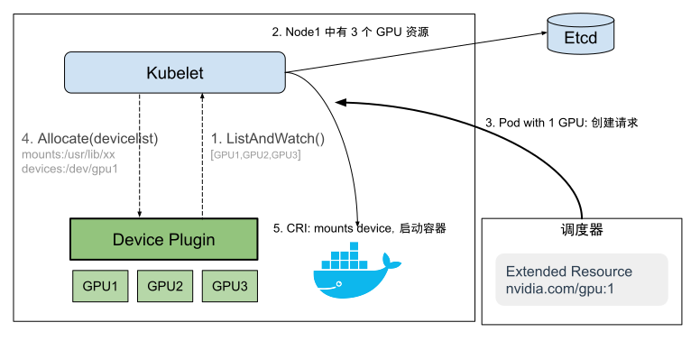

# 7.7.2 扩展资源与设备插件

在 Kubernetes 中，节点的标准资源（如 CPU、内存和存储）由 Kubelet 自动报告，但节点内的异构硬件资源（如 GPU、FPGA、RDMA 或硬件加速器），Kubernetes 并未识别和管理。

## 1. 扩展资源

作为通用的容器编排平台，Kubernetes 需要集成各种异构硬件资源，以满足更广泛的计算需求。为此，Kubernetes 提供了“扩展资源”（Extended Resource）机制，允许用户像使用标准资源一样声明和调度特殊硬件资源。

为了让调度器了解节点的异构资源，节点需向 API Server 报告资源情况。报告方式是通过向 Kubernetes API Server 发送 HTTP PATCH 请求。例如，某节点拥有 4 个 GPU 资源，以下是相应的 PATCH 请求示例：
```bash
PATCH /api/v1/nodes/<your-node-name>/status HTTP/1.1
Accept: application/json
Content-Type: application/json-patch+json
Host: k8s-master:8080
[
  {
    "op": "add",
    "path": "/status/capacity/nvidia.com~1gpu",
    "value": "4"
  }
]
```
需要注意的是，上述 PATCH 请求仅告知 Kubernetes，节点 `<your-node-name>` 拥有 4 个名为 GPU 的资源，但 Kubernetes 并不理解 GPU 资源的具体含义和用途。

接着，运行 kubectl describe node 命令，查看节点资源情况。从输出结果中可以看到，之前扩展的 nvidia.com/gpu 资源容量为 4。
```bash
$ kubectl describe node <your-node-name>
...
Status
  Capacity:
  	cpu: 2
  	memory: 2049008Ki
  	nvidia.com/gpu: 4
```

在完成上述操作后，配置 Pod 的 YAML 文件时，就可以像配置标准资源（如 CPU 和内存）一样，为自定义资源（例如 nvidia.com/gpu）设置 request 和 limits。以下是包含 nvidia.com/gpu 资源申请的 Pod 配置示例：
```yaml
apiVersion: v1
kind: Pod
metadata:
  name: gpu-pod
spec:
  containers:
    - name: cuda-container
      image: nvidia/cuda:10.0-base
      resources:
        request:
          nvidia.com/gpu: 1
```
在上述 Pod 资源配置中，GPU 的资源名称为 nvidia.com/gpu，并且为其分配了 1 个该资源的配额。这表明 Kubernetes 调度器会将该 Pod 调度到具有足够 nvidia.com/gpu 资源的节点上。

一旦 Pod 成功调度到目标节点，系统将自动执行一系列配置操作，例如设置环境变量、挂载 GPU 设备驱动等。这些操作完成后，容器内的程序便可使用 GPU 资源了。

## 2. 设备插件

除非特殊情况，通常不需用手动的方式扩展异构资源。

在 Kubernetes 中，管理异构资源主要通过一种称为**设备插件**（Device Plugin）的机制负责。该机制的原理是，通过定义一系列标准化的 gRPC 接口，使 kubelet 能够与设备插件进行交互，从而实现设备发现、状态更新以及资源上报等功能。

具体来说，设备插件定义了如下 gRPC 接口，硬件设备插件按照这些规范实现接口后，即可与 kubelet 进行交互。

```protobuf
service DevicePlugin {
	// 返回设备插件的配置选项。
	rpc GetDevicePluginOptions(Empty) returns (DevicePluginOptions) {}
	// 实时监控设备资源的状态变化，并将设备资源信息上报至 Etcd 中。
	rpc ListAndWatch(Empty) returns (stream ListAndWatchResponse) {}
	// 执行特定设备的初始化操作，并告知 kubelet 如何使设备在容器中可用。
	rpc Allocate(AllocateRequest) returns (AllocateResponse) {}

	// 从一组可用的设备中返回一些优选的设备用来分配。
	rpc GetPreferredAllocation(PreferredAllocationRequest) returns (PreferredAllocationResponse) {}

	// 在容器启动之前调用，用于特定于设备的初始化操作。确保容器能够正确地访问和使用特定的硬件资源。
	rpc PreStartContainer(PreStartContainerRequest) returns (PreStartContainerResponse) {}
}
```
目前，Kubernetes 社区已有多个专用设备插件，涵盖 NVIDIA GPU、Intel GPU、AMD GPU、FPGA 和 RDMA 等硬件。以 GPU 设备插件为例，其工作原理如下：

- **设备发现与注册**：设备插件在节点上运行，自动检测并将 GPU 资源注册到 Kubernetes API，例如，NVIDIA GPU 设备插件将 GPU 注册为 nvidia.com/gpu；
- **资源暴露与分配**：设备插件通过 Kubernetes API 将 GPU 资源暴露给 Pod，Pod 可通过 request 和 limit 字段声明所需的 GPU 资源，例如，Pod 可以在 limits 中指定 nvidia.com/gpu: 1 来请求一个 NVIDIA GPU；
- **调度与使用**：当 Pod 请求特殊硬件资源时，Kubernetes 调度器根据节点的资源状态和 Pod 的需求进行调度。一旦 Pod 被调度并分配了资源，kubelet 调用设备插件的 Allocate 接口获取设备配置信息（如设备路径、驱动目录），并将这些信息添加到容器创建请求中。最终，容器运行时（如 Docker、Containerd）会将硬件驱动目录挂载到容器内，容器中的应用程序即可直接访问这些设备了。

:::center
  <br/>
  图 7-35 NVIDIA GPU 设备插件工作原理
:::

最后，再来看扩展资源和设备插件的问题。Pod 只能通过类似“nvidia.com/gpu:2”的计数方式申请 2 个 GPU，但这些 GPU 的具体型号、拓扑结构、是否共享等属性并不明确。也就是说，设备插件仅实现了基本的入门级功能，能用，但不好用。

在“成本要省”、“资源利用率要高”背景推动下，Nvidia、Intel 等头部厂商联合推出了“动态资源分配”（Dynamic Resource Allocation，DRA）机制，允许用户以更复杂的方式描述异构资源，而不仅仅是简单的计数形式。DRA 属于较新的机制，具体的接口规范因硬件供应商和 Kubernetes 版本不同而有所变化。限于篇幅，笔者就不再扩展讨论了，有兴趣的读者请查阅其他资料。