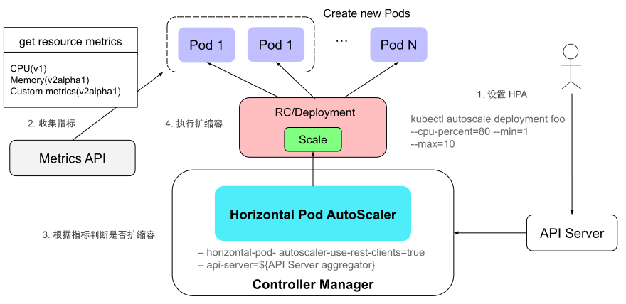

# 7.8 资源弹性伸缩

为了平衡服务负载的巨大波动及资源预估与实际使用之间的差距，Kubernetes 提供了三种资源自动扩缩（autoscaling）解决方案：HPA、VPA 以及节点自动伸缩（Cluster Autoscaler）组件。

## 7.8.1 Pod 水平自动伸缩

HPA（Horizontal Pod Autoscaler，Pod 水平自动扩缩）是根据工作负载（如 Deployment）的需求自动调整 Pod 副本的数量的机制。

HPA 的原理很简单，即监控资源使用程度做出相应的调整：
- 当负载较高时，增加工作负载的 Pod 副本数量；
- 当负载减少时，缩减工作负载的 Pod 副本数量。

实现自动扩缩关键是，如何准确识别资源耗用程度？为此，Kubernetes 提供了一种称为 Metrics API 的指标接口，用于获取节点、Pod 资源情况。来看一个 Metrics API 的响应示例，输出了 cpu、memory 资源耗用情况。

```bash
$ kubectl get --raw "/apis/metrics.k8s.io/v1beta1/nodes/minikube" | jq '.'
{
  "kind": "NodeMetrics",
  "apiVersion": "metrics.k8s.io/v1beta1",
  "metadata": {
    "name": "minikube",
    "selfLink": "/apis/metrics.k8s.io/v1beta1/nodes/minikube",
    "creationTimestamp": "2022-01-27T18:48:43Z"
  },
  "timestamp": "2022-01-27T18:48:33Z",
  "window": "30s",
  "usage": {
    "cpu": "487558164n",
    "memory": "732212Ki"
  }
}
```
最初，Metrics API 仅支持 CPU 、内存。随着需求的增加，Metrics API 开始支持用户自定义指标（Custom Metrics），用户自行开发 Custom Metrics Server，调用其他服务（如 Prometheus），便能够识别(应用程序、系统资源、服务性能、外部系统等）繁忙程度。

接下来看 HPA 的使用方式。如图 7-38 所示，通过命令 kubectl autoscale 创建 HPA，设置监控的指标类型（如 cpu-percent）、期望的目标值（70%）以及 Pod 副本数量的范围（最少 1 个，最多 10 个）。

```bash
$ kubectl autoscale deployment foo --cpu-percent=70 --min=1 --max=10
```
随后，HPA 定期获取 Metrics 数据，与设定的目标值比较，决定是否进行扩缩。如果需要扩缩，HPA 调用 Deployment 的 Scale 接口调整副本数量，将每个 Pod 的负荷维持在用户期望的水平。

:::center
  <br/>
  图 7-38 HPA 扩缩容的原理
:::

## 7.8.2 Pod 垂直自动伸缩

VPA 全称是 Vertical Pod Autoscaler（Pod 垂直自动伸缩）。它的实现思路与 HPA 基本一致，两者都是通过 Metrics 接口获取指标，评估后做出相应的调整。不同的是，VPA 调整的是工作负载的资源配额（如 Pod 的 CPU 和内存的 request 和 limit）。

值得注意的是，VPA 是 Kubernetes 的附加组件，需要安装和配置后才能为工作负载（如 Deployment）定义资源调整策略。

以下是一个 VPA 配置示例，供读者参考：

```yaml
apiVersion: autoscaling.k8s.io/v1
kind: VerticalPodAutoscaler
metadata:
  name: example-app-vpa
  namespace: default
spec:
  targetRef:
    apiVersion: apps/v1
    kind: Deployment
    name: example-app
  updatePolicy:
    updateMode: Auto  # 决定 VPA 如何应用推荐的资源调整，也可以设置为 "Off" 或 "Initial" 来控制更新策略
```
将上述 YAML 文件提交到 Kubernetes 集群后，通过 kubectl describe vpa 命令查看 VPA 推荐的资源策略。

```bash
$ kubectl describe vpa example-app-vpa
...
Recommendation:
    Container Recommendations:
      Container Name:  nginx
      Lower Bound:
        Cpu:     25m
        Memory:  262144k
      Target:
        Cpu:     25m
        Memory:  262144k
      Uncapped Target:
        Cpu:     25m
        Memory:  262144k
      Upper Bound:
        Cpu:     11601m
        Memory:  12128573170
...
```

相比于 HPA，VPA 适用于负载动态变化较大、资源需求不确定的场景，尤其是在无法精确预估应用资源需求的情况下。

## 7.8.3 基于事件驱动的伸缩

虽然 HPA 基于 Metrics 接口实现了弹性伸缩，但 Metrics 接口指标范围有限且粒度较粗。为了实现能基于外部事件更细粒度的扩缩容，微软与红帽联合开发了 —— KEDA（Kubernetes Event-driven Autoscaling，基于事件驱动的 Kubernetes 自动扩缩器）。

KEDA 的出现并非为了取代 HPA，而是与其互补。它的工作原理如图 7-39 所示，用户配置 ScaledObject（缩放对象）定义 Scaler（KEDA 的内部组件）的工作方式，Scaler 持续从外部系统获取状态数据，与配置的扩缩条件比较。当条件满足时，Scaler 触发扩缩操作，调用 Kubernetes 的 HPA 组件调整工作负载 Pod 副本数。

:::center
  <br/>
  图 7-39 KEDA 架构图
:::

KEDA 内置了几十种常见的 Scaler，用于处理特定的事件源或指标源。笔者列举部分 Scaler 供参考：
- 消息队列 Scaler：获取 Kafka、RabbitMQ、Azure Queue、AWS SQS 等消息队列的消息数量。
- 数据库 Scaler：获取 SQL 数据库的连接数、查询延迟等。
- HTTP 请求 Scaler：获取 HTTP 请求数量或响应时间。
- Prometheus Scaler：通过 Prometheus 获取自定义指标来触发扩缩操作，如队列长度、CPU 使用率等业务特定指标。
- 时间 Scaler：根据特定时间段触发扩缩逻辑，如每日的高峰期或夜间低峰期。

以下为 Kafka Scaler 的配置示例，它监控某个 Kafka 主题中的消息数量：
- 当消息队列超过设定的阈值时，触发扩展操作，增加 Pod 副本数量，提高消息处理的吞吐量；
- 当消息队列为空时，触发缩减操作，减少 Pod 的副本数量，降低资源成本（可以缩减至 0，minReplicaCount）。

```yaml
apiVersion: keda.sh/v1alpha1
kind: ScaledObject
metadata:
  name: kafka-scaledobject
  namespace: default
spec:
  scaleTargetRef:
    apiVersion: apps/v1
    kind: Deployment
    name: brm-index-basic
  pollingInterval: 10
  minReplicaCount: 0
  maxReplicaCount: 20
  triggers:
    - type: kafka
      metadata:
        bootstrapServers: kafka-server:9092
        consumerGroup: basic
        topic: basic
        lagThreshold: "100"
        offsetResetPolicy: latest
```
## 7.8.4 节点自动伸缩

业务的增长（也有可能萎缩），会导致集群资源不足或者过度冗余。如果能根据集群资情况自动增/减节点，保证集群可用性的同时，还能最大程度降低资源成本！

Cluster AutoScaler 是专门用于调整节点的组件，它的功能如下：
- **自动扩展（Scale Up）**：当节点资源不能满足 Pod 需求时，Cluster AutoScaler 向云服务提供商（如 GCE、GKE、Azure、AKS、AWS 等）请求创建新的节点，扩展集群容量，确保业务能够获得所需的资源。
- **自动缩减（Scale Down）**：当节点资源利用率长期处于低水平（如低于 50%），Cluster AutoScaler 将该节点上的 Pod 调度到其他节点，然后将节点从集群中移除，避免资源浪费。

:::center
  <br/>
  图 7-40 Cluster AutoScaler 自动缩减（Scale Down）的原理
:::

虽然 Cluster Autoscaler 是 Kubernetes 官方提供的组件，但它深度依赖公有云厂商！因此具体使用方法、功能以及限制以公有云厂商实现为准，笔者就不再过多介绍了。

[^1]: 参见 https://keda.sh/docs/2.12/scalers/
[^2]: 参见 https://keda.sh/community/#end-users

