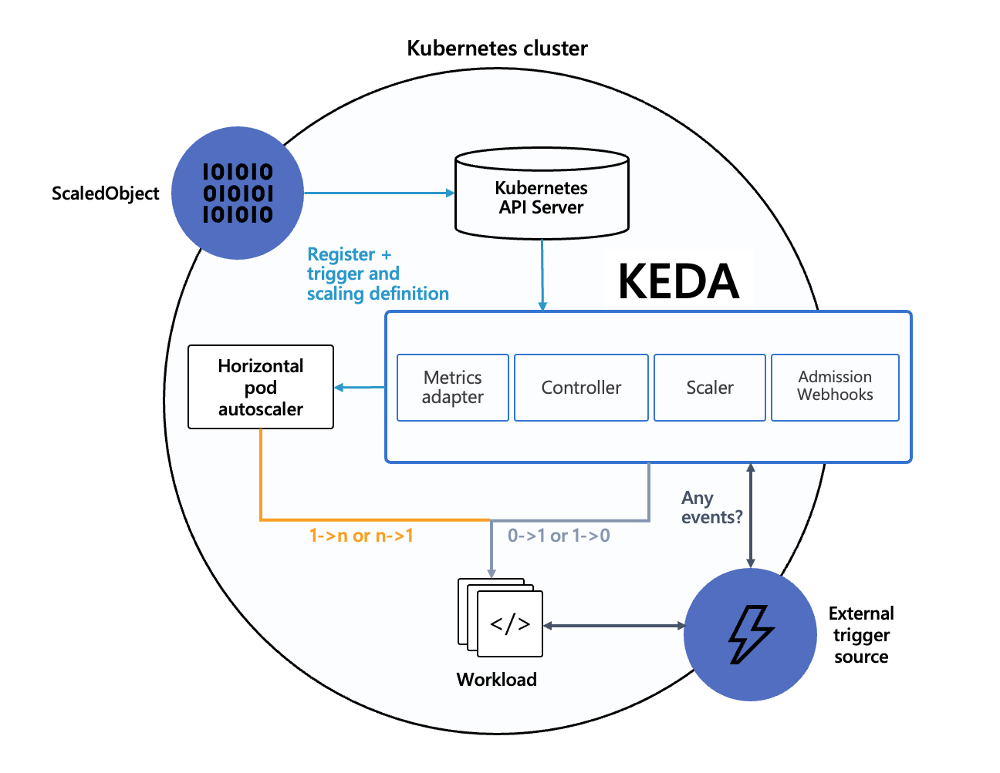

# 7.8 资源弹性伸缩

为了平衡服务负载的巨大波动及资源预估与实际使用之间的差距，Kubernetes 提供了三种资源自动伸缩（autoscaling）解决方案：HPA、VPA 以及节点自动伸缩（Cluster Autoscaler）组件。
## 7.8.1 Pod 水平自动伸缩

HPA 全称是 Horizontal Pod Autoscaler（Pod 水平自动扩缩），是对 Kubernetes 的工作负载的副本数进行自动水平扩缩容的机制，也是 Kubernetes 中使用最广泛的自动扩缩机制。

HPA 的实现思路很简单，即通过监控业务繁忙情况做出相应的挑战。在业务忙时，扩容 Worload（如 Deployment）Pod 副本数量；等到业务闲下来时，自然又要把 Pod 副本数再缩下去。所以实现水平扩缩容的关键之一是：”如何识别业务的忙闲程度？“。

Kubernetes 提供一种标准的 Metrics 接口提供有关节点和 Pod 的资源使用情况的信息。如下所示，在 minikube 节点上一个 Metrics 接口响应示例。

```bash
$ kubectl get --raw "/apis/metrics.k8s.io/v1beta1/nodes/minikube" | jq '.'
{
  "kind": "NodeMetrics",
  "apiVersion": "metrics.k8s.io/v1beta1",
  "metadata": {
    "name": "minikube",
    "selfLink": "/apis/metrics.k8s.io/v1beta1/nodes/minikube",
    "creationTimestamp": "2022-01-27T18:48:43Z"
  },
  "timestamp": "2022-01-27T18:48:33Z",
  "window": "30s",
  "usage": {
    "cpu": "487558164n",
    "memory": "732212Ki"
  }
}
```
最早，Metrics 接口只支持 CPU 和 内存的使用指标。后来为了适应更灵活的需求，Metrics API 开始扩展支持用户自定义 metrics 指标（custom metrics），自定义数据则需要用户自行开发 custom metrics server 调用其他服务（如 Prometheus）来获取自定义指标。

有了 Metrics 接口，也就是能识别业务的繁忙程度了。那么，如图 7-34 所示，使用 kubectl autoscale 命令创建 HPA，并设置监控 metrics 的类型（cpu-percent）、期望目标 metrics 数值（70%）以及 Workload 内 Pod 副本数量的区间（最小 1，最大 10）。

```bash
kubectl autoscale deployment foo --cpu-percent=70 --min=1 --max=10
```
然后，HPA 组件就会定期实时获取 metrics 数据并将它与目标期望值比较，决定是否扩缩。如果执行扩缩，则调用 deployment 的 scale 接口调整当前副本数，最终实现尽可能将 deployment 下的每个 Pod 的最终 metrics 指标维持到用户期望的水平。

:::center
  <br/>
  图 7-34 HPA 扩缩容的原理
:::

## 7.8.2 Pod 垂直自动伸缩

VPA 的全称是 Vertical Pod Autoscaler（Pod 垂直自动伸缩）。VPA 的实现思路和 HPA 基本一致，也是通过监控 Metrics 接口，然后评估指标做出相应的调整。与 HPA 调整 workload 副本数量的方式不同，VPA 调整的是 workload 的资源配额（如 Pod 的 CPU、内存 的 request、limit）。

值得一提的是，VPA 是 Kubernetes 中一个可选的附加组件，需要单独安装和配置，才能为特定的 Deployment 创建 VPA 资源，定义 Pod 的资源调整策略。如下为一个 VPA 配置示例，供读者参考：

```yaml
apiVersion: autoscaling.k8s.io/v1
kind: VerticalPodAutoscaler
metadata:
  name: example-app-vpa
  namespace: default
spec:
  targetRef:
    apiVersion: apps/v1
    kind: Deployment
    name: example-app
  updatePolicy:
    updateMode: Auto  # 决定 VPA 如何应用推荐的资源调整，也可以设置为 "Off" 或 "Initial" 来控制更新策略
```

将上述 yaml 文件提交到 Kubernetes 集群，通过 kubectl describe vpa 可以查看 VPA 的推荐的资源策略。

```bash
$ kubectl describe vpa example-app-vpa
...
Recommendation:
    Container Recommendations:
      Container Name:  nginx
      Lower Bound:
        Cpu:     25m
        Memory:  262144k
      Target:
        Cpu:     25m
        Memory:  262144k
      Uncapped Target:
        Cpu:     25m
        Memory:  262144k
      Upper Bound:
        Cpu:     11601m
        Memory:  12128573170
...
```

由上可以看出，VPA 适用于负载动态变化较大、对资源使用要求不确定的应用场景。特别是在无法精确预估应用资源需求的情况下。

## 7.8.3 基于事件驱动的伸缩

HPA 虽然能基于外部指标实现弹性伸缩，但缺点指标的作用有限且粒度太粗。为了支持外部事件实现更细粒度的自动扩缩，微软和红帽联合开发一种基于事件触发的 Kubernetes 自动扩缩器 KEDA（Kubernetes Event-driven Autoscaling）。

KEDA 的出现并非取代 HPA，它们实际上是一种组合配合关系。KEDA 的工作原理如图 7-35 所示，用户通过配置 ScaledObject（缩放对象）来定义 Scaler 的工作方式，Scaler（KEDA 内部的组件）持续从外部系统获取实时数据，并将这些数据与配置的扩展条件进行比较。当条件满足时，Scaler 将触发扩展操作，调用 Kubernetes 的 Horizontal Pod Autoscaler（HPA）调整对应工作负载的 Pod 副本数。

:::center
  <br/>
  图 7-35 KADA 架构图
:::

KEDA 通过内置几十种常见的 Scaler 用来处理特定的事件源或指标源，笔者列举常见的 Scaler 供你参考：

- 消息队列 Scaler：如 Kafka、RabbitMQ、Azure Queue、AWS SQS 等消息队列的消息数量。
- 数据库 Scaler：如 SQL 数据库的连接数、数据库查询延迟等。
- HTTP 请求 Scaler：基于 Web API 的请求数量或响应时间。
- Prometheus Scaler：通过 Prometheus 获取的自定义指标来触发扩展，如队列长度、CPU 使用率等业务特定指标。
- 时间 Scaler：根据特定的时间段触发扩展逻辑，例如每日的高峰期或夜间低峰期。


以下是一个 Kafka Scaler 配置示例，它监控某个 Kafka 主题中的消息数量：
- 当消息数量超过设定的阈值时，它会触发 Kubernetes 集群中的工作负载自动扩展以处理更多的消息；
- 当消息处理完毕，消息队列变空时，Scaler 会触发缩减操作，减少 Pod 的副本数（可以缩减至 0，minReplicaCount）。

```yaml
apiVersion: keda.sh/v1alpha1
kind: ScaledObject
metadata:
  name: kafka-scaledobject
  namespace: default
spec:
  scaleTargetRef:
    apiVersion: apps/v1
    kind: Deployment
    name: brm-index-basic
  pollingInterval: 10
  minReplicaCount: 0
  maxReplicaCount: 20
  triggers:
    - type: kafka
      metadata:
        bootstrapServers: kafka-server:9092
        consumerGroup: basic
        topic: basic
        lagThreshold: "100"
        offsetResetPolicy: latest
```

## 7.8.4 节点自动伸缩

随着业务的增长（也有可能萎缩），应用数量和资源需求相应的变化，可能导致集群资源不足或者资源过度冗余。为了有效控制成本，动态伸缩的范畴应该扩展到整个集群范围，也就是说能根据资源利用率情况自动增/减节点。

在 Kubernetes 中，Cluster AutoScaler 是专门用于自动扩展和缩减集群节点的组件。它的主要功能如下：
- 自动扩展（Scale Up）：当集群中的节点资源不足以满足当前的 Pod 请求时，Cluster AutoScaler 会自动向云服务提供商（如 GCE、GKE、Azure、AKS、AWS 等）请求创建新的节点，从而扩展集群容量，确保应用能够获得所需的资源。
- 自动缩减（Scale Down）：当某个节点的资源利用率长期处于较低水平（如低于 50%），Cluster AutoScaler 会自动将该节点上的 Pod 重新调度到其他节点，并在确定某些节点可以安全地移除时，将这些节点从集群中移除，以减少成本和资源浪费。

:::center
  <br/>
  图 7-36 Cluster AutoScaler 伸缩原理
:::

Cluster Autoscaler 虽然是 Kubernetes 官方标准，但是由于他深度依赖公有云厂商，因此具体使用方法、功能以及限制以公有云厂商具体实现为准。笔者就不再过多介绍了。

[^1]: 参见 https://keda.sh/docs/2.12/scalers/
[^2]: 参见 https://keda.sh/community/#end-users

