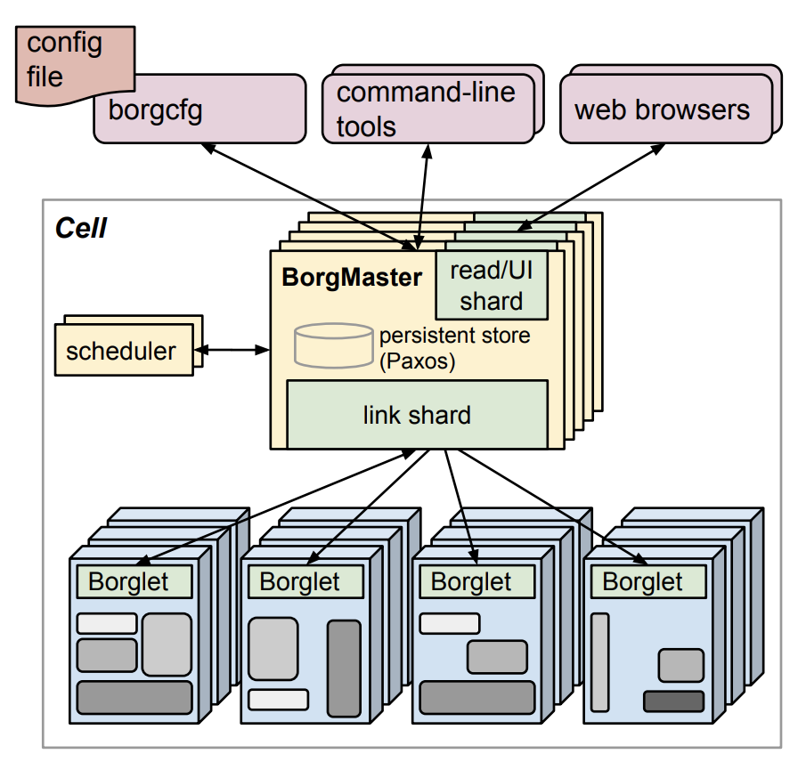
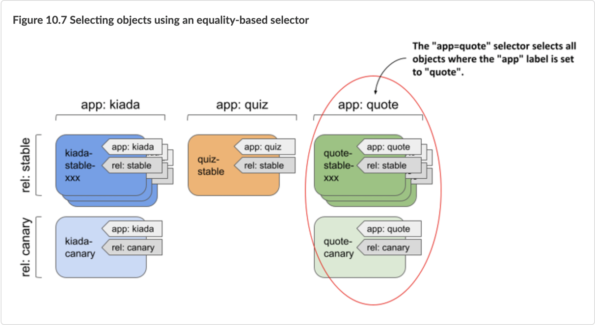

# 7.1 从 Borg 到 Kubernetes

这几年业界对容器技术兴趣越来越大，但在 Google 内部十几年前就已经开始大规模容器实践了，这个过程中也先后设计了三套不同的容器管理系统。 这三代系统虽然出于不同目的设计，但每一代都受前一代的强烈影响。

## 7.1.1 Google 十年三代系统的演进

### 1. Borg
Borg 是 Google 内部第一代容器管理系统。如图 7-1 所示，Borg 是非常典型的 Master(BorgMaster) + Agent(Borglet)架构。用户的操作请求提交给 Master，由 Master 负责记录下「某某实例运行在某某机器上」这类元信息，然后 Agent 通过与 Master 通讯得知分配给自己的任务、在 Work 节点中执行管理操作。

:::center
   
  图 7-1 Borg 架构图
:::

开发 Borg 的过程中，Google 的工程师们为 Borg 设计了两种 workload（工作负载）：
- **long-running service（长期运行的服务）**：通常是对请求延迟敏感的在线业务，譬如 Gmail、Google Docs 和 Web 搜索以及内部基础设施服务（如 BigTable）。
- **batch job（批处理作业任务）**：对短期性能波动并不敏感，运行时间在几秒到几天不等。典型的 batch job 为各色的离线计算任务。

Borg 为什么需要区分两种不同的 workload 呢？原因是这两类 workload 差异性实在太大：

- **二者的运行状态机不同**：long-running service 存在『环境准备ok，但进程没有启动』、『健康检查失败』等状态，这些状态 batch job 是没有的。状态机的不同，决定了对这些应用有着不同的『操作接口』，进一步影响了用户的API设计。
- **关注点与优化方向不一样**：一般而言，long-running service 关注的是服务的『可用性』，而 batch job 关注的是系统的整体吞吐。关注点的不同，会进一步导致内部实现的彻底分化。

Borg 中大多数 long-running service 都会被赋予高优先级并划分为生产环境级别的任务（prod），而 batch job 则会被赋予低优先级（non-prod）。在实际环境中，prod 任务会被分配和占用大部分的 CPU 和内存资源。正是由于有了这样的划分，Borg 的“资源抢占”模型才得以实现，即 prod 任务可以占用 non-prod 任务的资源。

Borg 通过不同类型 workload 的混部共享计算资源，**提升了资源利用率，降低了成本**。而底层支撑这种共享的是 Linux 内核中新出现的容器技术（Google 给 Linux 容器技术贡献了大量代码），它能实现**延迟敏感型应用**和 **CPU 密集型批处理任务**之间的更好隔离。

:::tip 容器技术的发展得益于 Google 的贡献

当前 Linux 内核中用于物理资源隔离的 cgroups，就是 Google Borg 研发团队贡献给社区的。这个工作是后面众多容器技术的基础。早期的 LXC，以及后面发展起来的 Docker 等，都受益于 Google 的贡献。

:::

随着 Google 内部的应用程序越来越多地被部署到 Borg 上，应用团队与基础架构团队开发了大量围绕 Borg 的管理工具和服务：资源需求量预测、自动扩缩容、服务发现和负载均衡、Quota 管理等等，并逐渐形成一个基于 Borg 的内部生态。

驱动 Borg 生态发展的是 Google 内部的不同团队，从结果来看，Borg 生态是一堆异构、自发的工具和系统，而非一个有设计的体系。

### 2. Omega

为了使 Borg 的生态系统更加符合软件工程规范，Google 在吸取 Borg 经验的基础上开发了 Omega 系统。

Omega 的开发并没有复用 Borg 的代码，但吸取了 Borg 的设计思想：
- Omega 将集群状态存储在一个基于 Paxos 的中心式面向事务 store（数据存储）内；
- 控制平面组件（例如调度器）都可以直接访问这个 store；
- 用乐观并发控制来处理偶发的访问冲突。

相比 Borg ，Omega 最大的改进是将 BorgMaster 的功能拆分为了几个彼此交互的组件，而不再是一个单体的、中心式的 Master。改进后的 Borg 与 Omega 成为 Google 最关键的基础设施。

:::center
    
  图 7-2 Borg 与 Omega 是 Google 最关键的基础设施
:::

### 3. Kubernetes

Google 开发的第三套容器管理系统叫 Kubernetes。开发这套系统的背景是：
- 全球越来越多的开发者也开始对 Linux 容器感兴趣（Linux 容器是 Google 的家底，却被 Docker 搞偷袭）；
- Google 已经把公有云基础设施作为一门业务在卖，且在持续增长（Google 是云计算概念提出者，但起了大早赶了个晚集，云计算市场被 AWS 、阿里云等占尽了先机）。

2013 年夏天，Google 的工程师们开始讨论借鉴 Borg 的经验进行容器编排系统的开发，并希望用 Google 十几年的技术积累影响错失的云计算市场格局。Kubernetes 项目获批后，Google 在 2014 年 6 月的 DockerCon 大会上正式宣布将其开源。

:::center
   
  图 7-3 Kubernetes 架构视图
:::

如图 7-3 所示 Kubernetes 的架构，能看出其中大量概念来源于 Borg/Omega 系统：分布式的彼此交互组件构成的 Master 架构、Pod（之 Borg Alloc）、工作节点中的 Kublet（之 Borglet）、etcd（之 Omega 集群状态存储 store）。

Kubernetes 在借鉴 Borg 和 Omega 的基础上，首要设计目标就是在享受容器带来的资源利用率提升的同时，让部署和管理复杂分布式系统的基础设施标准化且简单。

为了进一步理解基础设施的标准化，回顾 Kubernetes 出现之前的场景：

1. 云厂商只提供了计算实例、块存储、虚拟网络和对象存储等基础构建模块，开发者需要像拼图一样将它们拼出一个相对完整的基础设施方案。
2. 对于其他云厂商，重复过程 1，因为各家的 API、结构和语义并不相同，甚至差异很大。

虽然 Terraform 等工具供了一种跨厂商的通用格式，但原始的结构和语义仍然是五花八门，例如针对 AWS 编写的 Terraform descriptor 无法用到 Azure。

现在再来看 Kubernetes 从一开始就提供的东西：描述各种资源需求的标准 API。例如，

- 描述 Pod、Container 等计算需求的 API。
- 描述 Service、Ingress 等虚拟网络功能的 API。
- 描述 Volumes 之类的持久存储的 API。
- 甚至还包括 service account 之类的服务身份的 API 等等。

这些 API 是跨公有云/私有云和各家云厂商的，各云厂商会将 Kubernetes 结构和语义对接到它们各自的原生 API。提供一套跨厂商的标准结构和语义来声明核心基础设施（Pod、Service、Volume）是 Kubernetes 设计的关键，在此基础上，它又通过 CRD 将这个结构扩展到任何/所有基础设施资源。

:::tip 什么是 CRD

CRD（Custom Resource Define，自定义资源）是 Kubernetes（v1.7+）为提高可扩展性，让开发者去自定义资源的一种方式。CRD 资源可以动态注册到集群中，注册完毕后，用户可以通过 kubectl 来创建访问这个自定义的资源对象，类似于操作 Pod 一样。不过需要注意的是 CRD 仅仅是资源的定义而已，还需要编写 Controller 去监听 CRD 的各种事件来实现自定义的业务逻辑。

:::

有了 CRD，用户不仅能声明 Kubernetes API 预定义的计算、存储、网络服务，还能声明数据库、task runner、消息总线、数字证书等等任何云厂商能想到的东西！

随着 Kubernetes 资源模型越来越广泛的传播，现在已经能够用一组 Kubernetes 资源来描述一整个软件定义计算环境。就像用 docker run 可以启动单个程序一样，用 kubectl apply -f 就能部署和运行一个分布式应用，而无需关心是在私有云还是公有云以及具体哪家云厂商上。

## 7.1.2 Google 的经验以及教训

Google 的论文中总结了设计及使用这三代系统演进中的一些经验和教训。

### 1. 底层 Linux 内核容器技术

容器管理系统属于上层管理和调度，在底层支撑整个系统的，是 Linux 内核的容器技术。

容器技术提供的资源隔离能力，使 Google 的资源利用率远高于行业标准。例如，Borg 能利用容器实现延迟敏感型应用和 CPU 密集型批处理任务的混部，从而提升资源利用率，

- 业务用户为了应对突发业务高峰和做好 failover，通常申请的资源量要大于他们实际需要的资源量，这意味着大部分情况下都存在着资源浪费；
- 通过混部就能把这些资源充分利用起来，给批处理任务使用。

### 2. 资源隔离 + 容器镜像：解耦应用和运行环境

现代容器技术处理提供资源隔离外，另外还有一个很重要的机制是实现应用程序依赖文件的打包和部署，也就是容器镜像机制。

- 内核 cgroup、chroot、namespace 等基础设施的最初目的是保护应用免受 noisy、nosey、messy neighbors 的干扰。
- 而这些技术与容器镜像相结合，创建了一个新的抽象，将应用与它所运行的（异构）操作系统隔离开来。

### 3. 从面向机器转变到面向应用

随着时间推移，Google 意识到**容器化技术的最大的益处早就超越了单纯的提高硬件资源使用率的范畴**；**更大的变化在于数据中心运营的范畴已经从以机器为中心迁移到了以应用程序为中心**。

:::tip  什么是以应用程序为中心

系统原生为用户提交的制品提供一系列的上传、构建、打包、运行、绑定访问域名等接管运维过程的功能，以应用程序为中心解放了开发者的生产力，让他们不用再关心应用的运维状况，而是专心开发自己的应用。

:::

容器化使数据中心的观念从原来的面向机器向了面向应用：

- 容器封装了应用环境，向应用开发者和部署基础设施屏蔽了大量的操作系统和机器细节；
- 每个设计良好的容器和容器镜像都对应的是单个应用，因此管理容器其实就是在管理应用，而不再是管理机器。

### 4. 容器作为基本管理单元

将数据中心的核心从机器转移到了应用，这带了了几方面好处：

1. 应用开发者和应用运维团队无需再关心机器和操作系统等底层细节；
2. 基础设施团队引入新硬件和升级操作系统更加灵活， 可以最大限度减少对线上应用和应用开发者的影响；
3. 将收集到的 telemetry 数据（例如 CPU、memory usage 等 metrics）关联到应用而非机器，显著提升了应用监控和可观测性，尤其是在垂直扩容、 机器故障或主动运维等需要迁移应用的场景。

#### 4.1 通用 API 和自愈能力

容器能提供一些通用的 API 注册机制，使管理系统和应用之间无需知道彼此的实现细节就能交换有用信息。

- 在 Borg 中，这个 API 是一系列 attach 到容器的 HTTP endpoints。 例如，/healthz endpoint 向 orchestrator 汇报应用状态，当检测到一个不健康的应用时， 就会自动终止或重启对应的容器。这种自愈能力（self-healing）是构建可靠分布式系统的最重要基石之一。
- K8s 也提供了类似机制，health check 由用户指定，可以是 HTTP endpoint 也可以一条 shell 命令（到容器内执行）。

#### 4.2 应用维度 metrics 聚合：监控和 auto-scaler 的基础

容器还能用其他方式提供面向应用的监控：例如， cgroups 提供了应用的 resource-utilization 数据；前面已经介绍过了， 还可以通过 export HTTP API 添加一些自定义 metrics 对这些进行扩展。

基于这些监控数据就能开发一些通用工具，例如 auto-scaler 和 cAdvisor3， 它们记录和使用这些 metrics，但无需理解每个应用的细节。 由于应用收敛到了容器内，因此就无需在宿主机上分发信号到不同应用了；这更简单、更健壮， 也更容易实现细粒度的 metrics/logs 控制，不用再 ssh 登录到机器执行 top 排障了

虽然开发者仍然能通过 ssh 登录到他们的 容器，但实际中很少有人这样做。

监控只是一个例子。面向应用的转变在管理基础设施（management infrastructure）中产生涟漪效应：

- 我们的 load balancer 不再针对 machine 转发流量，而是针对 application instance 转发流量；
- Log 自带应用信息，因此很容易收集和按应用维度（而不是机器维度）聚合； 从而更容易看出应用层面的故障，而不再是通过宿主机层的一些监控指标来判断问题；
- 从根本上来说，实例在编排系统中的 identity 和用户期望的应用维度 identity 能够对应起来， 因此更容易构建、管理和调试应用。

#### 4.3 单实例多容器（pod vs. container）

Borg 里容器被分为两级，最外层的提供对于池化资源的集合，而内层的容器则负责具体的部署；外层的容器被成为 Alloc。 Kubernetes 里外层的容器被叫做 Pod。 Borg 甚至允许应用程序跑在最外层的容器外面，然而这一设计变成了一系列麻烦的来源，所以Kubernetes统一化了所有的应用程序部署和调度方法。

一种常见的范式是将一个复杂的应用程序的一个实例防止在外层的容器中，然后将其内部的不同的部分防止在不同的内部子容器中。

相比于把所有功能打到一个二进制文件，这种方式能让不同团队开发和管理不同功能，好处：

- 健壮：例如，应用即使出了问题，log offloading 功能还能继续工作；
- 可组合性：添加新的辅助服务很容易，因为操作都是在它自己的 container 内完成的；
- 细粒度资源隔离：每个容器都有自己的资源限额，比如 logging 服务不会占用主应用的资源。

### 5. 容器编排仅仅是个开始

Borg 使得我们能在共享的机器上运行不同类型的 workload 来提升资源利用率。 但围绕 Borg 衍生出的生态系统让我们意识到，Borg 本身只是开发和管理可靠分布式系统的开始， 各团队根据自身需求开发出的围绕 Borg 的不同系统与 Borg 本身一样重要。下面列举其中一些：

- 服务命名（naming）和服务发现（Borg Name Service, BNS）；
- 应用选主：基于 Chubby2；
- 应用感知的负载均衡（application-aware load balancing）；
- 自动扩缩容：包括水平（实例数量）和垂直（实例配置/flavor）自动扩缩容；
- 发布工具：管理部署和配置数据；
- Workflow 工具：例如允许多个 job 按 pipeline 指定的依赖顺序运行；
- 监控工具：收集容器信息，聚合、看板展示、触发告警。

### 避免野蛮生长：K8s 统一 API

开发以上提到的那些服务都是为了解决应用团队面临的真实问题，

- 其中成功的一些后来得到了大范围的采用，使很多其他开发团队的工作更加轻松有效；
- 但另一方面，这些工具经常使用非标准 API、非标准约定（例如文件位置）以及深度利用了 Borg 内部信息， 副作用是增加了在 Borg 中部署应用的复杂度。

Kubernetes则尝试采用一致的基于API的方式来降低复杂性。 Kubernetes里面使用ObjectMetadata、Specification、Status这三类元信息，并将它们放置在所有的API对象的属性集中。

:::center
  
  图 7-1 元信息
:::

- Object Metadata：所有 object 的 Object Metadata 字段都是一样的，包括
	- object name
	- UID (unique ID)
	- object version number（用于乐观并发控制）
	- labels
- Spec：用于描述这个 object 的期望状态； Spec and Status 的内容随 object 类型而不同。
- Status：用于描述这个 object 的当前状态；

这种统一 API 提供了几方面好处：

- 学习更加简单，因为所有 object 都遵循同一套规范和模板；
- 编写适用于所有 object 的通用工具也更简单；
- 用户体验更加一致。

#### 一致性

Kubernetes的一致性是通过不同API对象相互之间的解耦来实现的；各个API组件基本关注于不同的任务，它们除了共享这些基本的元信息之外， 互相之间是尽量地保持功能上的正交。 比如负责无状态服务实例部署复制replication的控制器和负责自动扩展的控制器互相之间就可以互不干扰；前者负责控制有多少个POD实例需要被创建，而后者会基于这一能力来动态地调整POD的个数，而无需关心这些POD具体是怎么被创建和删除的。

这一设计思路对应到设计模式上来说就是单一职责模式的直接化用。

一致性还体现在这些API对象的通用的外观上，比如 Kubernetes 提供了三种 POD 级别部署复制的控制器

- ReplicationController 负责运行诸如Web服务器这样的多实例负载均衡的无状态服务
- DaemonSet 保证单个集群节点上总有一个唯一的实例再运行
- Job 表示一个运行完毕就结束的批处理作业 尽管它们内部的控制逻辑和策略完全不同，它们都共享同样的POD模型。

### 控制器协调调度循环

我们还通过让不同 k8s 组件使用同一套设计模式来实现一致性。Borg、Omega 和 k8s 都用到了 reconciliation controller loop 的概念，提高系统的容错性。

- 循环比较对象的期望状态(spec)和当前的实际运行期状态(status)
- 如果发现不一致，则执行控制器对应的动作来尝试协调差异
- 重新回到第一步继续这个循环

这个处理思路是基于观察者－控制器模式，而不是基于复杂的状态图，因此它更容易处理系统错误。 任何时候控制器因为失效等原因需要重启的时候，它只需要从上次的状态继续运行下去就可以了。

## 7.1.3 Google 避坑指南

列举一些经验教训，希望大家要犯错也是去犯新错，而不是重复踩我们已经踩过的坑。

### 不要尝试让容器管理系统直接来管理端口（port）

早期的 Borg 系统由于允许所有的服务共享宿主机的 IP 地址，所以它为每个容器都分配了唯一的端口号，同时该端口号成为平台调度处理的一部分。当容器被移动到一个新的机器上的时候，它会得到一个新的端口号。

这意味着：

- 类似 DNS（运行在 53 端口）这样的传统服务，只能用一些内部魔改的版本；
- 客户端无法提前知道一个 service 的端口，只有在 service 创建好之后再告诉它们；
- URL 中不能包含 port（容器重启 port 可能就变了，导致 URL 无效），必须引入一些 name-based redirection 机制；

因此在设计 k8s 时，我们决定给每个 pod 分配一个 IP，

- 这样就实现了网络身份（IP）与应用身份（实例）的一一对应；
- 避免了前面提到的魔改 DNS 等服务的问题，应用可以随意使用 well-known ports（例如，HTTP 80）；
- 现有的网络工具（例如网络隔离、带宽控制）也无需做修改，直接可以用；

此外，所有公有云平台都提供 IP-per-pod 的底层能力；在 bare metal 环境中，可以使用 SDN overlay 或 L3 routing 来实现每个 node 上多个 IP 地址。

### 容器索引不要用数字 index，用 labels

用户一旦习惯了容器开发方式，马上就会创建一大堆容器出来， 因此接下来的一个需求就是如何对这些容器进行分组和管理。

Borg提供了一种叫做jobs的机制来对容器进行分组，一个job里面包含多个执行等同任务的容器，它们用基于0开始的连续的整数下标作为索引。 看起来种方式很自然和直接，然而随着复杂性的增加这一方案很快就露出了它的弊端

- 这个数组中的下标不得不承担双重职责：定位某个实例的拷贝，并在程序员需要调试的时候指向老的版本
- 当位于中间的一个拷贝退出的时候，数组下标就会出现空洞
- 需要执行横跨多个集群的任务的时候，下标的安插就显得很困难
- Borg无法支持应用程序层面的基于角色的版本指定，比如用户想用基于金丝雀部署的方式来滚动升级，这种死板的分配方式就无能为力，以至于用户不得不将类似信息编码到Job名字上的方式来间接达成目标

作为对比，Kubernetes 采用了基于松散的标签的方式来对容器进行分组。如果一个容器头上打了多个标签，那么它就同时隶属于不同的组。 Kubernetes 支持动态地添加、删除和修改这些标签，并支持用标签选择器的类似集合的语法来查询某个标签下的所有容器。

:::center
    
  图 7-1 元信息
:::

### Ownership 设计要格外小心

在 Borg 中，task 并不是独立于 job 的存在：

- 创建一个 job 会创建相应的 tasks，这些 tasks 永远与这个 job 绑定；
- 删除这个 jobs 时会删除它所有的 tasks。

 这样虽然方便但是却有一个大大的缺陷：因为只有一个基于下标的分组，Borg需要管理所有的可能的场景。 如果一个Job需要存储仅仅对某个服务有意义的参数，那么用户就必须寻找一种间接的方式来完成。

 Kubernetes则通过上述的基于Label的解耦方式来分离POD的生存周期管理和容器选择策略。 这样的灵活性允许下面这种用户场景：当用户想对他的服务POD进行调试的时候，他可以去掉某个POD头上的标签，然后后台的部署控制器就会注意到这个标签的变更，进而将其从服务实例列表中删除。 此时用户就可以在这个运行的POD上做调试而不用担心对正在运行的业务造成任何影响。 同时后台的控制器会根据实现定义的POD数量要求，重新创建一个新的POD来替换这个不正常的POD实例。

### 不要泄露原始状态

Borg、Omega 和 k8s 的一个核心区别是它们的 API 架构。

Borg是一个基于单体架构的复杂软件，它的核心模块直到所有的API操作的予以逻辑。其内部维护了包括机器和机器上跑的Job和Task的集群状态控制逻辑，并使用基于Paxos的中心化存储来保存这些状态信息。

Omega则不在保留中心化的状态管理逻辑，而仅仅保留了一个处于从属角色的全局的状态存储用于异常恢复。所有的逻辑语义控制操作则被下放给了数据存储的使用端，它们会直接读写对应的数据存储。 实现上每一个Omega组件使用了完全相同的客户端库来做数据结构的序列化、反序列化，重试和语义一致性处理。

Kubernetes走了一条中间路线：既保留了Omega的去中心化存储架构的扩展性和灵活性，又复用了系统范围的数据修改策略的一致性。 这种做法依赖于一个中心化的API Server，该Server屏蔽了底层存储和对象校验、默认值初始化、版本处理的细节。