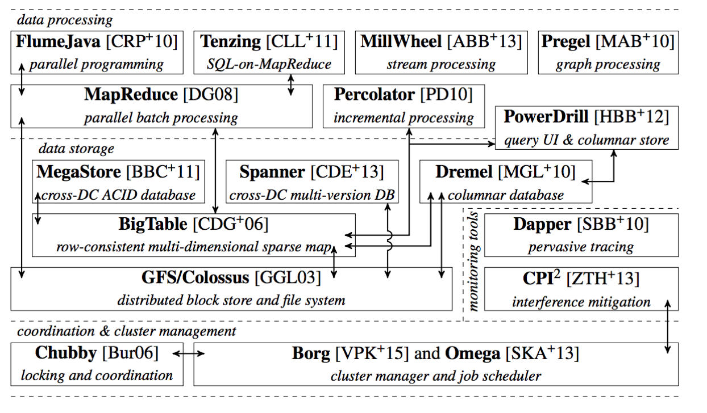

# 7.1 从 Borg 到 Kubernetes

这几年业界对容器技术兴趣越来越大，但在 Google 内部十几年前就已经开始大规模容器实践了，这个过程中也先后设计了三套不同的容器管理系统。

这三代系统的设计虽然出于不同目，但每一代都受前一代的强烈影响。

## 7.1.1 Borg 系统
Borg 是 Google 内部第一代容器管理系统。它的架构如图 7-1 所示，是典型的 Master（BorgMaster) + Agent（Borglet）架构。

用户的操作请求提交给 Master，由 Master 负责记录下“某某实例运行在某某机器上”这类元信息，Agent 通过与 Master 通讯得知分配给自己的任务，然后在 Work 节点中执行任务等操作。

:::center
   
  图 7-1 Borg 架构图 [图片来源](https://research.google/pubs/large-scale-cluster-management-at-google-with-borg/)
:::

开发 Borg 的过程中，Google 的工程师们为 Borg 设计了两种 Workload（工作负载）：
- **Long-Running Service（长期运行的服务）**：通常是对请求延迟敏感的在线业务，譬如 Gmail、Google Docs 和 Web 搜索以及内部基础设施服务（如 BigTable）。
- **Batch Job（批处理作业任务）**：对短期性能波动并不敏感，运行时间在几秒到几天不等。典型的 Batch Job 为各色的离线计算任务。

区分 2 种不同类型 Workload 原因在于：

- **两者运行状态机不同**：Long-Running Service 存在“环境准备ok，但进程没有启动”、“健康检查失败”等状态，这些状态 Batch Job 是没有的。状态机的不同，决定了对这些应用有着不同的“操作接口”，进一步影响用户的 API 设计。
- **关注点与优化方向不一样**：一般而言，Long-Running Service 关注的是服务的“可用性”，而 Batch Job 关注的是系统的整体吞吐。关注点的不同，会进一步导致内部实现的分化。

Borg 中大多数 Long-Running Service 都会被赋予高优先级并划分为生产环境级别的任务（prod），而 Batch Job 则会被赋予低优先级（non-prod）。生产实践中，prod 类型的任务会被分配和占用大部分的 CPU 和内存资源。

正是由于有了这样的划分，Borg 的“资源抢占”模型才得以实现，即 prod 任务可以占用 non-prod 任务的资源。

Borg 通过不同类型 Workload 的混部共享计算资源，**提升了资源利用率，降低了成本**。底层支撑这种共享的是 Linux 内核中新出现的容器技术（Google 给 Linux 容器技术贡献了大量代码），它能实现**延迟敏感型应用**和 **CPU 密集型批处理任务**之间的更好隔离。

:::tip 容器技术的发展得益于 Google 的贡献

当前 Linux 内核中用于物理资源隔离的 cgroups，就是 Google Borg 研发团队贡献给社区的。这个工作是后面众多容器技术的基础。早期的 LXC，以及后面发展起来的 Docker 等，都要得益于 Google 的贡献。
:::

随着 Google 内部的应用程序越来越多地被部署到 Borg 上，应用团队与基础架构团队开发了大量围绕 Borg 的管理工具和服务：资源需求量预测、自动扩缩容、服务发现和负载均衡、Quota 管理等等，并逐渐形成一个基于 Borg 的内部生态。

## 7.1.2 Omega 系统

驱动 Borg 生态发展的是 Google 内部的不同团队，从结果看，Borg 生态是一堆异构、自发的工具和系统，而非一个有设计的体系。

为了使 Borg 的生态系统更加符合软件工程规范，Google 在吸取 Borg 经验的基础上开发了 Omega 系统。

Omega 继承了 Borg 中经过验证的成功设计，完全从头开始开发，以便架构更加整洁一致：
- Omega 将集群状态存储在一个基于 Paxos 的中心式面向事务 store（数据存储）内；
- 控制平面的组件（譬如容器编排调度器）都可以直接访问这个 store；
- 提出了一种基于共享状态双循环的调度策略，用于解决大规模集群的资源调度问题（这个设计又反哺到 Borg 中）。

相比 Borg ，Omega 最大的改进是将 BorgMaster 的功能拆分为了几个彼此交互的组件，而不再是一个单体的、中心式的 Master。

如图 7-2 所示，改进后的 Borg 与 Omega 成为 Google 最关键的基础设施。

:::center
    
  图 7-2 Borg 与 Omega 是 Google 最关键的基础设施 [图片来源](https://cs.brown.edu/~malte/pub/dissertations/phd-final.pdf)
:::

## 7.1.3 Kubernetes 系统

凭借多年运行 Borg 和 GCP（Google Cloud Platform，Google 云端平台）的经验，使得 Google 非常认可容器技术，也深知目前 Docker 在规模化使用场景下的不足。如果 Google 率先做好这件事不仅能让自己在云计算市场扳回一局，而且也能抓住一些新的商业机会。比如，在 AWS 上运行的应用有可能自由地移植到 GCP 上运行，这对于 Google 的云计算业务无疑极其有利。

2013 年夏天，Google 的工程师们开始讨论借鉴 Borg 的经验进行容器编排系统的开发，并希望用 Google 十几年的技术积累影响错失的云计算市场格局。Kubernetes 项目获批后，Google 在 2014 年 6 月的 DockerCon 大会上正式宣布将其开源。

通过图 7-3 观察 Kubernetes 架构，能看出大量设计来源于 Borg/Omega 系统：

- API Server、Scheduler、Controller Mannager、Cloud Controller Mannager 等彼此交互的分布式组件构成的 Master 系统；
- Kubernetes 的最小运行单元 Pod。在 Borg 系统中，Pod 的原型是 Alloc（“资源分配”的缩写）；
- 在工作节点中，用于管理容器的 Kublet。从它的名字可以看出，它的设计来源于 Brog 系统中的 Borglet 组件；
- 分布式 KV 存储 Etcd（之 Omega 集群状态存储 store）等等。

:::center
   
  图 7-3 Kubernetes 架构以及组件概览 [图片来源](https://link.medium.com/oWobLWzCQJb)
:::

出于降低用户使用的门槛，并最终达成 Google 从底层进军云计算市场意图，Kubernetes 定下的设计目标是**享受容器带来的资源利用率提升的同时，让部署和管理复杂分布式系统的基础设施标准化且简单**。

为了进一步理解基础设施的标准化，来看 Kubernetes 从一开始就提供的东西，描述各种资源需求的标准 API：

- 描述 Pod、Container 等计算需求的 API。
- 描述 Service、Ingress 等虚拟网络功能的 API。
- 描述 Volumes 之类的持久存储的 API。
- 甚至还包括 Service Account 之类的服务身份的 API 等等。

这些 API 是跨公有云/私有云和各家云厂商的，各云厂商会将 Kubernetes 结构和语义对接到它们各自的原生 API。

提供一套跨厂商的标准结构和语义来声明核心基础设施（Pod、Service、Volume...）是 Kubernetes 设计的关键，在此基础上，它又通过 CRD 将这个结构扩展到任何/所有基础设施资源。

:::tip 什么是 CRD
CRD（Custom Resource Define，自定义资源）是 Kubernetes（v1.7+）为提高可扩展性，让开发者去自定义资源的一种方式。
:::

有了 CRD，用户不仅能声明 Kubernetes API 预定义的计算、存储、网络服务，还能声明数据库、Task Runner、消息总线、数字证书等等任何云厂商能想到的东西！

随着 Kubernetes 资源模型越来越广泛的传播，现在已经能够用一组 Kubernetes 资源来描述一整个软件定义计算环境。

就像用 docker run 可以启动单个程序一样，现在用 kubectl apply -f 就能部署和运行一个分布式应用，而无需关心是在私有云还是公有云或者具体哪家云厂商上。

## 7.1.4 以应用为中心的转变

从最初的 Borg 到 kubernetes，**容器化技术的最大的益处早就超越了单纯的提高硬件资源使用率的范畴**；**更大的变化在于数据中心运营的范畴已经从以机器为中心迁移到了以应用为中心**。

:::tip 什么是以应用为中心
系统原生为用户提交的制品提供一系列的上传、构建、打包、运行、绑定访问域名等接管运维过程的功能，以应用程序为中心解放了开发者的生产力，让他们不用再关心应用的运维状况，而是专心开发自己的应用。
:::

容器化使数据中心的观念从原来的面向机器向了面向应用：

- 容器封装了应用环境，向应用开发者和部署基础设施屏蔽了大量的操作系统和机器细节；
- 每个设计良好的容器和容器镜像都对应的是单个应用，因此管理容器其实就是在管理应用，而不再是管理机器。

将数据中心的核心从机器转移到了应用，这对软件开发领域带来这几方面的巨大变动：

1. 应用开发者和应用运维团队无需再关心机器和操作系统等底层细节，**PaaS 理念登场**；
2. 基础设施团队引入新硬件和升级操作系统更加灵活，最大限度减少对线上应用和应用开发者的影响，**DevOps 由虚变实**；
3. 将收集到的 telemetry 数据（譬如 CPU、memory usage 等 Metrics）关联到应用而非机器，显著提升了应用监控和可观测性，尤其是在垂直扩容、 机器故障或主动运维等需要迁移应用的场景，**直接促使软件可观测性领域应运而生**。
