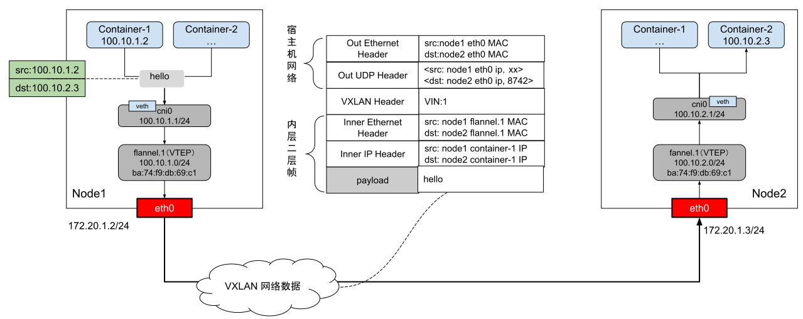
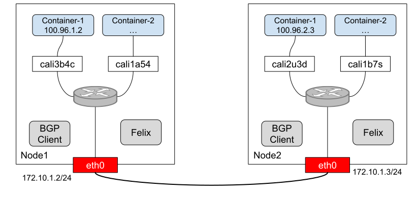

# 7.6 容器间通信的原理

要理解容器网络的工作原理，一定要从 Flannel 项目入手。Flannel 是 CoreOS 推出的容器网络解决方案，是业界公认是“最简单”的容器网络解决方案。接下来，笔者将以 Flannel 为例，介绍容器间通信的三种模式、容器网络接口（CNI）的设计及生态。


## 7.6.1 Overlay 覆盖网络模式

本书第三章 5.4 节已详细介绍了 Overlay 网络的设计思想，简而言之：它在现有三层网络之上“叠加”了一层由内核 VXLAN 模块管理的虚拟二层网络。

为在宿主机网络上构建虚拟二层通信网络（即建立隧道网络），VXLAN 模块会在通信双方配置特殊的网络设备作为隧道端点，称为 VTEP（VXLAN Tunnel Endpoints，VXLAN 隧道端点）。VTEP 是虚拟网络设备，具备 IP 地址和 MAC 地址。它根据 VXLAN 通信规范，负责将分布在不同节点和子网的“主机”（如容器或虚拟机）发送的数据包进行封装和解封，从而使它们能够像在同一局域网内一样进行通信。

上述基于 VTEP 设备构建“隧道”通信的流程，可以总结为图 7-26。

:::center
   <br/>
  图 7-26 Flannel VXLAN 模式通信逻辑
:::

从图 7-26 可以看到，宿主机内的容器通过 veth-pair（虚拟网卡）桥接到名为 cni0 的 Linux Bridge。同时，每个宿主机都有一个名为 flannel.1 的设备，作为 VXLAN 所需的 VTEP 设备。当容器接收或发送数据包时，它们通过 flannel.1 设备进行封装和解封。

在 VXLAN 规范中，数据包由两层构成：
- **内层帧**（Inner Ethernet Header），属于 VXLAN 逻辑网络；
- **外层帧**（Outer Ethernet Header），属于宿主机网络。

当 Kubernetes 节点加入 Flannel 网络后，Flannel 会启动名为 flanneld 的服务，作为 DaemonSet 在集群中运行。flanneld 负责为每个节点内的容器分配子网，并同步集群内的网络配置信息，以确保各节点之间的网络连通性和一致性。

接下来，我们来分析当 Node1 中的 Container-1 与 Node2 中的 Container-2 通信时，Flannel 是如何进行封包和解包的。

首先，当 Container-1 发出请求时，目标地址为 100.10.2.3 的 IP 数据包会通过 cni0 Linux 网桥。由于该地址不在 cni0 网桥的转发范围内，数据包将被送入 Linux 内核协议栈，进一步路由到 flannel.1 设备进行处理。

Node1 中的路由信息由 flanneld 添加，规则大致如下：
```bash
[root@Node1 ~]# route -n
Kernel IP routing table
Destination     Gateway         Genmask         Flags Metric Ref    Use Iface
100.10.1.0      0.0.0.0         255.255.255.0   U     0      0        0 cni0
100.10.2.0      100.10.2.0      255.255.255.0   UG    0      0        0 flannel.1
```
上面两条路由的意思是：
- 凡是发往 100.10.1.0/24 网段的 IP 报文，都需要经过接口 cni0。
- 凡是发往 100.10.2.0/24 网段的 IP 报文，都需要经过接口 flannel.1，并且最后一跳的网关地址是 10.224.1.0（也就是 Node2 中 VTEP 的设备）。

根据上述路由规则，Container-1 发出的数据包会交由 flannel.1 设备处理，即数据包进入了隧道的“起始端点”。当“起始端点”接收到原始的 IP 数据包后，它会构造 VXLAN 网络的内层以太网帧，并将其发送到隧道网络的“目的端点”，即 Node2 中的 VTEP 设备。这样，虚拟二层网络就成功建立，容器可以跨节点进行通信。

构造 VXLAN 网络内层以太网帧的前提是，Node1 节点的 flannel.1 设备需要知道 Node2 中 flannel.1 设备的 IP 地址和 MAC 地址。当前，我们已经通过 Node1 的路由表获得了 VTEP 设备的 IP 地址（100.10.2.0）。那么，如何获取 flannel.1 设备的 MAC 地址呢？

实际上，Node2 中 VTEP 设备的 MAC 地址已由 flanneld 自动添加到 Node1 的 ARP 表中。在 Node1 中执行下面的命令：
```bash
[root@Node1 ~]# ip n | grep flannel.1
100.10.2.0  dev flannel.1 lladdr ba:74:f9:db:69:c1 PERMANENT # PERMANENT 表示永不过期
```
上面记录的意思是，IP 地址 10.10.2.0（也就是 Node2 flannel.1 设备的 IP）对应的 MAC 地址是 ba:74:f9:db:69:c1。

:::tip 注意
这里 ARP 表记录并不是通过 ARP 协议学习得到的，而是 flanneld 预先为每个节点设置好的，没有过期时间。
:::

现在，内层以太网帧已完成封装。接下来，Linux 内核将内层帧封装至宿主机 UDP 报文内，以“搭便车”的方式发送到宿主机的二层网络中。

为了实现“搭便车”机制，Linux 内核会在内层数据帧前添加一个特殊的 VXLAN Header，用于标识“乘客” 要转发给 VXLAN 模块处理。VXLAN Header 中有一个重要的标志 —— VNI（VXLAN Network Identifier），这是 VTEP 设备判断数据包是否属于自己处理的依据。在 Flannel 的 VXLAN 模式下，所有节点的 VNI 默认为 1，这也是 VTEP 设备命名为 flannel.1 的原因。

接下来，Linux 内核会将二层数据帧封装进宿主机的 UDP 报文。

在进行 UDP 封装时，首先需要确定四元组信息，即目的 IP 和目的端口。默认情况下，Linux 内核为 VXLAN 分配的 UDP 端口为 4789，因此目的端口为 4789。而目的 IP 地址则通过转发表（forwarding database，fdb）获取，fdb 表中的信息也由 flanneld 提前配置。在 Node1 中执行下面的命令：
```bash
[root@Node1 ~]# bridge fdb show | grep flannel.1
ba:74:f9:db:69:c1 dev flannel.1 dst 192.168.50.3 self permanent
```
上面记录的意思是，目的 MAC 地址为 ba:74:f9:db:69:c1（ Node2 VTEP 设备的 MAC 地址）的数据帧封装后，应该发往哪个目的IP（192.168.50.3）。

至此，VTEP 设备已收集到所有封装所需的信息，并调用宿主机网络的 UDP 协议发送函数将数据包发出。接下来的过程与本机 UDP 程序发送数据包类似，就不再赘述了。

接下来，我们来看 Node2 收到数据包后的处理流程。

当数据包到达 Node2 的 8472 端口时，内核中的 VXLAN 模块会检查以下两个条件：
- **VNI 比较**：VXLAN 模块会检查 VXLAN Header 中的 VNI 是否与本机的 VXLAN 网络的 VNI 一致；
- **MAC 地址比较**：接着，比较内层数据帧中的目的 MAC 地址与本机的 flannel.1 设备的 MAC 地址是否匹配。

如果上述两个条件都满足，VXLAN 模块会去除数据包中的 VXLAN Header 和内层以太网帧 Header，恢复出 Container-1 原始发送的数据包。随后，根据 Node2 节点的路由规则（由 flanneld 提前配置），继续进行路由处理。
```bash
[root@Node2 ~]# route -n
Kernel IP routing table
Destination     Gateway         Genmask         Flags Metric Ref    Use Iface
...
100.10.2.0      0.0.0.0         255.255.255.0   U     0      0        0 cni0
```
从上面的路由规则可以看出，目标地址属于 100.10.2.0/24 网段的数据包会被交给 cni0 接口处理。接下来，数据包将按照 Linux 网桥的处理流程转发至对应的 Pod。

至此，Flannel VXLAN 模式的整个工作流程宣告结束。

## 7.6.2 三层路由模式

Flannel 的 host-gw 模式是“host gateway”的缩写。从名称可以看出，host-gw 工作模式通过宿主机路由表实现容器间通信。

该模式的工作原理简单明了，如图 7-27 所示。

:::center
   <br/>
  图 7-27 Flannel 的 host-gw 模式
:::

现在，假设 Node1 中的 container-1 与 Node2 中的 container-2 通信，我们来看 host-gw 模式是如何工作的。

首先，当 Kubernetes 节点加入 Flannel 网络后，flanneld 会在上面创建以下路由规则：

```bash
$ ip route
100.96.2.0/24 via 10.244.1.0 dev eth0
```
这条路由的含义是，目的地为 100.96.2.0/24 的 IP 包应通过 eth0 接口发送，其下一跳地址为 10.244.1.0（via 10.244.1.0）。

:::tip 什么是下一跳
所谓“下一跳”是指 IP 数据包发送时需要经过某个路由设备的中转，下一跳的地址就是该中转路由设备的 IP 地址。例如，如果你个人电脑中配置的网关地址为 192.168.0.1，那么本机发出的所有 IP 包都需要经过 192.168.0.1 进行中转。
:::

一旦确定了下一跳地址，Node1 中的 container-1 发出的 IP 包将被宿主机网络路由至下一跳地址，即 Node2 节点。

同样，Node2 中也有 flanneld 提前创建的路由规则。如下所示：
```bash
$ ip route
100.10.0.0/24 dev cni0 proto kernel scope link src 100.10.0.1
```
这条路由规则的含义是，目的地属于 100.10.0.0/24 网段的 IP 包应被送往 cni0 网桥。接下来的处理过程笔者就不再赘述了。

由此可见，Flannel 的 host-gw 模式实际上将每个容器子网（如 Node1 中的 100.10.1.0/24）的下一跳设置为目标主机的 IP 地址，利用宿主机的路由功能充当容器间通信的“路由网关”，这也是“host-gw”名称的由来。

host-gw 模式没有封包/解包的额外消耗，在性能表现上肯定优于前面介绍的 Overlay 模式。但由于它依赖于下一跳路由，因此它肯定无法用于宿主机跨子网的通信。

三层路由模式除了 Flannel 的 host-gw 模式外，还有一个更具代表性的项目 —— Calico。

Calico 和 Flannel 的原理都是直接利用宿主机的路由功能实现容器间通信，但不同之处在于**Calico 通过 BGP 协议实现路由规则的自动化分发**。因此 Calico 的灵活性更强，更适合大规模容器组网。

:::tip 什么是 BGP
BGP（Border Gateway Protocol，边界网关协议）使用 TCP 作为传输层的路由协议，用于交互 AS（Autonomous System，自治域）之间的路由规则。每个 BGP 服务实例一般称为“BGP Router”，与 BGP Router 连接的对端称为“BGP Peer”。每个 BGP Router 收到 Peer 传来的路由信息后，经过校验判断后，将其存储在路由表中。
:::

了解 BGP 协议之后，再看 Calico 的架构（图 7-28 ），就能理解它各个组件的作用了：
- **Felix**：负责在宿主机上插入路由规则，相当于 BGP Router；
- **BGP Client**：BGP 的客户端，负责在集群内分发路由规则，相当于 BGP Peer。

:::center
   <br/>
  图 7-28 Calico BGP 路由模式
:::

除了对路由信息的维护的区别外，Calico 与 Flannel 的另一个不同之处在于，它不会设置任何虚拟网桥设备。观察图 7-28，Calico 并未创建 Linux Bridge，而是将每个 Veth-Pair 设备的另一端放置在宿主机中（名称以 cali 为前缀），然后根据路由规则进行转发。例如，Node2 中 container-1 的路由规则如下：
```bash
$ ip route
10.223.2.3 dev cali2u3d scope link
```
这条路由规则的含义是，发往 10.223.2.3 的数据包应进入与 container-1 连接的 cali2u3d 设备（也就是 Veth-Pair 设备的另一端）。

由此可见，Calico 实际上将集群中每个节点的容器视为一个 AS（Autonomous System，自治域），并将节点视为边界路由器，节点之间相互交互路由规则，从而构建出容器间的三层路由网络。

## 7.6.3 Underlay 底层网络模式

接下来介绍的是最后一种容器间通信模式 —— Underlay 底层网络模式。

Underlay 模式本质上是**直接利用宿主机的二层网络进行通信**。在这种模式下，容器通常依赖于 MACVLAN 技术来组网。

MAC 地址通常是网卡接口的唯一标识，保持一对一关系。而 MACVLAN 技术打破了这一规则，它借鉴 VLAN 子接口的概念，在物理设备之上、内核网络栈之下创建多个“虚拟以太网卡”，每个虚拟网卡都有独立的 MAC 地址。

通过 MACVLAN 技术虚拟出的副本网卡在功能上与真实网卡完全对等。在接收到数据包后，物理网卡承担类似交换机的职责，它根据目标 MAC 地址判断该数据包应转发至哪块副本网卡处理（如图 7-29 所示）。

:::center
   <br/>
  图 7-29 MACVLAN 工作原理
:::

由于同一物理网卡虚拟出的副网卡天然位于同一子网（VLAN）内，因此它们可以直接在宿主机的二层网络中进行通信。

Docker 的网络模型中的 Macvlan 模式，正是利用上述“子设备”实现组网。Docker 使用 Macvlan 模式配置网络的命令如下：

```bash
$ docker network create -d macvlan \
  --subnet=192.168.1.0/24 \
  --gateway=192.168.1.1 \
  -o parent=eth0 macvlan_network
```

可以看出，Underlay 底层网络模式直接利用物理网络资源，绕过了容器网络桥接和 NAT，因此具有最佳的性能表现。不过，由于依赖硬件和底层网络环境，部署时需要根据具体的软硬件条件进行调整，缺乏 Overlay 网络那样的开箱即用的灵活性。

## 7.6.4 CNI 插件及生态

设计一个容器网络模型是一个很复杂的事情，Kubernetes 本身并不直接实现网络模型，而是通过 CNI（Container Network Interface，容器网络接口）把网络变成外部可扩展的功能。

CNI 接口最初由 CoreOS 为 rkt 容器创建，如今已成为容器网络的事实标准，广泛应用于 Kubernetes、Mesos 和 OpenShift 等容器平台。需要注意的是，CNI 接口并非类似于 CSI、CRI 那样的 gRPC 接口，而是指调用符合 CNI 规范的可执行程序，这些程序被称为“CNI 插件”。

以 Kubernetes 为例，Kubernetes 节点默认的 CNI 插件路径为 /opt/cni/bin。在该路径下，可以查看到可用的 CNI 插件，这些插件有的是内置的，有些是安装容器网络方案时自动下载的。
```bash
$ ls /opt/cni/bin/
bandwidth  bridge  dhcp  firewall  flannel calico-ipam cilium...
```
CNI 插件的大致工作流程如图 7-30 所示。在创建 Pod 时，容器运行时根据 CNI 配置规范（如设置 VXLAN 网络、配置节点容器子网等），通过标准输入（stdin）向 CNI 插件传递网络配置信息。待 CNI 插件完成网络配置后，容器运行时通过标准输出（stdout）接收配置结果。

:::center
   <br/>
  图 7-30 CNI 插件工作原理
:::

举个具体例子，使用 Flannel 配置 VXLAN 网络，来帮助你理解 CNI 插件的工作流程。

首先，当在宿主机安装 flanneld 时，flanneld 启动会在每台宿主机生成对应的 CNI 配置文件，告诉 Kubernetes：该集群使用 flannel 容器网络方案。 CNI 配置文件通常位于 /etc/cni/net.d/ 目录下。它的配置如下所示：

```json
{
  "cniVersion": "0.4.0",
  "name": "container-cni-list",
  "plugins": [
    {
      "type": "flannel",
      "delegate": {
        "isDefaultGateway": true,
        "hairpinMode": true,
        "ipMasq": true,
        "kubeconfig": "/etc/kube-flannel/kubeconfig"
      }
    }
  ]
}
```
接下来，容器运行时（如 CRI-O 或 containerd）会加载上述 CNI 配置文件，将 plugins 列表中的第一个插件（Flannel）设置为默认插件。在 Kubernetes 启动容器之前（即在创建 Infra 容器时），kubelet 调用 CNI 插件，传入下面两类参数，来为 Infra 容器配置网络。
- **Pod 信息**：如容器的唯一标识符、Pod 所在的命名空间、Pod 的名称等，这些信息一般组织成 JSON 对象；
- **CNI 插件要执行的操作**：
	- add 操作：用于分配 IP 地址、创建 veth pair 设备等，并将容器添加到 Flannel 网络中；
	- del 操作：用于清除容器的网络配置，将容器从 Flannel 网络中删除。

接下来，容器运行时会通过标准输入将上述参数传递给 CNI 插件。后续的逻辑则是 CNI 插件的具体操作，具体细节就不再赘述了。
```bash
echo '{
  "cniVersion": "0.4.0",
  "name": "flannel",
  "type": "flannel",
  "containerID": "abc123def456",
  "namespace": "default",
  "podName": "my-pod",
  "netns": "/var/run/netns/abc123def456",
  "ifname": "eth0",
  "args": {
    "isDefaultGateway": true
  }
}' | /opt/cni/bin/flannel add abc123def456
```
最后，CNI 插件执行完毕后，会将容器的 IP 地址等信息返回给容器运行时，并由 kubelet 更新到 Pod 的状态字段中，整个容器网络配置就宣告结束了。

通过 CNI 这种开放性的设计，需要接入什么样的网络，设计一个对应的网络插件即可。这样一来节省了开发资源集中精力到 Kubernetes 本身，二来可以利用开源社区的力量打造一整个丰富的生态。现如今，如图 7-31 所示，支持 CNI 规范的网络插件多达几十种。这些网络插件笔者无法逐一解释，但就实现的容器通信模式而言，总结就上面三种类型：Overlay 覆盖网络模式、三层路由模式 和 Underlay 底层网络模式。

:::center
   <br/>
  图 7-31 CNI 网络插件 [图片来源](https://landscape.cncf.io/guide#runtime--cloud-native-network)
:::

需要补充的是，对于容器编排系统而言，网络并非孤立的功能模块，还要配套各类的网络访问策略能力支持。例如，用来限制 Pod 出入站规则网络策略（NetworkPolicy），对网络流量数据进行分析监控等等额外功能。这些需求明显不属于 CNI 规范内的范畴，因此并不是每个 CNI 插件都会支持这些额外功能。如果你选择 Flannel 插件，必须配套其他插件（如 Calico 或 Cilium）才能启用网络策略。因此，有这方面需求的，应该考虑功能更全面的网络插件。


