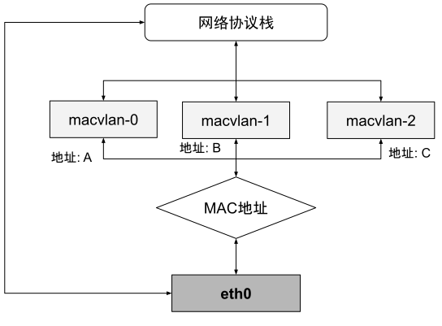
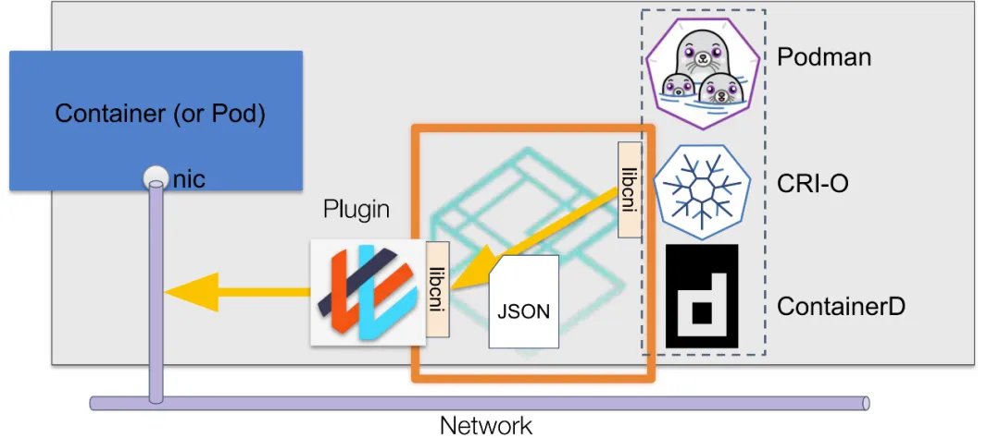

# 7.6 容器间通信的原理

在理解了容器的演进、持久化存储的原理之后，相信还有个问题反复萦绕在你心头：“在一个集群内，容器是如何实现相互通信的？”。

要理解容器网络的工作原理，一定要从 Flannel 项目入手。Flannel 是 CoreOS 推出的容器网络解决方案，业界公认是“最简单”的容器网络解决方案。它支持两种工作模式：VXLAN 和 host-gw，分别对应容器跨主机通信的 Overlay（覆盖网络）和三层路由方式。

接下来，笔者将以 Flannel 为例，详细介绍容器间 Overlay 网络和三层路由模式通信的原理，以及容器网络接口（CNI）的设计及生态。


## 7.6.1 Overlay 覆盖网络模式

本书第三章 5.4 节已详细介绍了 Overlay 网络的设计思想，一言蔽之：即在现有三层网络之上“覆盖”一层由内核 VXLAN 模块维护的虚拟二层网络。

为了在宿主机网络之上构建虚拟的二层通信网络（即建立一条隧道网络），VXLAN 模块会在通信双方配置一个特殊的网络设备作为隧道端点，称为 VTEP（VXLAN Tunnel Endpoints，VXLAN 隧道端点）。VTEP 实际上是一个虚拟网络设备，因此它既有 IP 地址，也有 MAC 地址。VTEP 设备根据 VXLAN 通信规范，对 VXLAN 二层网络中的“主机”（如容器或虚拟机）进行数据包的封装和解封。通过这种方式，这些“主机”可以像在同一局域网内通信。实际上，这些“主机”可能分布在不同的节点、子网，甚至位于不同的物理机房内。

上述基于 VTEP 设备构建“隧道”通信的流程，可以总结为图 7-26 所示。

:::center
   <br/>
  图 7-26 Flannel VXLAN 模式通信逻辑
:::

从图 7-26 可以看到，宿主机内的容器通过 veth-pair（虚拟网卡）桥接到一个名为 cni0 的 Linux Bridge。每个宿主机内都有一个名为 flannel.1 的设备，它充当 VXLAN 所需的 VTEP 设备。当容器收到或发送数据包时，会通过 flannel.1 设备进行封装和解封。

VXLAN 规范中的数据包由两层组成：
- 内层帧（Inner Ethernet Header）属于 VXLAN 逻辑网络；
- 而外层帧（Out Ethernet Header）则属于宿主机网络。

可以看出，VXLAN 实际上是一种基于 IP 网络的二层 VPN 技术，采用“MAC in UDP”封装形式来传输二层流量。

当 Kubernetes 的节点加入 Flannel 网络后，Flannel 会开启一个服务（名为 flanneld）作为 DaemonSet 在 Kubernetes 集群中运行。flanneld 负责为节点内的容器分配子网，并同步 Kubernetes 集群内的网络配置信息，以确保各节点之间的网络连通性和一致性。

现在，我们看看当 Node1 中的 Container-1 与 Node2 中的 Container-2 通信时，Flannel 是如何封包/解包的。

首先，当 Container-1 发出请求，目标地址为 100.10.2.3 的 IP 数据包会进入 cni0 Linux 网桥。由于目标地址不在 cni0 网桥的转发范围内，因此数据包会被送入 Linux 内核协议栈中进行进一步处理（其实，就是将数据包路由到 flannel.1 设备处理）。

flanneld 启动后，会在 Node1 中添加如下路由规则（当然，其他节点也会添加类似的路由规则）。
```bash
[root@Node1 ~]# route -n
Kernel IP routing table
Destination     Gateway         Genmask         Flags Metric Ref    Use Iface
100.10.1.0      0.0.0.0         255.255.255.0   U     0      0        0 cni0
100.10.2.0      100.10.2.0      255.255.255.0   UG    0      0        0 flannel.1
```
上面两条路由的意思是：
- 凡是发往 100.10.1.0/24 网段的 IP 报文，都需要经过接口 cni0。
- 凡是发往 100.10.2.0/24 网段的 IP 报文，都需要经过接口 flannel.1，并且最后一跳的网关地址是 10.224.1.0（也就是 Node2 中 VTEP 的设备）。

根据上面的路由规则，Container-1 的发出的数据包交由 flannel.1 接口处理，也就是说数据包进入了隧道的“起始端点”。因此，当“起始端点”收到“原始的 IP 包”后，它需要构造 VXLAN 网络的内层以太网帧，然后将其发送给隧道网络的“目的地端点”，即 Node2 中的 VTEP 设备。这样，就能成功构建虚拟的二层网络，实现跨节点的容器通信。

进行下一步需要解决的问题是，Node1 节点的 flannel.1 设备需要知道 Node2 中 flannel.1 设备的 IP 地址和 MAC 地址。目前，我们已经通过 Node1 的路由表获得了 VTEP 设备的 IP 地址（100.10.2.0）。那么，flannel.1 设备的 MAC 地址该如何获取呢？

实际上，Node2 中 VTEP 设备的 MAC 地址已由 flanneld 自动添加到 Node1 的 ARP 表中，可以通过在 Node1 中使用 ip 命令查看。
```bash
[root@Node1 ~]# ip n | grep flannel.1
100.10.2.0  dev flannel.1 lladdr ba:74:f9:db:69:c1 PERMANENT # PERMANENT 表示永不过期
```
上面记录的意思是：IP 地址 10.10.2.0（也就是 Node2 flannel.1 设备的 IP）对应的 MAC 地址是 ba:74:f9:db:69:c1。

:::tip 注意
这里 ARP 表记录并不是通过 ARP 协议学习得到的，而是 flanneld 预先为每个节点设置好的，没有过期时间。
:::

现在，隧道网络的内层数据帧已封装完成。接下来，Linux 内核将把内层数据帧进一步封装到宿主机网络的数据帧中。然后，通过宿主机的 eth0 网卡，以“搭便车”的方式将其发送出去。


为了实现“搭便车”机制，Linux 内核会在内层数据帧前添加一个特殊的 VXLAN Header，以指示“乘客”实际上是 Linux 内核中 VXLAN 模块需要使用的数据。VXLAN Header 中有一个重要的标志 —— VNI（VXLAN Network Identifier），这是 VTEP 设备判断数据包是否属于自己处理的依据。在 Flannel 的 VXLAN 工作模式中，所有节点的 VNI 默认为 1，这也是 VTEP 设备为什么命名为 flannel.1 的原因。

接下来，Linux 内核会将上述二层数据帧封装进宿主机的 UDP 报文内。

进行 UDP 封装时，需要确定四元组信息，也就是要知道 UDP 报文中的目的 IP 和目的端口。

- Linux 内核中默认为 VXLAN 分配的 UDP 监听端口为 8472。因此目的地端口即 8472。
- 目的 IP 则通过转发表（forwarding database，fdb）获取，fdb 表中的数据是由 Flannel 预先设置的。

在宿主机中使用如下命令查看 fdb 表的记录。该命令会列出当前桥接设备的转发表（FDB），显示各个 MAC 地址及其对应的端口信息。
```bash
[root@Node1 ~]# bridge fdb show | grep flannel.1
ba:74:f9:db:69:c1 dev flannel.1 dst 192.168.50.3 self permanent
```
上面记录的意思是，目的 MAC 地址为 ba:74:f9:db:69:c1（ Node2 VTEP 设备的 MAC 地址）的数据帧封装后，应该发往哪个目的IP（宿主机网络中节点的 IP）。

根据上面的记录可以看出，Node1 中 UDP 包的目的 IP 应该为 192.168.50.3，也就是 Node2 节点的 IP。至此，VTEP 设备已获得封装所需的所有信息，然后调用宿主机网络的 UDP 协议发包函数将数据包发送出去。接下来的过程与本机的 UDP 程序发送数据包没有太大区别，笔者就不再赘述了。

我们接着来看 Node2 收到数据包后的处理流程。

当数据包到达 Node2 的 8472 端口时，内核中的 VXLAN 模块执行以下步骤：
- **VNI 比较**：VXLAN 模块会检查 VXLAN Header 中的 VNI 是否与本机的 VXLAN 网络的 VNI 一致。
- **MAC 地址比较**：接着，模块会比较内层数据帧中的目的 MAC 地址与本机的 flannel.1 设备的 MAC 地址是否匹配。

上述两个条件都满足的情况下，数据包被进一步处理。也就是，去掉数据包的 VXLAN Header 和内层帧 Header 后，恢复出原始的 Container-1 发出的数据包。接着，根据 Node2 节点中的路由规则（由 Flannel 维护）处理，路由规则如下所示：

```bash
[root@Node2 ~]# route -n
Kernel IP routing table
Destination     Gateway         Genmask         Flags Metric Ref    Use Iface
...
100.10.2.0      0.0.0.0         255.255.255.0   U     0      0        0 cni0
```

可以看出，目的地属于 100.10.2.0/24 网段的数据包会交由 cni0 接口处理。随后，数据包将按照 Linux 网桥的处理流程继续进行转发。

以上，就是整个 Flannel VXLAN 模式的工作原理。

## 7.6.2 三层路由模式

Flannel 的 host-gw 模式是“host gateway”的缩写。从名称可以看出，host-gw 工作模式通过主机的路由表实现容器间的通信。

Flannel 的 host-gw 模式的工作原理相当直观，如图 7-27 所示。

:::center
   <br/>
  图 7-27 Flannel 的 host-gw 模式
:::

现在，我们假设 Node1 中的 container-1 向 Node2 中的 container-2 发起请求，观察  host-gw 模式是如何工作的。

首先，当节点加入 Flannel 网络后，flanneld 会在宿主机上创建以下路由规则。

```bash
$ ip route
100.96.2.0/24 via 10.244.1.0 dev eth0
```
这条路由的含义是，目的地为 100.96.2.0/24 的 IP 包应通过 eth0 接口发送，其下一跳地址为 10.244.1.0（via 10.244.1.0）。

:::tip 什么是下一跳
所谓“下一跳”是指 IP 数据包发送时需要经过某个路由设备的中转，下一跳的地址就是该中转路由设备的 IP 地址。例如，如果你个人电脑中配置的网关地址为 192.168.0.1，那么本机发出的所有 IP 包都需要经过 192.168.0.1 进行中转。
:::

知道了下一跳地址，接下来容器发出的 IP 包被宿主机网络路由至下一跳地址的主机内，也就是 Node2 节点中。

同样，Node2 中也有 flanneld 提前创建的路由规则。如下所示：
```bash
$ ip route
100.10.0.0/24 dev cni0 proto kernel scope link src 100.10.0.1
```
这条路由规则的含义是，目的地属于 100.10.0.0/24 网段的 IP 包应被送往 cni0 网桥。接下来的处理过程笔者就不再赘述了。

由此可见，Flannel 的 host-gw 模式实际上是将每个容器子网（例如 Node1 中的 100.10.1.0/24）下一跳设置为目标主机的 IP 地址，借助宿主机的路由功能充当容器间通信的“路由网关”，这也是“host-gw”名称的由来。

由于没有封包/解包的额外消耗，这种通过宿主机路由的方式在性能上肯定优于前面介绍的 Overlay 模式。然而，由于 host-gw 使用下一跳路由，因此无法在路由网关内实现跨越子网的通信。

三层路由模式除了 Flannel 的 host-gw 模式外，还有一个更具代表性的项目 —— Calico。

Calico 和 Flannel 的原理都是直接利用宿主机的路由功能实现容器间通信，但不同之处在于**Calico 通过 BGP 协议实现路由规则的自动化分发**。因此 Calico 的灵活性更强，更适合大规模容器组网。

:::tip 什么是 BGP
BGP（Border Gateway Protocol，边界网关协议）使用 TCP 作为传输层的路由协议，用于交互 AS（Autonomous System，自治域）之间的路由规则。每个 BGP 服务实例一般称为 BGP Router，与 BGP Router 连接的对端称为 BGP Peer。每个 BGP Router 在收到 Peer 传来的路由信息后，经过校验判断后，将其存储在路由表中。
:::

了解 BGP 协议之后，再看 Calico 的架构（图 7-28 ），就能理解它各个组件的作用了：
- Felix：负责在宿主机上插入路由规则，相当于 BGP Router；
- BGP Client：BGP 的客户端，负责在集群内分发路由规则，相当于 BGP Peer。

:::center
   <br/>
  图 7-28 Calico BGP 路由模式
:::

除了对路由信息的维护的区别外，Calico 与 Flannel 的另一个不同之处在于，它不会设置任何虚拟网桥设备。

观察图 7-28，Calico 并未创建 Linux Bridge，而是将每个 Veth-Pair 设备的另一端放置在宿主机中（名称以 cali 为前缀），然后根据路由规则进行转发。例如，Node2 中 container-1 的路由规则如下。
```bash
$ ip route
10.223.2.3 dev cali2u3d scope link
```
这条路由规则的含义是，发往 10.223.2.3 的数据包应进入与 container-1 连接的 cali2u3d 设备（也就是 Veth-Pair 设备的另一端）。

由此可见，Calico 实际上将集群中每个节点的容器视为一个 AS（Autonomous System，自治域），并将节点视为边界路由器，节点之间相互交互路由规则，从而构建出容器间的三层路由模式的网络。


## 7.6.3 Underlay 底层网络模式

Underlay 底层网络模式的本质是利用宿主机的 2 层互通网络。容器使用 Underlay 模式组网时，通常需要依赖 MACVLAN 技术。

MAC 地址原本是网卡接口的“身份证”，应该严格保持一对一关系。而 MACVLAN 打破了这一关系，它借鉴了 VLAN 子接口的思路，在物理设备之上、内核网络栈之下生成多个“虚拟以太网卡”，每个“虚拟以太网卡”都有一个独立的 MAC 地址。

通过 MACVLAN 技术虚拟出的副本网卡在功能上与真实网卡完全对等。在接收到数据包后，实际的物理网卡承担类似交换机的职责。物理网卡会根据目标 MAC 地址判断该数据包应转发至哪块副本网卡处理（如图 7-29 所示）。

:::center
   <br/>
  图 7-29 MACVLAN 工作原理
:::

由于同一块物理网卡虚拟出的副本网卡天然处于同一个 VLAN 中，因此可以直接在宿主机中的二层网络中直接通信。

Docker 的网络模型中，名为 Macvlan 的网络模型，就是利用了上述“子设备”实现组网。Docker 使用 Macvlan 模式组网的命令如下所示：

```bash
$ docker network create -d macvlan \
  --subnet=192.168.1.0/24 \
  --gateway=192.168.1.1 \
  -o parent=eth0 macvlan_network
```

可以看出，Underlay 底层网络模式直接使用物理网络资源，绕过容器网络桥接和 NAT，因此有着最优秀的性能表现。不过，也由于它依赖于硬件和底层网络环境，部署时需根据具体软硬件情况进行调整，缺乏像 Overlay 网络那样的开箱即用的灵活性。


## 7.6.4 CNI 插件以及生态

设计一个容器网络模型是一个很复杂的过程，Kubernetes 本身并不实现网络模型，而是通过 CNI（Container Network Interface，容器网络接口）把网络变成外部可扩展的功能。

CNI 接口最初由 CoreOS 为 rkt 容器创建，现在已成为容器网络的事实标准，许多容器平台（如 Kubernetes、Mesos 和 OpenShift 等）都采用了 CNI 标准。需要注意的是，CNI 接口并不是指类似 CSI、CRI 那样的 gRPC 接口，而是指对符合 CNI 规范可执行程序的调用（exec），这些可执行程序被称为 CNI 插件。

以 Kubernetes 为例，Kubernetes 节点默认的 CNI 插件路径为 /opt/cni/bin。在该路径下查看时，可以看到可供使用的 CNI 插件，这些插件有的是内置的，有些是安装容器网络方案时自动下载的。
```bash
$ ls /opt/cni/bin/
bandwidth  bridge  dhcp  firewall  flannel calico-ipam cilium...
```

图 7-30 展示了 CNI 插件的大致工作流程。当创建 Pod 设置容器网络时，由容器运行时根据 CNI 的配置规范（例如设置 VXLAN 网络、设置各个节点容器子网范围等）通过标准输入（stdin）向 CNI 插件传递网络配置信息。等待 CNI 插件配置完网络后，再通过标准输出（stdout）向容器运行时返回执行结果。

:::center
   <br/>
  图 7-30 CNI 插件工作原理
:::

举一个具体的例子：使用 flannel 配置 VXLAN 网络，帮助你理解 CNI 插件使用的流程。

首先，当在宿主机安装 flanneld 时，flanneld 启动会在每台宿主机生成对应的 CNI 配置文件，告诉 Kubernetes：该集群使用 flannel 容器网络方案。 CNI 配置文件通常位于 /etc/cni/net.d/ 目录下。以下是一个示例配置文件 10-flannel.conflist：

```json
{
  "cniVersion": "0.4.0",
  "name": "container-cni-list",
  "plugins": [
    {
      "type": "flannel",
      "delegate": {
        "isDefaultGateway": true,
        "hairpinMode": true,
        "ipMasq": true,
        "kubeconfig": "/etc/kube-flannel/kubeconfig"
      }
    }
  ]
}
```
接下来，容器运行时（如 CRI-O 或 containerd）加载上述 CNI 配置文件，将 plugins 列表里的第一个插件（flannel）设置为默认插件。

当 Kubelet 组件在启动容器之前（也就是创建 Infra 容器时），调用 CNI 插件为 Infra 容器配置网络。这里的 CNI 插件就是可执行文件 /opt/cni/bin/flannel。调用 CNI 插件时，传入的参数分为两个部分：
- Pod 信息：如容器的唯一标识符、Pod 所在的命名空间、Pod 的名称等，这些信息一般组织成 JSON 对象；
- CNI 插件执行的方法，如 add 和 del。
	- add 操作的含义是：执行分配 IP，创建 veth pair 设备等操作，将新创建的容器添加 flannel 网络中；
	- del 操作的含义是：清除容器的网络配置，将容器从 flannel 网络中删除。

然后，容器运行时通过标准输入将上述参数传递给插件。后面就是 CNI 插件的具体操作了，笔者就不再赘述了。
```bash
echo '{
  "cniVersion": "0.4.0",
  "name": "flannel",
  "type": "flannel",
  "containerID": "abc123def456",
  "namespace": "default",
  "podName": "my-pod",
  "netns": "/var/run/netns/abc123def456",
  "ifname": "eth0",
  "args": {
    "isDefaultGateway": true
  }
}' | /opt/cni/bin/flannel add abc123def456
```
最后，当 CNI 插件执行结束之后，会把容器的 IP 地址等信息返回给容器运行时，然后被 kubelet 添加到 Pod status 字段中，整个容器网络配置就宣告解决了。

有了类似容器运行时接口（CRI）、持久化存储接口（CSI）这种开放性的设计，需要接入什么样的网络，设计一个对应的网络插件即可。这样一来节省了开发资源可以集中精力到 Kubernetes 本身，二来可以利用开源社区的力量打造一整个丰富的生态。现如今，支持 CNI 规范的网络插件多达二十几种，如图 7-31 所示。

:::center
   <br/>
  图 7-31 CNI 网络插件 [图片来源](https://landscape.cncf.io/guide#runtime--cloud-native-network)
:::

上述几十种网络插件笔者无法逐一解释，但就实现的容器通信模式而言，将其总结，其实就上面三种类型：Overlay 覆盖网络模式、三层路由模式 和 Underlay 底层网络模式。

最后，对于容器编排系统而言，考虑网络并非孤立的功能模块，最好还要配套各类的网络访问策略能力支持。例如，用来限制 Pod 出入站规则网络策略（NetworkPolicy），对网络流量数据进行分析监控等等额外功能。

上述需求明显不属于 CNI 规范内的范畴，因此并不是每个 CNI 插件都会支持这些额外的功能。例如，如果选择 Flannel 且需要启用网络策略，必须额外配合其他插件（如 Calico 或 Cilium）来实现。因此，有这方面需求的，应该考虑功能更全面的网络插件。


