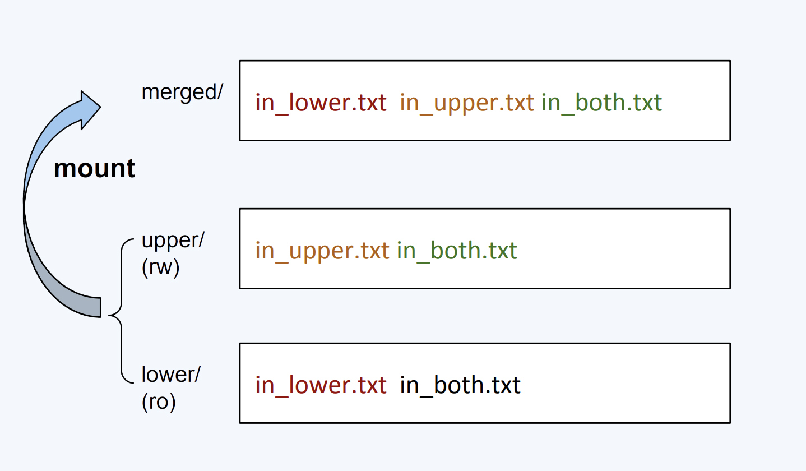

# 7.3 容器镜像的原理与应用

容器镜像是 Docker 革命性的创新，它在短短几年就迅速改变了整个云计算领域的发展历程。在本节中，我们将深入分析镜像技术原理，并探讨其在下载加速、启动加速、存储优化等场景中的最佳实践。

## 7.3.1 什么是容器镜像

所谓的“容器镜像”，其实就是一个“特殊的压缩包”，它将应用及其依赖（包括操作系统中的库和配置）打包在一起，形成一个自包含的环境。

很多开发者通常将应用依赖局限于编程语言层面。例如，某个 Java 应用依赖特定版本的 JDK，或者 Python 应用依赖 Python 2.7。但一个常被忽视的事实是：“操作系统本身才是应用运行所需的最完整依赖环境”。制作容器镜像的过程，实际上就是创建一个符合特定要求的操作系统快照。Docker 中，这个操作是：

```bash
$ docker build 镜像名称
```
一旦镜像创建完成，用户便可通过 Docker 创建一个“沙盒”，解压镜像并将其作为根文件系统（rootfs）挂载，容器内的应用程序和依赖就可以顺利运行。Docker 中，这个操作是：

```bash
$ docker run 镜像名称
```
上述的“沙盒”，其实就是上一篇介绍的 namespace 和 cgroups 技术创建出来的隔离环境。

由于镜像打包的是“整个操作系统”，应用程序与运行依赖全部封装在了一起，从而赋予了容器最核心的一致性能力。无论是在本地，还是在云端某个虚拟机，只要解压打包好的容器镜像，应用程序运行所依赖的环境就能完美重现。

:::tip 注意
严格讲，rootfs 只是操作系统的一部分，是按规则组织的一些文件和目录，并不包括操作系统内核。如果容器内的进程与内核交互，将影响宿主机，这是容器相比虚拟机的主要缺陷之一（不安全）。
:::

## 7.3.2 容器镜像分层设计原理

rootfs 解决了应用程序运行环境的一致性问题，但并未解决所有问题。

例如，当应用程序升级或运行环境发生变动时，是否需要重新制作一次 rootfs？将整个 rootfs 直接打包不仅无法复用，还会浪费大量存储空间。举例来说，笔者基于 CentOS ISO 制作了一个 rootfs，配置了 Java 运行环境。那么，笔者的同事发布 Java 应用时，肯定想复用之前安装过 Java 运行环境的 rootfs，而不是重新制作一个。此外，如果每个人都重新制作 rootfs，考虑到一台主机通常运行几十个容器，将会占用巨大的存储空间。

分析上述 Java 应用对 rootfs 的需求，发现底层的 rootfs（例如 CentOS + JDK）其实是固定的。那么，是否可以通过增量修改的方式来支持不同应用的依赖？比如，维护一个共同的“基础 rootfs”，然后根据应用的不同依赖制作不同的镜像。例如，**CentOS + JDK** + app-1、**CentOS + JDK** + app-2 和 **CentOS** + Python + app-3 等等。

增量修改的思路当然可行，这也是 Docker 镜像设计的核心。与传统的 rootfs 制作流程不同，Docker 引入了“层”（layer）的概念，每次创建镜像时，都会生成一个新的层，即一个增量式的 rootfs。

Docker 镜像的分层设计依赖于 UnionFS（联合文件系统）技术，UnionFS 允许将多个目录联合挂载到同一目录下，呈现给用户的是一个统一的文件系统视图，而非多个分散的目录。

UnionFS 有多种实现，例如 OverlayFS、Btrfs 和 AUFS 等。在 Linux 内核 3.18 版本中，OverlayFS 被合并进主分支，并逐渐成为各大主流 Linux 发行版的默认联合文件系统。OverlayFS 的使用非常简便，只需通过 mount 命令，指定文件系统类型为 overlay，并配置以下相关参数：
- **lowerdir**：OverlayFS 的只读层，通常用于提供基础文件系统，可以指定多个目录；
- **upperdir**：OverlayFS 的读写层，用于存储用户的增量修改；
- **merged**：挂载完成后，展示给用户的统一文件系统视图。

笔者举一个具体的例子供你参考，代码如下所示：

```bash
#!/bin/bash

umount ./merged
rm upper lower merged work -r

mkdir upper lower merged work
echo "I'm from lower!" > lower/in_lower.txt
echo "I'm from upper!" > upper/in_upper.txt
# `in_both` is in both directories
echo "I'm from lower!" > lower/in_both.txt
echo "I'm from upper!" > upper/in_both.txt

// 使用 mount 命令即将 lower、upper 挂载到 merged。

$ sudo mount -t overlay overlay \
 -o lowerdir=./lower,upperdir=./upper,workdir=./work \
 ./merged
```

使用 mount 命令，指定文件系统类型为 overlay，挂载后的文件系统如图 7-7 所示。

:::center
  <br/>
  图 7-7 OverlayFS 挂载后的文件系统视图
:::


当在 merged 目录中执行增删改操作时，OverlayFS 文件系统会触发写时复制（CoW，Copy-On-Write）策略。下面通过一系列操作来解释 CoW 的基本原理：

- **新建文件时**：文件会被写入到 upper 目录中；
- **删除文件时**：
  - 如果删除 in_upper.txt，该文件会从 upper 目录中移除；
  - 如果删除 in_lower.txt，lower 目录中的 in_lower.txt 文件保持不变，但 upper 目录会新增一个特殊文件，标记 in_lower.txt 在 merged 目录中已被删除。
- **修改文件时**：如果修改 in_lower.txt，upper 目录会创建一个新的 in_lower.txt 文件，包含更新后的内容，而 lower 目录中的原始文件保持不变。


再来看 Docker 镜像利用联合文件系统的分层设计。如图 7-8 所示，整个镜像从下往上由 6 个层组成：

- 最底层是基础镜像 Debian Stretch，相当于“base rootfs”，所有容器可以共享这一层；
- 接下来的 3 层是通过 Dockerfile 中的 ADD、ENV、CMD 等指令生成的只读层；
- Init Layer 位于只读层和可写层之间，存放可能会被修改的文件，如 /etc/hosts、/etc/resolv.conf 等。这些文件原本属于 Debian 镜像，但容器启动时，用户往往会写入一些指定的配置，因此 Docker 为其单独创建了这一层；
- 最上层是通过 CoW（写时复制）技术创建的可写层（Read/Write Layer）。容器内的所有增、删、改操作都发生在此层。但该层的数据不具备持久性，容器销毁时，所有写入的数据也会丢失。容器镜像内无法写入任何数据，是不可变基础设施的思想的体现，无论容器重启多少次或在任何机器上运行，只要使用相同的镜像，启动的服务始终保持一致。

:::center
  <br/>
  图 7-8 Docker 容器镜像分层设计概览
:::

最终，这 6 个层被联合挂载到 /var/lib/docker/overlay/mnt 目录。容器系统通过系统调用 chroot 和 pivot_root 切换根目录，使得容器内的进程仿佛独占一个带有 Java 环境的 Debian 操作系统。

通过镜像分层设计，以 Docker 镜像为核心，不同公司和团队的开发人员可以紧密协作。每个人不仅可以发布基础镜像，还可以基于他人的基础镜像构建和发布自己的软件。**镜像的增量操作使得拉取和推送内容也是增量的，这远比操作虚拟机动辄数 GB 的 ISO 镜像要更敏捷**。更重要的是，容器镜像一旦发布，全球任何地方的用户都能下载并复现应用所需的完整环境，打通了“开发-测试-部署”流程中的每个环节。

## 7.3.3 构建足够小的容器镜像

容器镜像的一大挑战是尽量减小镜像体积。较小的镜像在部署、故障转移和存储成本等方面具有显著优势。构建足够小镜像的方法如下：

- **选用精简的基础镜像**：基础镜像应只包含运行应用程序所必需的最小系统环境和依赖。选择 Alpine Linux 这样的轻量级发行版作为基础镜像，镜像体积会比 CentOS 这样的大而全的基础镜像要小得多；
- **使用多阶段构建镜像**：在构建过程中，编译缓存、临时文件和工具等不必要的内容可能被包含在镜像中。通过多阶段构建，可以只打包编译后的可执行文件，从而得到更加精简的镜像。

以下是通过多阶段构建一个精简 Nginx 镜像的示例，供读者参考：

```dockerfile
# 第 1 阶段
FROM skillfir/alpine:gcc AS builder01
RUN wget https://nginx.org/download/nginx-1.24.0.tar.gz -O nginx.tar.gz && \
tar -zxf nginx.tar.gz && \
rm -f nginx.tar.gz && \
cd /usr/src/nginx-1.24.0 && \
 ./configure --prefix=/app/nginx --sbin-path=/app/nginx/sbin/nginx && \
  make && make install
  
# 第 2 阶段 只打包最终可执行文件
FROM skillfir/alpine:glibc
RUN apk update && apk upgrade && apk add pcre openssl-dev pcre-dev zlib-dev 

COPY --from=builder01 /app/nginx /app/nginx
WORKDIR /app/nginx
EXPOSE 80
CMD ["./sbin/nginx","-g","daemon off;"]
```

使用 docker build 命令构建镜像并查看生成的镜像，最终大小为 23.4 MB。


```bash
$ docker build -t alpine:nginx .
$ docker images 
REPOSITORY                TAG             IMAGE ID       CREATED          SIZE
alpine                    nginx           ca338a969cf7   17 seconds ago   23.4MB
```

## 7.3.4 加速容器镜像下载

当容器启动时，如果本地没有镜像文件，它将从远程仓库（Repository）下载。镜像下载效率受限于网络带宽和仓库服务质量，镜像越大，下载时间越长，容器启动也因此变慢。

加速镜像下载的有效方式之一是使用 P2P 网络加速技术。Dragonfly 就是基于 P2P 网络实现的容器镜像分发加速系统，它提供了一种无需修改容器或镜像仓库配置的无侵入加速方案。

图 7-9 展示了 Dragonfly 的工作流程。首先，Dragonfly 在多个节点上启动 Peer 服务（类似 P2P 节点）。当容器系统下载镜像时，下载请求通过 Peer 转发到 Scheduler（类似 P2P 调度器），Scheduler 判断该镜像是否为首次下载：

- **首次下载**：Scheduler 启动回源操作，从源服务器获取镜像文件，并将镜像文件切割成多个“块”（Piece）。每个块会缓存到不同节点，相关配置信息上报给 Scheduler，供后续调度决策使用；
- **非首次下载**：Scheduler 根据配置，生成一个包含所有镜像块的下载调度指令。

最终，Peer 根据调度策略从集群中的不同节点下载所有块，并将它们拼接成完整的镜像文件。
:::center
  <br/>
  图 7-9 Dragonfly 是怎么工作的 [图片来源](https://d7y.io/zh/docs/)
:::

可以看出，Dragonfly 的镜像下载加速流程与 P2P 下载加速非常相似，二者的原理都是通过分布式节点和智能调度来加速大文件的传输与重组。

## 7.3.5 加速容器镜像启动

容器镜像的大小直接影响启动时间，一些大型软件的镜像可能超过数 GB。例如，机器学习框架 TensorFlow 的镜像大小为 1.83 GB，冷启动时至少需要 3 分钟。大型镜像不仅启动缓慢、镜像内的文件往往未被充分利用（业内研究表明，通常镜像中只有 6% 的内容被实际使用）[^1]。

2020 年，阿里巴巴技术团队发布了 Nydus 项目，它将镜像层的数据（blobs）与元数据（bootstrap）分离，容器第一次启动时，首先拉取元数据，再按需拉取 blobs 数据。相较于拉取整个镜像层，Nydus 下载的数据量大大减少。值得一提的是，Nydus 还使用 FUSE 技术（Filesystem in Userspace，用户态文件系统）重构文件系统，用户几乎无需任何特殊配置（感知不到 Nydus 的存在），即可按需从远程镜像中心拉取数据，加速容器镜像启动。

:::center
  <br/>
  图 7-10 Nydus 是怎么工作的 [图片来源](https://d7y.io/zh/blog/2022/06/06/evolution-of-nydus/)
:::

如图 7-11 所示，传统镜像格式（OCIv1）与 Nydus 镜像格式的启动时间对比。Nydus 将常见应用镜像的启动时间从几分钟缩短至仅几秒钟。

:::center
  <br/>
  图 7-11 OCIv1 与 Nydus 镜像启动时间对比
:::

综合来讲，上述优化措施对于大规模集群，或对扩容延迟有严格要求的场景（如大促扩容、游戏服务器扩容等）来说，不仅能显著降低容器启动时间，还能大幅节省网络和存储成本。值得一提的是，这些技术调整对业务工程师完全透明，不会影响原有的业务流程。

[^1]: 参见 https://indico.cern.ch/event/567550/papers/2627182/files/6153-paper.pdf