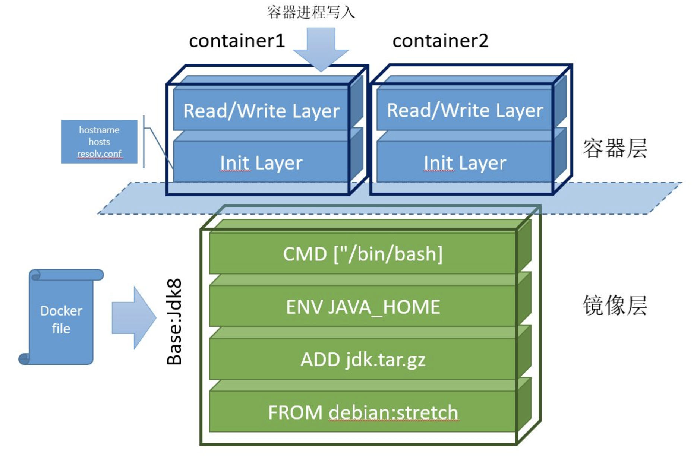

# 7.3 容器镜像的原理与应用

本书内容中反复提及一个概念“容器镜像”到底是什么呢？所谓的“容器镜像”，其实就是容器系统内部通过系统调用 chroot/pivot_root 为进程运行切换的根目录，也就是包含了应用运行依赖的库、资源、配置等 rootfs（Root Filesystem，根文件系统）文件系统。

事实上，大部分开发者理解的应用依赖一直局限编程语言层面，例如 Java 应用依赖某个版本的 JDK。但实际上，一个容易被忽视的事实是：**操作系统本身才是应用运行所需的最完整的依赖库**。由于 rootfs 打包的是“整个操作系统”，应用以及它运行所需的依赖全部被封装在了一起，从而也就赋予了容器所谓的一致性：无论是在本地、云端还是任意某台机器中，只要解压打包好的容器镜像，应用运行所依赖的环境就能重现。

另外，需要明确的是，Linux 操作系统只有开机启动时会加载指定版本的内核镜像，rootfs 只是一个操作系统包含的文件、目录，并不包含操作系统内核。因此，同一台主机内所有的容器，都共享主机操作系统的内核。如果容器内的进程与内核进行交互，将会影响主机以及其他容器，这是容器相比虚拟机主要缺陷之一。

## 7.3.1 镜像分层设计原理

上述的 rootfs 仅解决了应用运行环境一致性的问题，但并未解决所有问题。比如，应用每次升级或运行环境有改动时，该怎么办？难道要重新制作一次 rootfs 吗？

如果将整个 rootfs 粗暴地打包在一起，不仅无法复用，还会占用大量存储空间。例如，笔者基于 CentOS ISO 制作了一个 rootfs，并安装了 Java 运行环境用于部署 Java 应用。那么，笔者的同事发布 Java 应用时，肯定想复用之前安装过 Java 运行环境的 rootfs，而不是重新制作一个。此外，如果每个人都重新制作 rootfs，考虑到一台主机通常运行几十个容器，将会占用巨大的存储空间。

分析上述 Java 应用对 rootfs 的需求，会发现底层的 rootfs（CentOS + JDK）其实不变。那么，是否可以以增量修改的方式支持不同应用的依赖？比如，所有人维护一个共同的“base rootfs”，然后根据应用的不同依赖，制作不同的镜像，如 CentOS + JDK + app-1、CentOS + JDK + app-2 和 CentOS + Python + app-3。

增量修改的想法当然可行，这正是 Docker 设计的精髓所在。Docker 没有沿用传统的 rootfs 制作流程，而是在镜像设计中引入了层（layer）的概念。也就是说，用户每次制作镜像的操作都会生成一个层，也就是一个增量的 rootfs。

Docker 镜像分层设计使用了 UnionFS（联合文件系统）技术，UnionFS 能够将不同位置的目录联合挂载（union mount）到同一个目录下，使用户感受到的是一个统一的文件系统视图，而不是多个目录的存在。

UnionFS 的实现有很多种，如 OverlayFS、Btrfs、AUFS 等等。在 Linux 内核 3.18 版本中，OverlayFS 合入 Linux 内核的主分支。这之后，OverlayFS 逐渐成为各个主流 Linux 发行版本里缺省联合文件系统。

OverlayFS 的使用非常简单，只要使用 mount 挂载命令，并在命令中指定文件系统类型为 overlay（也就是 OverlayFS），随后再添加 OverlayFS 相关的参数：lowerdir（OverlayFS 中的只读层，可以指定多个目录）、upperdir（OverlayFS 中的读写层）和 merged（表示挂载操作完成后，展示给用户的合并后的文件系统视图）。代码如下所示：

```bash
#!/bin/bash

umount ./merged
rm upper lower merged work -r

mkdir upper lower merged work
echo "I'm from lower!" > lower/in_lower.txt
echo "I'm from upper!" > upper/in_upper.txt
# `in_both` is in both directories
echo "I'm from lower!" > lower/in_both.txt
echo "I'm from upper!" > upper/in_both.txt

// 使用 mount 命令即将 lower、upper 挂载到 merged。

$ sudo mount -t overlay overlay \
 -o lowerdir=./lower,upperdir=./upper,workdir=./work \
 ./merged
```

如图 7-7 所示，用户将在 merged 目录中看到 lowerdir 和 upperdir 中的所有文件。lowerdir 作为只读层，提供基础文件系统；upperdir 作为读写层，存储用户的增量修改；merged 目录则呈现了最终的统一文件系统视图，包含 lower 和 upper 两层的内容。

:::center
  <br/>
  图 7-7 OverlayFS 挂载后的文件系统视图
:::

当在 merged 目录里进行增删改操作时，OverlayFS 文件系统执行 CoW（Copy-On-Write，写时复制）策略。CoW 的基本原理可以通过以下操作说明：

- 新建文件时：文件会出现在 upper 目录中。
- 删除文件时：
  - 如果删除“in_upper.txt”，文件将在 upper 目录中消失。
  - 如果删除“in_lower.txt”，lower 目录中的 “in_lower.txt” 文件不会有变化，但 upper 目录中会增加一个特殊文件，表示“in_lower.txt”不能出现在 merged 目录中，表明它已经被删除。
- 修改文件时：
 - 如果修改“in_lower.txt”，会在 upper 目录中新建一个“in_lower.txt”文件，包含更新后的内容，而 lower 目录中的原文件“in_lower.txt”不会改变。

至此，相信你已经理解了联合文件系统的作用。再来看 Docker 镜像利用联合文件系统的分层设计，如图 7-9 所示，该容器从下往上由 6 个层构成：

- 最下层是基础镜像 debian stretch，该层相当于“base rootfs”，所有的容器都可以共用该层。
- 往上 3 层是在 Dockerfile 通过指令 ADD、ENV、CMD 等命令生成的只读层。
- Init Layer夹在只读层和可写层之间，主要存放可能会被修改的 /etc/hosts、/etc/resolv.conf 等文件，这些文件本来属于 Debian 镜像，但容器启动时，用户往往会写入一些指定的配置，所以 Docker 单独生成了这个层。
- 最上面的是利用 CoW 技术创建的可写层（Read/Write Layer）。容器内部的任何增、删、改都发生在这里，但该层的数据不具备持久性，当容器被销毁时，写入的数据也随之消失。容器镜像不会变化，是不可变基础设施思想的重要体现，无论是容器重启多少次、在哪一台机器运行，都能保证一份镜像拉起同样的服务。


:::center
  <br/>
  图 7-9 容器镜像层概览
:::

最终，这 6 个层被联合挂载到 /var/lib/docker/overlay/mnt 目录中，容器系统通过系统调用 chroot 和 pivot_root 切换进程根目录，运行在该目录内的进程就像独享一个带有 JAVA 环境的 Debian 操作系统。

通过镜像分层的设计，以 Docker 镜像为核心，不同公司、不同团队的开发人员可以紧密连接在一起。每个人都可以发布基础镜像，每个人都可以利用他人制作的基础镜像，发布自己的软件。由于镜像的操作是增量的，每次镜像的拉取和推送内容也是增量的，这远比操作虚拟机动辄数 GB 的 ISO 镜像要更敏捷。

更重要的是，一旦容器镜像发布，你在全世界任何地方都能下载该镜像，完全复现应用依赖的完整环境，打通了“开发-测试-部署”流程中的每一个环节。从此，我们可以快速拉起成千上万个一模一样的服务，机器故障迁移和服务动态伸缩也成为常态。

## 7.3.2 构建足够小的镜像

构建镜像的挑战之一是使镜像尽可能小，这样的小镜像在大规模集群部署、故障转移、存储成本方面都有巨大的优势。

为了构建足够小的镜像，推荐使用以下两种方法：

- 选用精简的基础镜像：基础镜像应只包含运行应用程序所必需的最小系统环境和依赖。选择 Alpine Linux 这样的轻量级发行版作为基础镜像，肯定要比 CentOS 这样大而全的基础镜像小得多。
- 使用多阶段构建镜像：在镜像构建过程中，会将编译缓存、临时文件、编译工具等都打包到镜像内，但应用运行并不依赖这些编译产物。使用多阶段构建后，第一阶段用来执行编译和测试工作，第二阶段复制编译后的可执行文件，从而得到一个最精简的镜像。

下面，通过多阶段构建一个 Nginx 镜像，供读者参考：

```dockerfile
# 第 1 阶段
FROM skillfir/alpine:gcc AS builder01
RUN wget https://nginx.org/download/nginx-1.24.0.tar.gz -O nginx.tar.gz && \
tar -zxf nginx.tar.gz && \
rm -f nginx.tar.gz && \
cd /usr/src/nginx-1.24.0 && \
 ./configure --prefix=/app/nginx --sbin-path=/app/nginx/sbin/nginx && \
  make && make install
  
# 第 2 阶段 只打包最终可执行文件
FROM skillfir/alpine:glibc
RUN apk update && apk upgrade && apk add pcre openssl-dev pcre-dev zlib-dev 

COPY --from=builder01 /app/nginx /app/nginx
WORKDIR /app/nginx
EXPOSE 80
CMD ["./sbin/nginx","-g","daemon off;"]
```

使用 docker build 命令编译镜像，并查看镜像产物，可以看到生成的镜像大小只有 23.4 MB。

```bash
$ docker build -t alpine:nginx .
$ docker images 
REPOSITORY                TAG             IMAGE ID       CREATED          SIZE
alpine                    nginx           ca338a969cf7   17 seconds ago   23.4MB
```

## 7.3.3 镜像下载加速

容器启动时，如果本地不存在镜像文件，得从远程仓库下载。镜像下载的效率会受网络带宽、镜像仓库服务质量的影响，镜像越大下载的时间越长，容器启动的时间也就越慢，那如何提高镜像下载的效率呢？

你大概率会想到 P2P 网络加速，Dragonfly 就是基于 P2P 网络实现的容器镜像分发加速系统，Dragonfly 提供了一种无侵入（用户不用修改容器、镜像仓库的配置）的镜像下载加速解决方案，它的工作流程如图 7-10 所示。

首先，Dragonfly 会在多个节点中启动 Peer 服务（类似 p2p 的节点），当容器系统下载一个镜像时，下载请求通过 Peer 转发到 Scheduler（类似 p2p 调度器），Scheduler 判断镜像是否第一次下载：

- 如果是首次下载，Scheduler 触发回源动作，即从源服务器获取镜像文件。在这个过程中，Dragonfly 会将镜像文件切分成多个小块（称为 Piece）。每个文件块缓存在不同节点内，相关信息会被上报给 Scheduler，用于优化后续的调度决策。
- 如果不是首次下载，Scheduler 根据已有的信息，提供所有镜像块的下载调度指令。

最后，Peer 根据调度信息，从集群不同节点下载所有的文件块，并拼接成完整的镜像文件。Dragonfly 整个流程是不是和 P2P 下载一模一样？它们原理其实都是通过分布式节点和智能调度来加速大文件的传输和重组。

:::center
  <br/>
  图 7-10 Dragonfly 是怎么工作的 [图片来源](https://d7y.io/zh/docs/)
:::

## 7.3.4 镜像启动加速

容器镜像的大小直接影响容器启动时间，一些大型软件的镜像可能超过数 GB。例如，用于机器学习的 TensorFlow 镜像大小为 1.83 GB，冷启动该镜像至少需要 3 分钟。

大型镜像不仅启动缓慢，而且镜像内的文件往往并未被充分利用（业内研究表明，一般镜像只有 6% 的内容被实际使用）。如果能够实现按需加载镜像内的文件，肯定能大幅降低，这便是 Nydus 项目出现的背景。

为实现按需加载镜像内的文件，降低容器启动时间，蚂蚁集团、阿里云和字节联合开发了容器镜像加速项目 Nydus。

Nydus 主要优化了镜像层（layer）的设计结构，通过将镜像层的数据（blobs）和元数据（bootstrap）分离来提升效率。Nydus 在拉取镜像层时，首先访问元数据，然后按需拉取 blob 数据，这样比拉取整个层的数据量小得多。最后，Nydus 使用 FUSE 技术（Filesystem in Userspace，用户态文件系统）重写文件系统。用户几乎无需任何特别配置（几乎感知不到 Nydus 的存在），即可按需从远程镜像中心拉取数据。

:::center
  <br/>
  图 7-11 Nydus 是怎么工作的 [图片来源](https://d7y.io/zh/blog/2022/06/06/evolution-of-nydus/)
:::

根据官网的性能测试数据，Nydus 能够把常见应用镜像的启动时间，从数分钟缩短到数秒钟。

:::center
  <br/>
  图 7-12 OCIv1 与 Nydus 镜像启动时间对比
:::

最后，总结镜像的应用：首先，在编译阶段生成足够小的镜像，然后通过 P2P 方式加速镜像下载，利用分布式节点和智能调度来提升下载速度和减少网络带宽消耗。接着，利用 Nydus 技术实现镜像层的延迟加载。

上述优化措施，对于大规模集群或者对冷启动扩容延迟要求较高的场景（大促扩容、游戏服务器扩容等）来说，这不仅能大幅降低容器启动时间，还能大量节省网络/存储开销。
