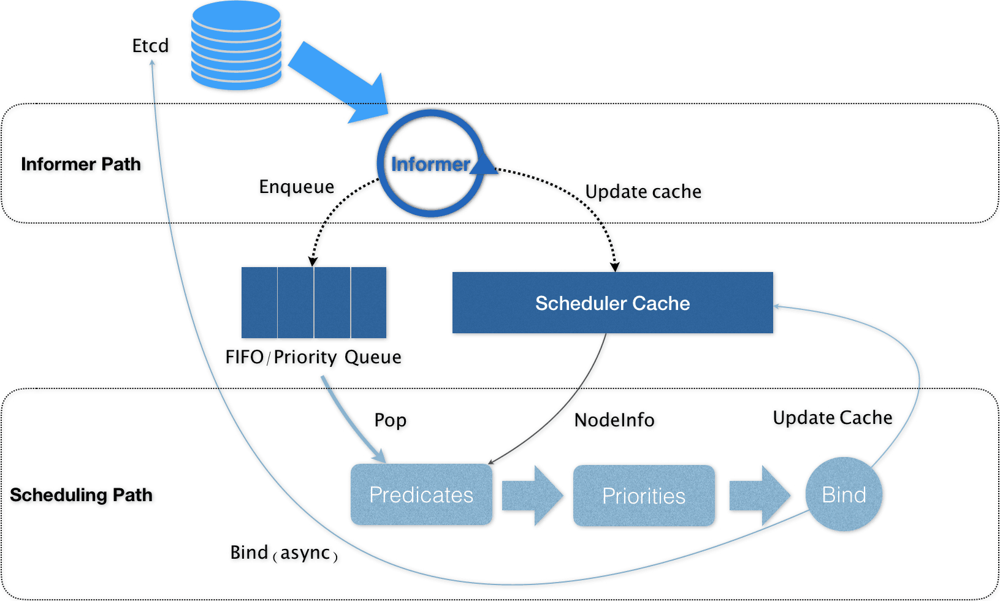

# 7.5.4 Kubernetes 默认调度器

调度器主要的职责是为一个新创建出来的 Pod，寻找一个最合适的节点（Node）。

:::tip <a/>

为了充分利用硬件资源，通常会将各种类型(CPU 密集、IO 密集、批量处理、低延迟作业)的 workloads 运行在同一台机器上，这种方式减少了硬件上的投入，但也使调度问题更加复杂。

随着集群规模的增大，需要调度的任务的规模也线性增大，由于调度器的工作负载与集群大小大致成比例，调度器有成为可伸缩性瓶颈的风险。

:::right

—— from Omega 论文

:::

默认调度器的主要职责，就是为一个新创建出来的 Pod，寻找一个最合适的节点（Node）而这里“最合适”的含义，包括两层：

- 预选：从集群所有的节点中，根据调度算法挑选出所有可以运行该 Pod 的节点；
- 优选：从第一步的结果中，再根据调度算法挑选一个最符合条件的节点作为最终结果。

所以在具体的调度流程中，默认调度器会首先调用一组叫作 Predicate 的调度算法，来检查每个 Node。然后，再调用一组叫作 Priority 的调度算法，来给上一步得到的结果里的每个 Node 打分。最终的调度结果，就是得分最高的那个Node。

:::tip inform
:::

:::center
   
  图 7-1 kube-scheduler 组件概览
:::

