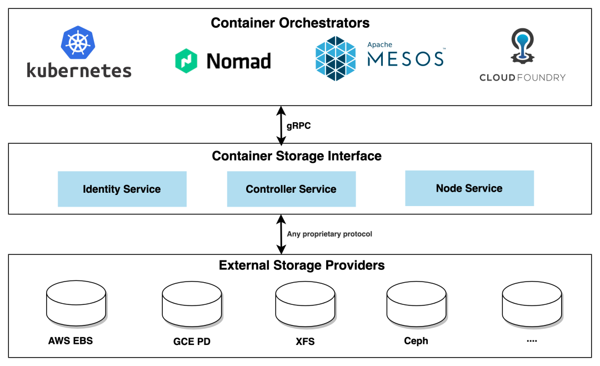

# 7.5 存储系统设计的演进

在计算机体系中，硬盘被定义为外设，如果要使用，得先添加（Attach）一块磁盘（Volume），然后再挂载（Mount）到某个目录。容器的本质是操作操作系统的虚拟化，自然地 Volume 和 Mount 的设计自然也被继承到容器系统中。 

但存储从来就不是件简单的事情：存储位置不限于宿主机（还有网络存储），存储的介质不限于只是磁盘（还有 tmpfs），存储的管理不限于映射关系（还有各种访问模式），存储的类型又有临时和持久之分。这么多的需求，反应到 Kubernetes Volum 设计中，仅 Volum 的类型就有十几种之多


:::center
  <br/>
:::


乍一看，这么多的类型，这么多的操作，实在难以下手。笔者从下面的几个角度中寻找出 Kubernetes 存储系统的演进的主线，在其中体会 Kubernetes 是如何设计存储的，理解了它的意图，也能更好地学习到如何正确使用 Kubernetes 存储。

- 从 Pod 中独立出来，具有单独的声明周期；
- 从临时存储到持久化存储
- PV 的创建从静态到动态
- 扩展的方式从 in-tree 到 out-tree 的转变。


## 临时存储


默认情况下，容器内创建的所有的文件都存储在一个可写的容器层内（参见 7.3 容器镜像的原理及演进），将数据写在容器内部，当容器不存在时，数据也肯定会随着容器的消逝而消失。

在 Docker 时代，我们通过创建 Volume 数据卷，然后挂载到指定容器的指定路径下，以实现容器数据的持久化存储。 

```
docker run -v /usr/share/nginx/html:/data nginx:lastest
```

上面的操作实际上相当于在容器中执行下面类似的代码。

```
// 将宿主机中的 /usr/share/nginx/html 挂载到 rootfs 指定的挂载点 /data 上
mount("/usr/share/nginx/html","rootfs/data", "none", MS_BIND, nulll)
```

:::center
  <br/>
:::


常见的临时卷包括 EmptyDir、HostPath、ConfigMap 和 Secret，Volume 是包在 Pod 内的，因此其生命周期与挂载它的 Pod 是一致的，当 Pod 因某种原因被销毁时，Volume 也会随之删除。

:::center
  <br/>
:::

Volume 的主要作用还 Pod 内部容器之间的数据共享。


## 从临时卷到持久化存储

Kubernetes 的 Volumn 和 Docker 还有很大的不同的。首先 Pod 有可能漂移到其他主机，想要让数据能够持久化，首先就需要将 Pod 和卷的声明周期分离，这也就是引入持久卷 PersistentVolume(PV) 的原因。

PV 为 Kubernete 集群提供了一个如何提供并且使用存储的抽象，如下代码所示，声明了一个 PV 存储对象，并描述了存储能力、访问模式、存储类型、回收策略、后端存储类型等信息。

```
apiVersion: v1
kind: PersistentVolume
metadata:
  name: pv1
spec:
  capacity:  #容量
    storage: 5Gi
  accessModes:  #访问模式
  - ReadWriteOnce
  persistentVolumeReclaimPolicy: Recycle  #回收策略
  storageClassName: slow  
  nfs:
    path: /
    server: 172.17.0.2
```

PV 描述了详细的存储信息，但对应用层的开发者却不太友好，应用层开发者只想知道我有多大的空间、I/O 是否满足要求，并不关心存储底层的配置。这时就需要对存储服务再次进行抽象，把应用开发者关心的逻辑再抽象一层出来，这就是 PVC（Persistent Volume Claim）。


如下声明一个 PVC，与某个 PV 绑定后再被应用（Pod）消费。

```
apiVersion: v1
kind: PersistentVolumeClaim
metadata:
  name: pv-claim
spec:
  storageClassName: manual
  accessModes:
    - ReadWriteOnce
  resources:
    requests:
      storage: 3Gi
```

在 Pod 中使用存储：

```
apiVersion: v1
kind: Pod
metadata:
  name: test-nfs
spec:
  containers:
  - image: nginx:alpine
    imagePullPolicy: IfNotPresent
    name: nginx
    volumeMounts:
    - mountPath: /data
      name: nfs-volume
  volumes:
  - name: nfs-volume
    persistentVolumeClaim:
      claimName: pv-claim
```

此时 NFS 的远端存储就挂载了到 Pod 中 nginx 容器的 /data 目录下。

PVC 和 PV 的设计，其实跟“面向对象”的思想完全一致：
- PVC 可以理解为持久化存储的“接口”，它提供了对某种持久化存储的描述，声明需要的存储类型、大小、访问模式等需求；
- 而这个持久化存储的实现部分则由 PV 负责完成。

作为应用开发者，我们只需要跟 PVC 这个“接口”打交道，而不必关心底层存储实现是 NFS 还是 Ceph。


## 从静态到动态

前面通过人工管理 PV 的方式叫作 Static Provisioning，如果是小规模的集群，这种方式倒也不是什么问题。但在一个大规模的 Kubernetes 集群里很可能有成千上万个 Pod，这肯定没办法靠人工的方式提前创建出成千上万个 PVC。所以，Kubernetes 为我们提供了一套可以自动创建 PV 的机制，即：Dynamic Provisioning。

Dynamic Provisioning 机制工作的核心在于一个名叫 StorageClass 的 API 对象，这个对象的作用其实就是创建 PV 的模板，它的定义主要包名称、存储提供者（provisioner）以及存储的相关参数。

如下示例，定义了一个名为 standard 的 StorageClass，存储提供者为 为 aws-ebs，其存储参数设置了一个 type ，值为 gp2，回收策略为 Retain。

```
apiVersion: storage.k8s.io/v1
kind: StorageClass
metadata:
  name: standard
provisioner: kubernetes.io/aws-ebs
parameters:
  type: gp2
reclaimPolicy: Retain
allowVolumeExpansion: true
mountOptions:
  - debug
volumeBindingMode: Immediate
```

https://kubernetes-csi.github.io/docs/drivers.html

现在，基于 StorageClass 的动态资源提供模式已经逐步成为各类云平台的标准存储管理模式。


## 从 in-tree 到 out-tree 的转变

CSI 存储提供商有两种类型，一种是 in-tree（树内类型），一种是 out-tree（树外类型）。前者是运行在k8s核心组件内部的存储插件；后者是一个独立于 Kubernetes 组件运行的存储插件，代码实现与 Kubernetes 本身解耦。

Kubernetes 最开始内置了 20 多种存储插件，但内置的往往满足不了定制化的需求。所以，和 CNI 一样，Kubernetes 也对外暴露存储接口，只要实现对应的接口方法，那么就可以创建属于自己的存储插件。

~~FlexVolume~~ 这个功能特性在 Kubernetes v1.2 引入

从 1.9 开始又引入了 Container Storage Interface（CSI）机制，CSI 的设计思想是将存储管理和容器编排系统解耦，使得新的存储系统可以通过实现一组标准化的接口来与 Kubernetes 进行集成，而无需修改 Kubernetes 的核心代码。
CSI 驱动器的出现为 Kubernetes 用户带来了更多的存储选择，同时也为存储供应商和开发者提供了更方便的接入点，使得集群的存储管理更加灵活和可扩展。值得注意的是 CSI 是整个容器生态的标准存储接口，同样适用于 Mesos、Cloud Foundry 等其他的容器集群调度系统。


:::center
  <br/>

:::

由于 CSI 的机制复杂、涉及的组件众多，详细介绍 CSI 工作原理也偏离了本节内容的范畴，相关的内容就不再过多介绍。接下来，我们从原理分析转回到开发者应用视角。得益 Kubernetes 的开放性设计，通过下图感受支持 CSI 的存储生态，基本上包含了市面上所有的存储供应商。

:::center
  <br/>

  CNCF 下的 Kubernetes 存储生态
:::

上述众多的存储系统实在无法一一展开，但无论多少种系统/供应商，总结其提供的存储类型来说无外乎 3 种：文件存储、块存储和对象存储。**三者的划分的依据可以根据数据的“用户”不同来解释：块存储的用户是可以读写块设备的软件系统，例如传统的文件系统、数据库；文件存储的用户是自然人；对象存储的用户则是其它计算机软件**。


### 块存储

传统的文件系统，是直接访问存储数据的硬件介质的。介质不关心也无法去关心这些数据的组织方式以及结构，那就用最简单粗暴的组织方式把所有数据按照固定的大小分块，每一块赋予一个用于寻址的编号。所以，硬盘往往又叫块设备（Block Device）。

在 Linux 的 IO 软件栈中，要直接使用块存储的话就要基于 LBA 编程，使用存储相匹配的协议（SCSI、SATA、SAS、FCP、FCoE、iSCSI..），因此接口较为简单朴素，再加上块存储本身处于整个存储软件栈的底层，这导致**块存储使用起来不友好，但具有超低的时延和超高的吞吐**。

### 文件存储

文件存储的用户是自然人，这个最容易理解。

专门组织块结构来构成文件的块的表（比如FAT），在表中再加入其他控制信息，就能很方便地扩展出更多的高级功能，比如除了文件占用的块地址信息外，在表中再加上文件的逻辑位置就形成了目录，加上文件的访问标志就形成了权限，我们还可以再加上文件的名称、创建时间、所有者、修改者等一系列的元数据信息。

文件存储的访问不像块存储那样有五花八门的协议，其 POSIX 接口（Portable Operating System Interface，POSIX）已经成为事实标准，诸如 Open、Write、Read 等许多操作数据的接口都能在文件系统中被找到。人们把定义文件分配表应该如何实现、储存哪些信息、提供什么功能的标准称为文件系统（File System），很常用的文件系统如 FAT32、NTFS、exFAT、ext2/3/4、XFS、BTRFS 等等。


### 对象存储

对象存储其实介于块存储和文件存储之间。文件存储的树状结构以及路径访问方式虽然方便人类理解、记忆和访问，但计算机需要把路径进行分解，然后逐级向下查找，最后才能查找到需要的文件，对于应用程序来说既没必要，也很浪费性能。


而块存储是排它的，服务器上的某个逻辑块被一台客户端挂载后，其它客户端就无法访问上面的数据了。而且挂载了块存储的客户端上的一个程序要访问里面的数据，不算类似数据库直接访问裸设备这种方式外，通常也需要对其进行分区、安装文件系统后才能使用

是否可以用不排它但又类似块设备访问的方式呢？但对块设备的访问方式虽然比文件存储快，其实也很麻烦——一个文件往往是由多个块组成，并且很可能是不连续的。

为了解决这中麻烦，使用一个统一的底层存储系统，管理这些文件和底层介质的组织结构，然后给每个文件一个唯一的标识，其它系统需要访问某个文件，直接提供文件的标识就可以了。存储系统可以用更高效的数据组织方式来管理这些标识以及其对应的存储介质上的块。

当然，对于不同的软件系统来说，一次访问需要获取的不一定是单个我们传统意义上的文件，根据不同的需要可能只是一个/组值，某个文件的一部分，也可能是多个文件的组合，甚至是某个块设备，统称为对象。这就是对象存储。


至于如何选择
公有云的：AWS S3，腾讯云的 COS，阿里云的 OSS 等，HDFS、FastDFS、swift 等属于对象存储。

