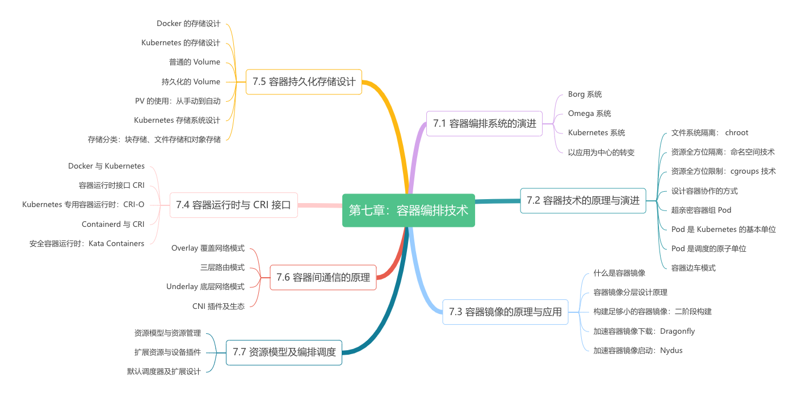

# 第七章：容器编排技术

:::tip <a/>

世界上有两个设计软件的方法，一种方法是设计的尽量简单，以至于明显没有什么缺陷，另外一种方式是使他尽量的复杂，以至于其缺陷不那么明显。

:::right
—— by C.A.R. Hoare[^1]
:::

以 Docker 为代表的容器引擎，通过容器镜像封装了应用运行所需的一切依赖，实现了测试/发布/部署的完美闭环。

但从单体应用转向分布式应用，随着容器规模的不断增加，手动操作容器的弊端不断放大，成为制约 Docker 大规模应用的主要障碍。面对系统内成千上万的容器，如何分配资源，容器之间如何通信，如何扩缩规模，如何在不同节点之间调度容器，
这些丞待解决的正是容器编排与部署问题，只有系统化的解决这一系列问题，容器编排系统才能获得更高的生产力。

Kubernetes 已经成为容器编排的事实标准。
在过去 10 年的发展中，Kubernetes 逐渐成为大数据分析、机器学习等复杂分布式系统的底座，解决复杂问题的同时，Kubernetes 自身也成为最复杂的软件系统之一。包括官方文档，绝大部分介绍 Kubernetes 的资料都直面各个工程细节，并不解释设计缘由。如果笔者再循规蹈矩地介绍一些“是什么”、“怎么做”等表面内容，一则重复前人的工作，二则也无法真正解释清楚 Kubernetes 为何这么设计。

Google 从 2015 年起陆续公布了《Borg, Omega, and Kubernetes》以及《Large-scale cluster management at Google with Borg》等论文，论文介绍了开发和运维 Borg、Omega 和 Kubernetes 系统的经验与教训。我们从这几篇论文着手，了解 Google 内部容器系统是怎么演变的，汲取他人的设计思想后，再来深刻理解 Kubernetes 中关于计算、网络和存储的设计原理和应用。本章内容安排如图 7-0 所示。

:::center
   
  图 7-0 本章内容导图
:::

[^1]: Charles Antony Richard Hoare（缩写为 C. A. R. Hoare），著名的计算科学家，图灵奖获得者，以设计了快速排序算法、霍尔逻辑、通信顺序进程闻名。