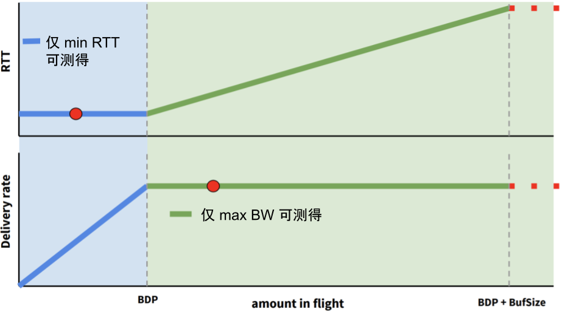

# 2.6 网络拥塞控制原理与实践

本节，我们分析互联网不同阶段拥塞控制算法原理，讨论在大带宽、高延迟的网络环境下改善“网络吞吐量”（Network Throughput）的设计。

## 2.6.1 网络拥塞控制原理

网络吞吐量与 RTT、带宽密切相关，图 2-22 展示了这两者的变化对网络吞吐量的影响，可以看出：
- RTT 越低，数据传输的延迟越低；
- 带宽越高，网络在单位时间内传输的数据越多。

:::center
   
 图 2-22 RTT、带宽变化对网络吞吐效率的影响
:::

首先，解释图中的一些术语，它们的含义如下：

- **RTprop (Round-Trip propagation time，两个节点之间最小时延)**：该值取决于物理距离，距离越长，时延越大。
- **BtlBw（Bottleneck Bandwidth，瓶颈带宽）**：如果把网络链路想象成水管，RTprop 是水管的长度，BtlBw 则是水管最窄处的直径。
- **BDP（Bandwidth-Delay Product，带宽、时延的乘积）**：它代表了网络上能够同时容纳的数据量（水管中有多少流动的水）。 BDP 的计算公式是：BDP = 带宽 × 时延。其中，带宽以比特每秒（bps）为单位，时延以秒为单位。
- **inflight 数据**：指已经发送出去，仍在网络中传输，尚未收到接收方确认的数据包。

受 RTT 和带宽影响，图 2-22 被分成了三个区间：

1. (0，BDP)：称为“应用受限区”（app limited）。该区间内，inflight 数据量未占满瓶颈带宽。RTT 最小、传输速率最高。
2. (BDP，BtlBwBuffSize)：称为“带宽受限区”（bandwidth limited）。该区间内，inflight 数据量已达到链路瓶颈容量，但尚未超过瓶颈容量加缓冲区容量。此时，应用能发送的数据量受带宽限制。RTT 逐渐变大，传输速率到达上限。
3. (BDP + BtlBwBuffSize，infinity)：称为“缓冲受限区”（buffer limited）。该区间内，实际发送速率已超过瓶颈容量加缓冲区容量，超出部分的数据会被丢弃，从而产生丢包。RTT 以及传输速率均达到上限。

根据图 2-22 可以看出，拥塞的本质是 inflight 数据量持续偏离 BDP 线向右扩展。所以，拥塞控制的关键在于调节 inflight 数据量保持在合适的区间。显然，当 inflight 数据量位于“应用受限区”与“带宽受限区”的边界时，传输速率接近瓶颈带宽，且无丢包发生。

## 2.6.2 早期拥塞控制旨在收敛

早期互联网的拥塞控制以丢包为控制条件，控制逻辑如图 2-21 所示。

发送方维护一个称为“拥塞窗口”（cwnd）的状态变量，其大小取决于网络拥塞程度和所采用的拥塞控制算法。数据传输过程中，发送方首先进入“慢启动”阶段，逐步增大拥塞窗口；当发生丢包时，进入“拥塞避免”阶段，逐步减小拥塞窗口；丢包消失后，再次进入慢启动阶段，如此一直反复。

:::center
   
 图 2-21 早期以丢包为条件的拥塞控制
:::

以丢包为控制条件的机制适应了早期互联网的特征：低带宽、浅缓存队列。

随着移动互联网的快速发展，尤其是图片和音视频应用的普及，网络负载大幅增加。同时，摩尔定律推动设备性能不断提升、成本持续下降。当路由器、网关等设备的缓存队列增大，网络链路变得更长、更宽时，RTT 可能因队列增加而上升，丢包则可能由于链路过长。也就是说，网络变差并不总是因为拥塞所致。因此，以丢包为控制条件的传统拥塞控制算法就不再适用了。

## 2.6.3 现代拥塞控制旨在效能最大化

早期的拥塞控制算法侧重于收敛，以避免互联网服务因“拥塞崩溃”而失效。BBR 算法的目标更进一步，充分利用链路带宽、路由/网关设备缓存队列，最大化网络效能。

最大化网络效能的前提是找到网络传输中的最优点，图 2-22 中的两个黑色圆圈即代表网络传输的最优点：
- 上面的圆圈为 min RTT（延迟极小值）：此时，网络中路由/网关设备的 Buffer 未占满，没有任何丢包情况;
- 下面圆圈的为 max BW（带宽极大值）：此时，网络中路由/网关设备的 Buffer 被充分利用。

当网络传输处于最优点时：

- 数据包投递率 = BtlBW（瓶颈带宽），保证了瓶颈链路被 100% 利用；
- 在途数据包总数 = BDP（时延带宽积），保证了 Buffer 的利用合理。

然而，最小延迟与最大带宽互相矛盾，无法同时测量。如图 2-24 所示，测量最大带宽时，必须填满瓶颈链路，此时缓冲区被占满，导致延迟增大；测量最小延迟时，需确保缓冲区不能被占满，这又无法测量最大带宽。

:::center
   
 图 2-24 无法同时得到 max BW 和 min RTT
:::

## 2.6.4 BBR 的设计原理

BBR 的解题思路是不再考虑丢包作为拥塞的判断条件，而是交替测量带宽和延迟，观测一段时间内的最大带宽和最小延迟来估算发包速率：

- 为了最大化带宽利用率，BBR 周期性探测链路条件的改善，并在检测到带宽提升时增加发包速率；
- 为了防止数据在中间设备缓存队列中堆积，BBR 定期探测链路的最小 RTT，并根据最小 RTT 调整发包速率。

BBR 的拥塞控制状态机是实现上述设计的核心基础。该状态机在任何时刻处于以下四种状态之一：启动（STARTUP）、排空（DRAIN）、带宽探测（PROBE_BW）和时延探测（PROBE_RTT）。

这四种状态的含义以及转换关系如图 2-23 所示。

- **启动阶段**（STARTUP）：连接建立时，BBR 采用类似传统拥塞控制的慢启动方式，指数级提升发送速率，目的是尽快找到最大带宽。当在连续一段时间内检测到发送速率不再增加，说明瓶颈带宽已达到，此时状态切换至排空阶段。
- **排空阶段**（DRAIN）：此阶段通过指数级降低发送速率，执行启动阶段的反向操作，目的是逐步清空缓冲区中的多余数据包。
- **带宽探测阶段**（PROBE_BW）：完成启动和排空阶段后，BBR 进入带宽探测阶段，这是 BBR 主要运行的状态。当 BBR 探测到最大带宽和最小延迟，并且在途数据量（inflight）等于 BDP 时，BBR 以稳定的速率维持网络状态，并偶尔小幅提速探测更大的带宽或小幅降速以公平释放带宽。
- **时延探测阶段**（PROBE_RTT）：如果未检测到比前一周期更小的最小 RTT，则进入时延探测阶段。在该状态下，拥塞窗口（Cwnd）被设定为 4 个 MSS（最大报文段长度），并重新测量 RTT，持续 200ms。超时后，根据网络带宽是否已满载，决定切换至启动阶段或带宽探测阶段。

:::center
   
 图 2-23 BBR 状态转移关系
:::

## 2.6.5 BBR 的性能表现

从 Linux 4.9 内核开始，BBR 被正式集成。此后，大多数 Linux 发行版仅需几条命令即可启用 BBR 算法。

通过 Linux 流量控制工具（tc），可以在两台机器之间模拟不同的延迟和丢包条件，以测试各类拥塞控制算法的性能。直接来看表 2-3 的测试结果，可以发现，在轻微丢包的网络环境下，BBR 的表现尤为突出。

:::center
表 2-3 不同网络环境下，各类拥塞控制算法的吞吐性能表现 [表数据来源](https://toonk.io/tcp-bbr-exploring-tcp-congestion-control/index.html)
:::

|服务端的拥塞控制算法|延迟|丢包率|吞吐性能表现|
|:--|:--|:--|:--|
| Cubic| <1ms| 0% |2.35Gb/s|
| Reno| <140ms| 0% |195 Mb/s|
| Cubic| <140ms| 0% |147 Mb/s|
|Westwood| <140ms| 0% |344 Mb/s| 
| BBR| <140ms| 0% |340 Mb/s| 
| Reno| <140ms| 1.5% |1.13 Mb/s| 
| Cubic| <140ms| 1.5% |1.23 Mb/s|
| Westwood| <140ms| 1.5% |2.46 Mb/s|
| BBR| <140ms| 1.5% |**160 Mb/s**| 
| Reno| <140ms| 3% |0.65 Mb/s| 
| Cubic| <140ms| 3% |0.78 Mb/s| 
| Westwood| <140ms| 3% |0.97 Mb/s| 
| BBR| <140ms| 3% |**132 Mb/s**| 