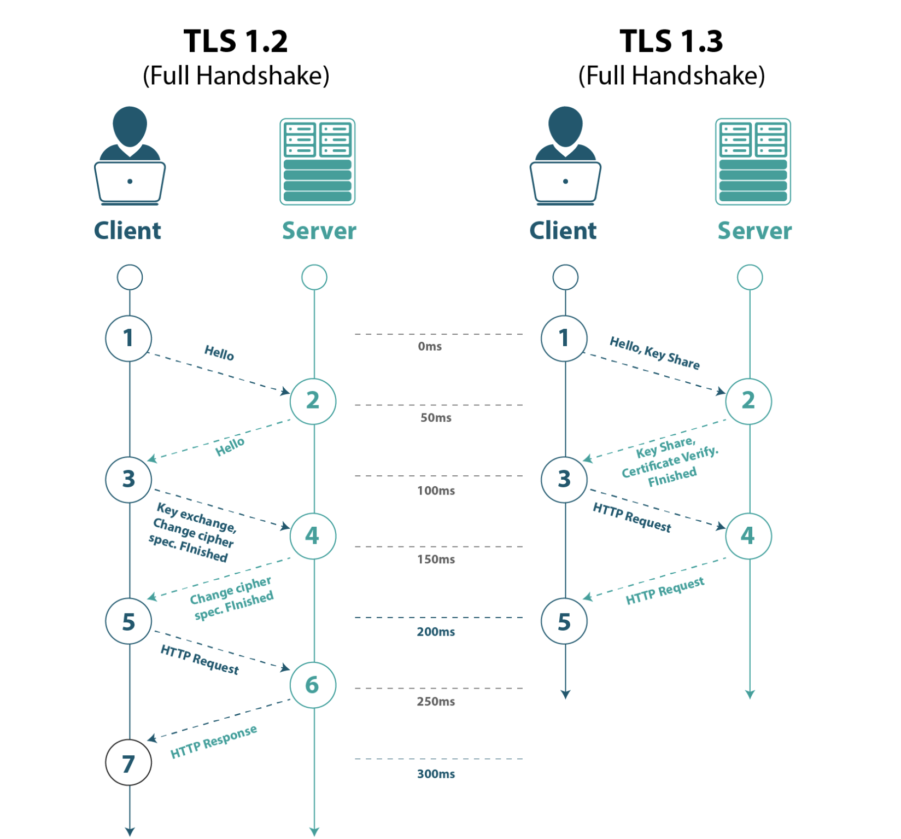
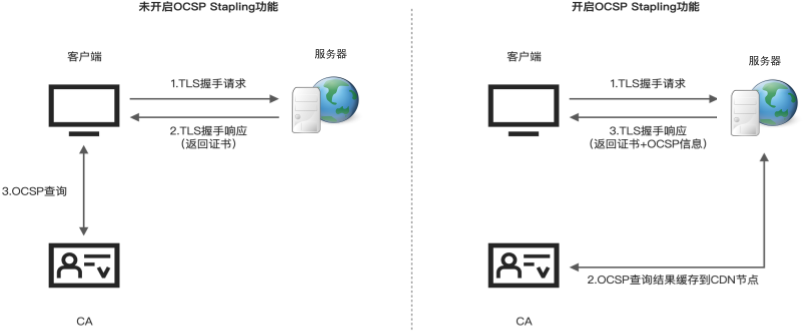

# 2.5.2 HTTPS 优化实践

众所周知，HTTPS 请求出了名的慢。在未进行优化的情况下，HTTPS 的延迟比 HTTP 高出几百毫秒。本节，将介绍 4 种优化手段来降低 HTTPS 请求的延迟。

## 1. 使用 TLS1.3 协议 

2018 年发布的 TLS 1.3 协议优化了 SSL 握手过程，将握手时间缩短至 1 次 RTT；若复用已有连接，还能实现 0 RTT（通过 early_data 机制）。

:::center
  <br/>
 图 2-17 TLS1.3 对比 TLS1.2
:::

以 Nginx 配置为例，确保 Nginx 版本为 1.13.0 或更高，OpenSSL 版本为 1.1.1 或更高。然后，在配置文件中使用 ssl_protocols 指令启用 TLSv1.3 支持。
```nginx
server {
	listen 443 ssl;
	ssl_protocols TLSv1.2 TLSv1.3;

	# 其他 SSL 配置...
}
```
## 2. 使用 ECC 证书

HTTPS 数字证书分为 RSA 证书和 ECC 证书，二者的区别如下：
- **RSA 证书**使用 RSA 算法生成公钥，兼容性较好，但不支持完美前向保密（PFS）。PFS 可确保即使私钥泄露，泄露之前的通信内容仍无法被破解。
- **ECC 证书**使用椭圆曲线加密算法（Elliptic Curve Cryptography）生成公钥，提供更高的计算速度和安全性，并支持 PFS。ECC 能以较小的密钥长度提供相同或更高的安全性。例如，256 位的 ECC 密钥相当于 3072 位的 RSA 密钥。

ECC 证书的唯一缺点是兼容性稍差。在 Windows XP 上，只有 Firefox 支持访问使用 ECC 证书的网站（因其独立实现 TLS，不依赖操作系统）；在 Android 平台上，需 Android 4.0 以上版本才能支持 ECC 证书。好消息是，从 Nginx 1.11.0 开始，支持配置 RSA/ECC 双证书。在 TLS 握手过程中，Nginx 会根据双方协商的密码套件（Cipher Suite）返回证书。如果支持 ECDSA 算法，则返回 ECC 证书；否则，返回 RSA 证书。

Nginx 双证书配置示例如下：

```nginx
server {
	listen 443 ssl;
	ssl_protocols TLSv1.2 TLSv1.3;

	# RSA 证书
	ssl_certificate  /cert/rsa/fullchain.cer;
	ssl_certificate_key  /cert/rsa/thebyte.com.cn.key;
	# ECDSA 证书
	ssl_certificate  /cert/ecc/fullchain.cer;
	ssl_certificate_key  /cert/ecc/thebyte.com.cn.key;

    # 其他 SSL 配置...
}
```
需要注意的是，配置了 ECC 证书并不意味着它一定会生效。ECC 证书的生效与客户端和服务端协商的密码套件（Cipher Suite）密切相关。密码套件决定了通信双方使用的加密、认证算法和密钥交换算法。

以下是密码套件的配置示例：

```nginx
server {
	# 设置协商加密算法时，优先使用我们服务端的加密套件，而不是客户端浏览器的加密套件。
	ssl_prefer_server_ciphers on;
	# 配置密码套件
    ssl_ciphers 'ECDHE+CHACHA20:ECDHE+CHACHA20-draft:ECDSA+AES128:ECDHE+AES128:RSA+AES128:RSA+3DES';

    # 其他 SSL 配置...
}
```
可以使用 openssl ciphers 命令查看服务器中指定的 ssl_ciphers 配置所支持的密码套件及其优先级。例如，运行以下命令查看支持的密码套件：

```bash
$ openssl ciphers -V 'ECDHE+CHACHA20:ECDHE+CHACHA20-draft:ECDSA+AES128:ECDHE+AES128:RSA+AES128:RSA+3DES' | column -t
0x13,0x02  -  TLS_AES_256_GCM_SHA384         TLSv1.3  Kx=any   Au=any    Enc=AESGCM(256)             Mac=AEAD
0x13,0x03  -  TLS_CHACHA20_POLY1305_SHA256   TLSv1.3  Kx=any   Au=any    Enc=CHACHA20/POLY1305(256)  Mac=AEAD
0x13,0x01  -  TLS_AES_128_GCM_SHA256         TLSv1.3  Kx=any   Au=any    Enc=AESGCM(128)             Mac=AEAD
0xCC,0xA9  -  ECDHE-ECDSA-CHACHA20-POLY1305  TLSv1.2  Kx=ECDH  Au=ECDSA  Enc=CHACHA20/POLY1305(256)  Mac=AEAD
0xCC,0xA8  -  ECDHE-RSA-CHACHA20-POLY1305    TLSv1.2  Kx=ECDH  Au=RSA    Enc=CHACHA20/POLY1305(256)  Mac=AEAD
0xC0,0x2B  -  ECDHE-ECDSA-AES128-GCM-SHA256  TLSv1.2  Kx=ECDH  Au=ECDSA  Enc=AESGCM(128)             Mac=AEAD
```

通过上面的输出，可以看到使用 ECDSA 签名认证算法（Au=ECDSA）的密码套件优先于使用 RSA 签名认证算法（Au=RSA）的套件。这种优先级确保在客户端支持的情况下，服务器优先选择 ECC 证书。


## 3. 调整 https 会话缓存

HTTPS 连接建立后，会生成一个会话（session），用于保存客户端和服务器之间的安全连接信息。如果会话未过期，后续连接可复用先前的握手结果，从而提高连接效率。

Nginx 中与会话相关的配置如下：

```nginx
server {
	ssl_session_cache shared:SSL:10m;
	ssl_session_timeout 1h;
}
```
上述配置说明如下：

- **ssl_session_cache**：设置 SSL/TLS 会话缓存的类型和大小。配置为 shared:SSL:10m 表示所有 Nginx 工作进程共享一个 10MB 的 SSL 会话缓存。根据官方说明，1MB 缓存可存储约 4,000 个会话。
- **ssl_session_timeout**：设置会话缓存中 SSL 参数的过期时间，决定客户端能在多长时间内重用缓存的会话信息。此例中，设定为 1 小时。

## 4. 开启 OCSP stapling

客户端首次下载数字证书时，会向 CA 发起 OCSP（在线证书状态协议）请求，验证证书是否被撤销或过期。由于不同 CA 的部署位置不同，这一操作通常会引起一定的网络延迟。

OCSP Stapling 技术可以解决这一问题。图 2-18 展示了其工作原理：客户端原本需要执行的 OCSP 查询被转交给后端服务器处理。服务器预先获取并缓存 OCSP 响应，在客户端发起 TLS 握手时，将证书的 OCSP 信息与证书链一起发送给客户端。

:::center
  <br/>
 图 2-18 OCSP Stapling 工作原理
:::

nginx 中与 OCSP Stapling 相关的配置如下：
```nginx
server {
	ssl_stapling on;
	ssl_stapling_verify on;
	ssl_trusted_certificate /path/to/xxx.pem;
	resolver 8.8.8.8 valid=60s;# 
	resolver_timeout 2s;
}
``` 

需要注意的是，如果 CA 提供的 OCSP 需要二次验证，则必须通过 ssl_trusted_certificate 指定 CA 的中级证书和根证书的位置，否则会报错：[error] 17105#17105: OCSP_basic_verify() failed。"

配置完成后，使用 openssl 命令测试服务端配置是否生效。

```bash 
$ openssl s_client -connect thebyte.com.cn:443 -servername thebyte.com.cn -status -tlsextdebug < /dev/null 2>&1 | grep "OCSP" 
OCSP response:
OCSP Response Data:
    OCSP Response Status: successful (0x0)
    Response Type: Basic OCSP Response
```
若结果中存在“successful”关键字，则表示已开启 OCSP Stapling 服务。

至此，整个 HTTPS 优化方案（TLS1.3、ECC 证书、OCSP Stapling）介绍结束。接下来，进入成果检验阶段。

## 5. 优化效果

首先使用 https://myssl.com/ 服务确认配置是否生效，如图 2-19 所示。

:::center
  <br/>
 图 2-19 证书配置
:::

接着，对不同证书（ECC 和 RSA），不同 TLS 协议（TLS1.2 和 TLS1.3）进行压测，测试结果如表 2-2 所示。

:::center
表 2-2 HTTPS 性能基准测试
:::
|证书、TLS 版本配置|QPS|单次发出请求数|延迟表现|
|:--|:--|:--|:--|
|RSA 证书 + TLS1.2| 316.20| 100|316.254ms|
|RSA 证书 + TLS1.2 + QAT| 530.48| 100|188.507ms|
|RSA 证书 + TLS1.3| 303.01| 100|330.017ms|
|RSA 证书 + TLS1.3 + QAT| 499.29| 100|200.285ms|
|ECC 证书 + TLS1.2| 639.39| 100|203.319ms|
|ECC 证书 + TLS1.3| 627.39| 100|159.390ms|

从测试结果来看，使用 ECC 证书相比 RSA 证书在性能上有显著提升。即使 RSA 证书启用了硬件加速技术 QAT（Quick Assist Technology），与 ECC 证书相比仍存在明显差距。此外，QAT 需要额外购买硬件，且维护成本较高，因此不再推荐使用。

综合考虑，建议 HTTPS 配置采用 TLS 1.3 协议与 ECC 证书。