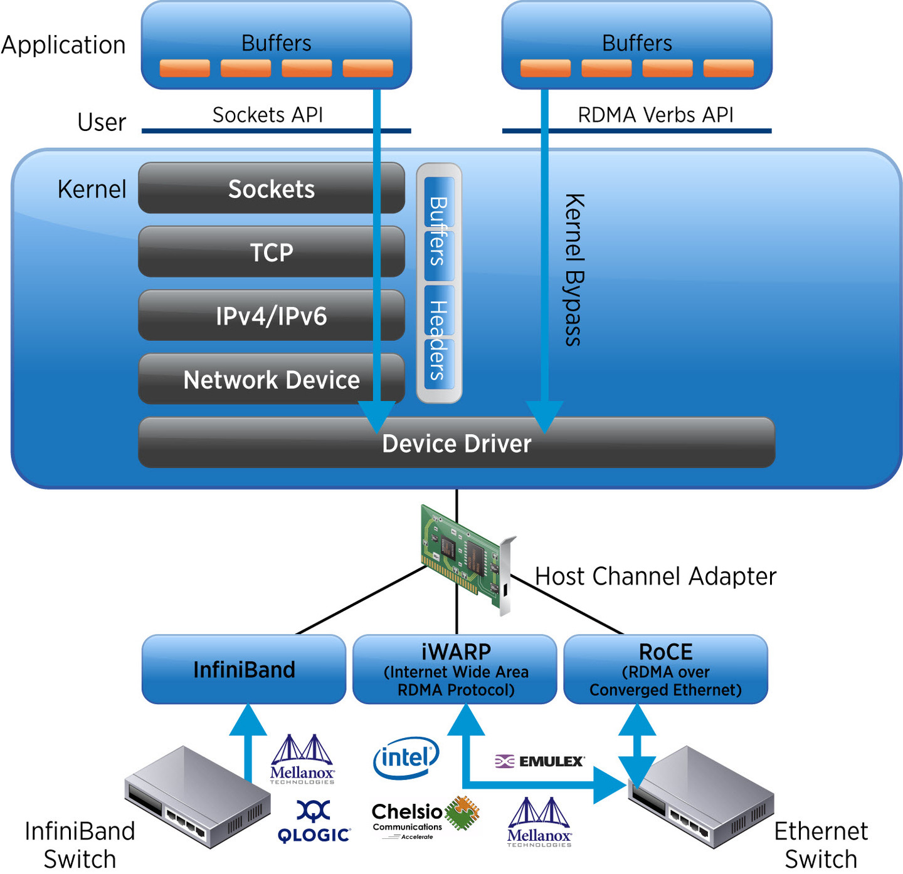

# 3.4.3 远程直接内存访问 RDMA

近几年，人工智能、分布式训练和分布式数据存储迅猛发展，对网络传输性能提出了更高的要求。

但传统的以太网在网络延迟、吞吐量和 CPU 资源消耗方面存在先天不足。此背景下，广泛应用于高性能计算领域的 RDMA（Remote Direct Memory Access，远程直接内存访问）技术，因其卓越的性能，逐渐成为满足上述需求的首选解决方案。

RDMA 设计灵感来源于 DMA（Direct Memory Access，直接内存访问），是一种允许主机之间直接访问彼此内存的技术。DMA 技术中，无需 CPU 参与，主机内部的设备（如硬盘或网卡）能够直接与内存交换数据；RDMA 的工作原理如图 3-10 所示，应用程序通过专用的接口（RDMA Verbs API）绕过主机操作系统和 TCP/IP 协议栈，达到了直接访问远程主机内存的效果。

:::center
   
  图 3-10  RDMA 技术栈
:::

RDMA 网络的协议实现分为三类：Infiniband、RoCE 和 iWARP，它们的含义及区别如下：

- Infiniband（无限带宽）），是一种专门为 RDMA 而生的技术，由 IBTA（InfiniBand Trade Association，
InfiniBand 贸易协会）在 2000 年提出，因其极致的性能（能够实现小于 3 μs 时延和 400Gb/s 以上的网络吞吐），在高性能计算（HPC）领域中备受青睐。
但注意的是，构建 Infiniband 网络需要配置全套专用设备，如专用网卡、专用交换机和专用网线，限制了其普及性。其次，它的技术架构封闭，不兼容现有的以太网标准。这意味着，绝大多数通用数据中心都无法兼容 Infiniband 网络。

	尽管存在上述缺陷，但 Infiniband 因其卓越的性能仍然是某些领域是首选。例如，全球流行的人工智能应用 ChatGPT 背后的分布式机器学习系统就是基于 Infiniband 网络构建的。

- iWRAP（Internet Wide Area RDMA Protocol，互联网广域 RDMA 协议），这是一种将 RDMA 封装在 TCP/IP 协议内的技术。RDMA 网络为了高性能而生，而 TCP/IP 协议为了可靠性而生，它的三次握手、拥塞控制等机制让 iWRAP 失去了绝大部分 RDMA 技术的优势。所以，先天设计缺陷让 iWRAP 逐渐被业界抛弃。

- 为了降低 RDMA 技术的使用成本，并使其应用于通用数据中心领域，2010 年，IBTA 发布了 RoCE（RDMA over Converged Ethernet，融合以太网的远程直接内存访问）技术，将 Infiniband 的数据标准（IB Payload）“移植”到以太网。只需配备支持 RoCE 的专用网卡和标准以太网交换机，即可享受 RDMA 技术带来的高性能。
	
	如图 3-11 所示，RoCE 发展过程中出现了两个版本 RoCEv1 和 RoCEv2：
	- RoCEv1 基于二层以太网，局限于同一子网，无法跨子网通信；
	- RoCEv2 基于三层 IP 网络，支持跨子网通信。

	RoCEv2 解决了 RoCEv1 无法跨子网的局限，凭借其低成本和兼容性优势，RoCE 技术开始广泛应用于分布式存储、并行计算等通用数据中心场景。根据云计算平台 Azure 公开的信息，至 2023 年，Azure 整个数据中心 70% 的流量已经是 RDMA 流量了[^1]。
:::center
   
  图 3-11 RoCE v1 只能在广播域内通信，RoCE v2 支持 L3 路由
:::

RDMA 网络对丢包极为敏感，任何数据包的丢失都可能导致大量重传，降低传输性能。Infiniband 网络依靠专用设备来确保网络可靠性，而 RoCE 网络则基于标准以太网实现 RDMA，这要求基础设施必须具备无损以太网功能，以避免丢包对性能造成严重影响。

目前，大多数数据中心使用 DCQCN （微软和 Mellanox 提出）或者 HPCC（阿里巴巴提出）算法为 RoCE 网络提供可靠性保障。由于这些算法涉及非常底层的技术（笔者的知识盲区），超出了本书的讨论范畴，笔者就不再详细介绍了，有兴趣的读者就请通过其他资料进一步了解。

[^1]: 参见 https://www.usenix.org/system/files/nsdi23-bai.pdf

