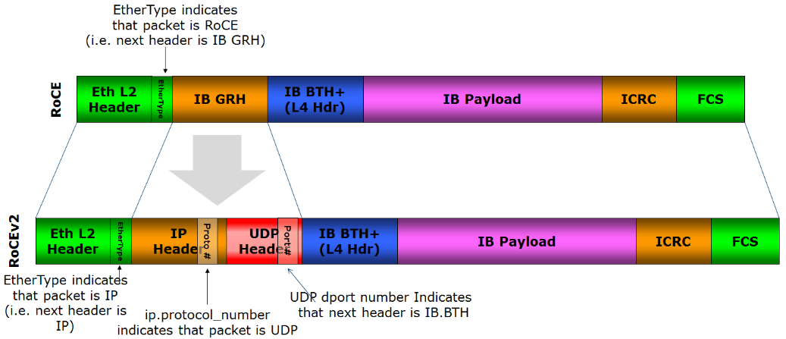

# 3.4.3 远程直接内存访问 RDMA

近年来，人工智能、分布式训练和分布式存储技术快速发展，对网络传输性能提出了更高要求。但传统以太网在延迟、吞吐量和 CPU 资源消耗方面存在先天不足。在这一背景下，RDMA（Remote Direct Memory Access，远程直接内存访问）技术凭借卓越的性能，逐渐成为满足高性能计算需求的优选方案。

RDMA 设计起源于 DMA（Direct Memory Access）技术[^1]，它的工作原理如图 3-10 所示，应用程序通过 RDMA Verbs API 直接访问远程主机内存，而无需经过操作系统或 CPU 参与数据拷贝，从而极大地降低延迟和 CPU 开销，提高数据传输效率。
:::center
   
  图 3-10  RDMA 的技术原理
:::

RDMA 网络的协议实现有三类，它们的含义及区别如下。

- **Infiniband**（无限带宽）），是一种专门为 RDMA 而生的技术，由 IBTA（InfiniBand Trade Association，
InfiniBand 贸易协会）在 2000 年提出，因其极致的性能（能够实现小于 3 μs 时延和 400Gb/s 以上的网络吞吐），在高性能计算领域中备受青睐。
但注意的是，构建 Infiniband 网络需要配置全套专用设备，如专用网卡、专用交换机和专用网线，限制了其普及性。其次，它的技术架构封闭，不兼容现有的以太网标准。这意味着，绝大多数通用数据中心都无法兼容 Infiniband 网络。

	尽管存在这些局限，InfiniBand 仍因其极致的性能成为特定领域的首选。例如，全球流行的人工智能应用 ChatGPT 背后的分布式机器学习系统，就是基于 Infiniband 网络构建的。

- **iWRAP**（Internet Wide Area RDMA Protocol，互联网广域 RDMA 协议）是一种将 RDMA 封装在 TCP/IP 协议中的技术。RDMA 旨在提供高性能传输，而 TCP/IP 侧重于可靠性，其三次握手、拥塞控制等机制削弱了 iWRAP 的 RDMA 技术优势，导致其性能大幅下降。因此，iWRAP 由于先天设计上的局限性，逐渐被业界淘汰。

- 为降低 RDMA 的使用成本，并推动其在通用数据中心的应用，IBTA 于 2010 年发布了 **RoCE**（RDMA over Converged Ethernet，融合以太网的远程直接内存访问）技术。RoCE 将 Infiniband 的数据格式（IB Payload）“移植”到以太网，使 RDMA 能够在标准以太网环境下运行。只需配备支持 RoCE 的专用网卡和标准以太网交换机，即可享受 RDMA 技术带来的高性能。
	
	如图 3-11 所示，RoCE 在发展过程中演化出两个版本：
	- **RoCEv1**：基于二层以太网，仅限于同一子网内通信，无法跨子网传输；
	- **RoCEv2**：基于三层 IP 网络，支持跨子网通信，提高了灵活性和可扩展性。

	RoCEv2 克服了 RoCEv1 不能跨子网的限制，并凭借其低成本和良好的兼容性，在分布式存储、并行计算等通用数据中心场景中得到广泛应用。根据微软 Azure 公开信息，截至 2023 年，Azure 数据中心中 RDMA 流量已占总流量的 70%[^1]。
:::center
   
  图 3-11 RoCE v1 只能在广播域内通信，RoCE v2 支持 L3 路由
:::

RDMA 网络对丢包极为敏感，任何数据包丢失都可能触发大量重传，严重影响传输性能。Infiniband 依赖专用设备确保网络可靠性，而 RoCE 构建在标准以太网上，实现 RDMA 通信。因此，RoCE 网络需要无损以太网支持，以避免丢包对性能造成重大影响。

目前，大多数数据中心采用 DCQCN（由微软与 Mellanox 提出）或 HPCC（由阿里巴巴提出）算法，为 RoCE 网络提供可靠性保障。由于这些算法涉及底层技术，超出本书讨论范畴，感兴趣的读者可参考其他资料以进一步了解。

[^1]: 参见 https://www.usenix.org/system/files/nsdi23-bai.pdf

