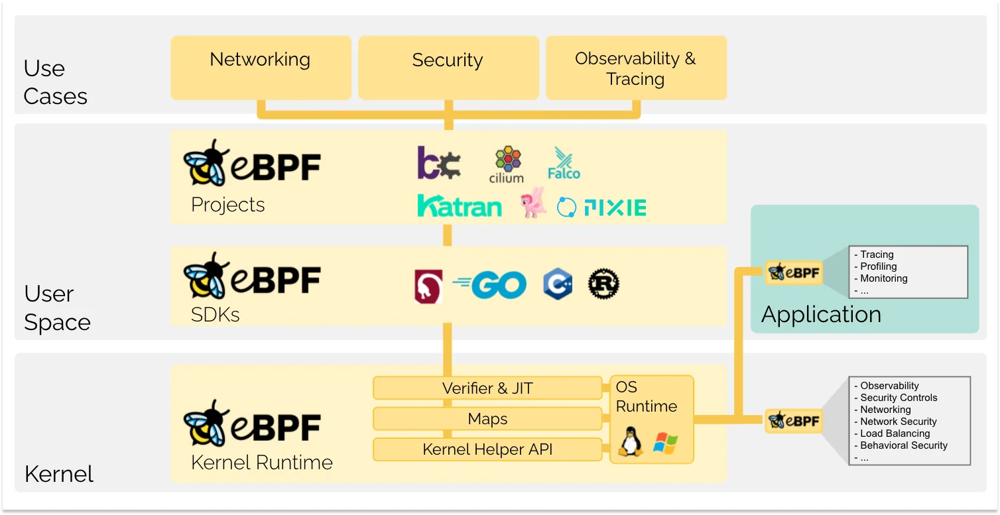

# 3.5.2 eBPF 和 快速数据路径 XDP 

由于 DPDK 完全基于“内核旁路”的思想，它天然无法与 Linux 内核生态很好地结合。

2016 年，在 Linux Netdev 会议上，David S. Miller[^1] 喊出了“DPDK is not Linux”的口号。同年，随着 eBPF 技术的成熟，Linux 内核终于迎来了属于自己的高速公路——XDP（eXpress Data Path，快速数据路径）。XDP 具有媲美 DPDK 的性能，并且背靠 Linux 内核，具备无需第三方代码库和许可、无需专用 CPU 等多种独特优势。

## 1. eBPF 技术简介

DPDK 技术是完全绕过内核，直接将数据包传递到用户空间进行处理。而 XDP 则正好相反，它选择在内核空间中执行我们定义的程序来处理数据包。

那么，如何在内核中执行用户空间定义的程序呢？这就需要用到 BPF（Berkeley Packet Filter，伯克利包过滤器）技术——一种允许在内核空间运行经过安全验证的代码的机制。

自 Linux 内核版本 2.5 起，BPF 就开始得到支持，但早期的 BPF 主要用于网络数据包的捕获和过滤。到了 Linux 内核 3.18 版本，开发者推出了一套全新的 BPF 架构，也就是我们今天所说的 eBPF（Extended Berkeley Packet Filter）。与早期的 BPF 相比，eBPF 的功能不再局限于网络分析。它几乎可以访问 Linux 内核所有关联的资源，并逐渐发展成为一个多功能的通用执行引擎，适用于网络优化（Networking）、系统安全（Security）、可观测性（Observability）和系统追踪（Tracing）等多种场景。

如今，许多文档中提到的 BPF 实际上指的是 eBPF，而将早期的 BPF 称为 cBPF（Classic Berkeley Packet Filter）。

:::center
  <br/>
 图 3-13 eBPF 的技术架构
:::


## 2. XDP 实际是 eBPF 的钩子

XDP 本质是一个可以加载 eBPF 程序的内核钩子，它允许开发人员在网络数据包进入内核的早期阶段（即在网卡驱动层内、数据包进入网络协议栈之前），对传入的数据包进行任意修改和快速决策，避免了内核内部处理带来的额外开销。处理完数据包之后，XDP 程序会返回一个动作（Action）作为输出，它代表了程序退出后对数据包应该做什么样的最终裁决。XDP 5 种动作名称及含义如下：

- XDP_ABORTED 意味着程序错误，会将数据包丢掉。
- XDP_DROP 会在网卡驱动层直接将该数据包丢掉，无需再进一步处理，也就是无需再耗费任何额外的资源。
- XDP_PASS 会将该数据包继续送往内核的网络协议栈，和传统的处理方式一致。这也使得 XDP 可以在有需要的时候方便地使用传统的内核协议栈进行处理。
- XDP_TX 会将该数据包从同一块网卡返回。
- XDP_REDIRECT 则是将数据包重定向到其他的网卡或 CPU，结合 AF_XDP[^2]可以将数据包直接送往用户空间。

:::center
  <br/>
 图 3-13 XDP 架构概览
:::


只要具备了挂钩内核的能力，能够拦截进出主机的每个数据包，就完全可以摆脱数据包在内核协议栈的冗长处理流程。以高性能知名的开源软件 Cilium 为例，它在 eBPF 和 XDP 的基础上，实现了一套全新的连接跟踪和 NAT 机制。然后以此为基础，构建出如 L3/L4 负载均衡、网络策略、观测和安全认证等各类高级功能。

由于 Cilium 方案底层网络实现独立于 Netfilter，因此它的 conntrack 和 NAT 信息不会存储在内核中的 conntrack 表和 NAT 表中。常规的 Linux 命令，如 conntrack、netstat、ss 和 lsof，无法查看 NAT 和 conntrack 数据。需要使用 Cilium 提供的查询命令，例如：

```bash
$ cilium bpf nat list
$ cilium bpf ct list global
```


[^1]: Linux 内核开发者，自 2005 年开始，已经提交过 4989 个 patch，是 Linux 核心源代码第二大的贡献者。
[^2]: 相较 AF_INET 是基于传统网络的 Linux socket，AF_XDP 则是一套基于 XDP 的高性能 Linux socket。
