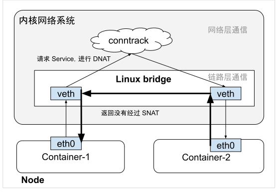

# 3.3.3 连接跟踪 conntrack

conntrack 是 connection track（连接跟踪）的缩写。顾名思义，这个模块是用来跟踪连接的。需要注意的是，conntrack 中的“连接”指的是通信双方之间的数据传输连接，不仅可以跟踪 TCP 连接，还可以跟踪 UDP、ICMP 这样的“连接”。

Linux 内核中的 conntrack 模块为每一个经过网络协议栈的数据包，生成一个新的连接记录项（Connection entry）。此后，所有属于此连接的数据包都被唯一地分配给这个连接，并标识连接的状态（如 NEW、ESTABLISHED 等）。

通过 cat /proc/net/nf_conntrack 命令查看连接记录项。如下所示的是一条状态为 ESTABLISHED 的 TCP 连接。

```bash
$ cat /proc/net/nf_conntrack
ipv4     2 tcp      6 88 ESTABLISHED src=10.0.12.12 dst=10.0.12.14 sport=48318 dport=27017 src=10.0.12.14 dst=10.0.12.12 sport=27017 dport=48318 [ASSURED] mark=0 zone=0 use=2
```

conntrack 是 iptables 连接状态匹配的基础，也是网络地址转换中实现 SNAT 和 DNAT 的前提。Linux 内核进行 NAT 时，conntrack 会跟踪每个连接的源地址和目标地址的映射关系，以确保返回流量能够正确地被重定向到原始发起请求的主机。

我们知道 Kubernetes 的核心组件 kube-proxy，其实就是个反向代理（也就是 NAT）。当外部的请求访问 Service 时，请求被 DNAT 成 PodIP:Port，响应时再经过 SNAT。这样有来有回，对于 conntrack 而言，是一个完整的映射关系。但如果发起请求的 Pod 和处理请求的 Pod 在同一个主机内，问题就来了：
- 发起请求时，数据包经过网络层时，内核中的 conntrack 模块根据 iptables 规则，判断是否需要进行 NAT；
- 返回响应时，如果 Linux 网桥检测到目的 IP 位于同一网桥上，则直接通过二层转发（即链路层通信），并没有触发网络层的 conntrack 模块，也就是不进行 SNAT。因此，通信双方不在同一“频道”上，也就无法正常通信。

:::center
  <br/>
  图 3-13 请求和响应不在一个“频道”上，双方通信失败
:::

针对上述问题，Linux 内核提供了 bridge-nf-call-iptables 配置，决定内核是否将通过网桥的流量交由 iptables 规则匹配处理（也就是处理 NAT）。这正是为什么在部署 Kubernetes 集群时，需要将 Linux 系统的 bridge-nf-call-iptables 设置为 1 的原因。

