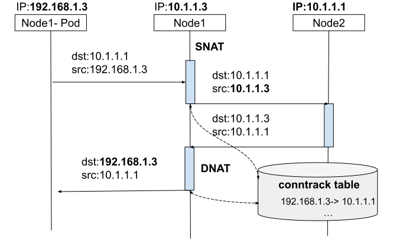

# 3.3.3 连接跟踪 conntrack

conntrack 是 connection track（连接跟踪）的缩写，顾名思义，这个模块就是用来做连接跟踪的。

注意，此处的“连接”需要同 TCP 协议中的连接区分开来，conntrack 中的连接指的是通信的两个端点之间用于传输数据的连接，不仅可以用来跟踪 TCP 的连接，还可以跟踪 UDP、ICMP 协议/报文这样“连接”。

如图 3-10 所示，这是一台 IP 地址为 10.1.1.3 的 Linux 机器，能看到这台机器上有两条连接：

1. 机器访问外部 HTTP 服务的连接（目的端口 80）。
2. 机器访问外部 DNS 服务的连接（目的端口 53）。

:::center
  <br/>
  图 3-10 conntrack 示例
:::

连接跟踪所做的事情就是发现并跟踪这些连接的状态，具体包括：

- 从数据包中提取元组信息，辨别数据流和对应的连接。
- 为所有连接维护一个 conntrack table（连接跟踪表），譬如连接的创建时间、发送 包数、发送字节数等。
- 回收过期的连接（GC）。
- 为更上层的功能（譬如 NAT）提供服务。

## 1. conntrack 原理

当加载内核模块 nf_conntrack 后，conntrack 机制就开始工作。回顾本章 3.2 节中的配图《数据包通过 Netfilter 时的流向过程》，conntrack（椭圆形方框）在内核中有两处位置（PREROUTING 和 OUTPUT 之前）能够跟踪数据包。

每个通过 conntrack 的数据包，内核会判断若此数据包属于一个已有的连接。如有，则更新所对应的 conntrack 条目的状态(譬如更新为 ESTABLISHED 状态)，如果是新连接，内核会为它新建一个 conntrack 条目。

所有的 conntrack 条目都存放在一张表里，称为连接跟踪表（conntrack table）。**注意，conntrack table 如果满了，会丢包**。

连接跟踪表存放于系统内存中，可用 cat /proc/net/nf_conntrack 命令查看当前跟踪的 conntrack 条目，conntrack 维护的所有信息都包含在条目中，通过它就可以知道某个连接处于什么状态。

如下一条状态为 ESTABLISHED 的 TCP 连接。
```bash
$ cat /proc/net/nf_conntrack
ipv4     2 tcp      6 88 ESTABLISHED src=10.0.12.12 dst=10.0.12.14 sport=48318 dport=27017 src=10.0.12.14 dst=10.0.12.12 sport=27017 dport=48318 [ASSURED] mark=0 zone=0 use=2
```

## 3. conntrack 是 NAT 的基础 

conntrack 是许多高级网络应用的基础，如经常使用的 NAT（Network Address Translation，网络地址转换）、iptables 的状态匹配等等。

先来看看 NAT 的工作原理。如图 3-11 所示，Node-1 Pod 的 192.168 网段是容器内部网络，外界无法直接访问，因此：

- 当源地址为 192.168 网段的数据包发送时，机器会先将源 IP 换成机器自己的 10.1.1.3 再发送出去，替换源地址的操作称 SNAT（Source NAT）。
- 收到应答包时，再进行相反的转换，进行 DNAT（对目的地址 destination 进行 NAT）。

NAT 操作的数据依赖连接跟踪表，如果没有连接跟踪表，NAT 功能将无法实现。

:::center
  <br/>
  图 3-12 DNAT 与 SNAT 工作原理
:::

## 4. conntrack 对 Kubernetes 的影响

部署 Kubernetes 时有一条配置 `net.bridge.bridge-nf-call-iptables = 1`，很多同学不明其意，我结合 conntrack 的原理说明这个配置的作用。

首先 Kubernetes 的 Service 本质是个反向代理，Pod 访问 Service 时会进行 DNAT，将原本访问 ClusterIP:Port 的数据包 NAT 成 Service 的某个 Endpoint (PodIP:Port)，然后内核将连接信息插入 conntrack 表以记录连接，目的端回包的时候内核从 conntrack 表匹配连接并反向 NAT，这样形成一个有来有回的连接链路。

但如果发起请求的 Pod 和 Service 的 Endpoint (处理请求的 Pod） 在同一个主机中，问题就来了：

- Pod 访问 Service，目的 IP 是 Cluster IP，不是网桥内的地址，走三层转发，会被 DNAT 成 PodIP:Port。
- 目的 Pod 回包时发现目的 IP 在同一网桥上，就直接走二层转发了，没有调用 conntrack，导致回包时没有原路返回。

于是，客户端与服务端的通信就不在一个 “频道” 上，不认为处在同一个连接，也就无法正常通信。

:::center
  <br/>
  图 3-13 请求经过 conntrack，返回没有经过 conntrack，通信失败。
:::

设置 bridge-nf-call-iptables 这个内核参数 (设置为 1)，表示 bridge 设备在二层转发时也去调用 iptables 配置的三层规则 (包含 conntrack)，所以开启这个参数就能够解决上述 Service 同节点通信问题。

这就是为什么在 Kubernetes 环境中，要求开启 bridge-nf-call-iptables 的原因。


