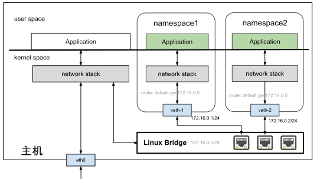

# 3.5.4 虚拟交换机 Linux bridge

物理网络中，我们如果要将多台主机连接起来，会使用以太网交换机设备将它们组成一个小型局域网。Linux 网络虚拟化系统中，也提供了交换机的虚拟实现 —— Linux Bridge（Linux 网桥）。

Linux Bridge 作为一个虚拟的交换机，和物理交换机有相似的功能，将一个或多个网络接口（如物理网卡 eth0、虚拟接口 veth0 等）添加到 Linux bridge 之后，它们的通信与物理交换机的转发行为是完全一致的，当二层数据包（帧）进入 Linux Bridge 时，它就会根据数据包的类型和目标 MAC 地址，按照如下规则理：

1. 如果数据包是广播帧，转发给所有桥接到该 Linux Bridge 的设备。
2. 如果数据包是单播帧，查看 FDB（地址转发表）中 MAC 地址与网络接口（Network Interface）的映射：
	- 如找不到记录，则洪泛（Flooding）给所有接入网桥的设备，并把响应设备的接口与 MAC 地址记录到 FDB 表中；
	- 如找到对应的记录，则直接转发到地址表中指定的设备。

值得注意的是，区别于物理交换机，Linux bridge 的本质是内核中的虚拟网络设备，也具备虚拟网卡的特征，即：可配置 MAC/IP 地址。通过 IP 地址，Linux 系统可以通过路由规则，将来自外部的数据报文直接发送到 Linux Bridge 中进行二层转发。

如图 3-23 所示，网络命名空间内的 Veth 设备的另一端桥接到 Linux Bridge，

:::center
   
 图 3-23 veth 网卡与 Linux Bridge
:::

Linux Bridge 除了最基本的交换机功能，还能够将数据包送到宿主机的内核协议栈进行进一步处理。这一点，是实现容器间通信第一步“将数据包从容器内发出去”的关键。

举个例子，某个容器 A 向另外一台节点中的容器 B 发起通信，容器 A 发出去的数据包先到达 Linux bridge，因为目的地 IP 不属于 Linux bridge 转发的范畴，因此 Linux bridge 将数据包送到宿主机协议栈进一步处理。

接下来，宿主机协议栈根据容器间通信模型，判断如何处理数据包。如果容器间网络模型是 Overlay 类型，宿主机内核将数据包交由 VTEP（VXLAN Tunnel Endpoints，VXLAN 隧道端点）或者 TUN 设备，基于宿主机的 IP 网络进行二次封装。

因为宿主机开启了 IP forward 功能，且封装后的数据包目的 IP 与宿主机处于同一个网络，最后数据包通过宿主机的 eth0 接口发送出去。

