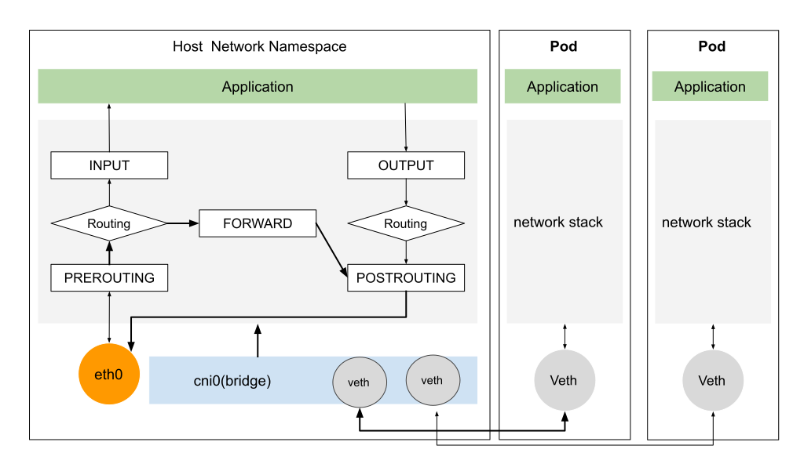

# 3.3 Linux 内核网络框架

Linux 网络数据包的处理看似是一套相对固定和封闭的流程，事实却并非如此，从 Linux 内核 2.4 版本起，内核就开放了一套通用的、可提供代码干预网络数据包在协议栈流转的过滤框架 —— Netfilter。

:::tip 什么是 Netfilter

Netfilter 是 Linux 内核中的一个强大的网络子系统，它提供了网络数据包过滤、网络地址转换（NAT）、数据包的修改和多种其他网络相关操作的功能。

:::
如图 3-2 所示的“数据包通过 Netfilter 时的流向过程”，里面包含了 XDP、Netfilter 和 traffic control 部分，是参考内核协议栈各 hook 点位置和 iptables 规则优先级的经典配图。

:::center
   
  图 3-2 数据包通过 Netfilter 时的流向过程 [图片来源](https://en.wikipedia.org/wiki/Netfilter)
:::

Netfilter 实际上就是一个数据包过滤器框架，Netfilter 在网络包收发以及路由的“管道”中，一共切了 5 个口（hook），分别是：

- PREROUTING：接收到的包进入协议栈后立即触发此 hook，在进行任何路由判断（将包发往哪里）之前。
- LOCAL_IN：接收到的包经过路由判断，如果目的是本机，将触发此 hook。
- FORWARD：接收到的包经过路由判断，如果目的是其他机器，将触发此 hook。
- LOCAL_OUT：本机产生的准备发送的包，在进入协议栈后立即触发此 hook。
- POST_ROUTING：本机产生的准备发送的包或者转发的包，在经过路由判断之后，将触发此 hook。

**其它内核模块（譬如 iptables、IPVS 等）可以向这些 hook 点注册钩子函数。当有数据包经过时，就会自动触发注册在这里的钩子函数，这样程序代码就能够通过钩子函数干预 Linux 的网络通信**，实现对数据包过滤、修改、SNAT/DNAT 等各种功能。

:::tip 额外知识

Hook 设计模式在其他软件系统中随处可见，譬如 eBPF、Git、Kubernetes 等等，Kubernetes 在编排调度、网络、资源定义等通过暴露接口的方式，允许用户根据自己的需求插入自定义代码或逻辑来扩展 Kubernetes 的功能。 
:::

如图 3-4 Kubernetes 网络模型说明，当一个 Pod 跨 Node 进行通信时经过了哪些“管道”。

首先，数据包从 Pod 的 veth-pair 接口发送到 cni0 虚拟网桥，cni 网桥把数据包送到主机协议栈，经过 PREROUTING hook，调用相关的链做 DNAT，经过 DNAT 处理后，数据包目的地址变成另外一个 Pod 地址。

因为开启了 ip_forword，Linux 具有了路由功能，内核协议栈判断目的地不属于本机，经过 FORWARD、POST_ROUTING 到达 eth0，最后通过主机网络发送到其他节点。

:::center
   
  图 3-4 Pod 发起请求另外一个节点，经过 Linux bridge、PREROUTING、FORWARD、POSTROUTING 
:::

对 Linux 内核网络框架基本了解之后，我们继续了解 Netfilter 的上层应用 iptables。
